# Unidad 6 Ciberseguridad

## Índice

- [Unidad 6 Ciberseguridad](#unidad-6-ciberseguridad)
  - [Índice](#índice)
  - [Mapa mental global](#mapa-mental-global)
  - [1. Seguridad y Privacidad de la Información](#1-seguridad-y-privacidad-de-la-información)
    - [1.1. Seguridad y privacidad en el entorno digital actual](#11-seguridad-y-privacidad-en-el-entorno-digital-actual)
    - [1.2. La seguridad de la información](#12-la-seguridad-de-la-información)
      - [1.2.1. Confidencialidad](#121-confidencialidad)
      - [1.2.2. Integridad](#122-integridad)
      - [1.2.3. Disponibilidad](#123-disponibilidad)
    - [1.3. La privacidad de la información](#13-la-privacidad-de-la-información)
      - [1.3.1. Marco legal](#131-marco-legal)
      - [1.3.2. Derechos de los individuos](#132-derechos-de-los-individuos)
      - [1.3.3. Diferencias entre seguridad y privacidad](#133-diferencias-entre-seguridad-y-privacidad)
      - [1.3.4. Relevancia en la era digital](#134-relevancia-en-la-era-digital)
      - [Tabla comparativa — Sección 1](#tabla-comparativa--sección-1)
      - [Ejemplos reales](#ejemplos-reales)
      - [Resumen](#resumen)
  - [2. Tratamiento de la información](#2-tratamiento-de-la-información)
    - [2.1. Ciclo de vida de la información](#21-ciclo-de-vida-de-la-información)
      - [2.1.1. Recopilación](#211-recopilación)
      - [2.1.2. Almacenamiento](#212-almacenamiento)
      - [2.1.3. Uso](#213-uso)
      - [2.1.4. Eliminación](#214-eliminación)
    - [2.2. Clasificación de la información](#22-clasificación-de-la-información)
    - [2.3. Protección de la información](#23-protección-de-la-información)
      - [Tabla comparativa — Sección 2](#tabla-comparativa--sección-2)
      - [Ejemplos reales (extra)](#ejemplos-reales-extra)
      - [Resumen de la sección 2](#resumen-de-la-sección-2)
  - [3. Almacenamiento de la información](#3-almacenamiento-de-la-información)
    - [Importancia del almacenamiento seguro](#importancia-del-almacenamiento-seguro)
    - [3.1. Copias de seguridad](#31-copias-de-seguridad)
      - [Copia completa](#copia-completa)
      - [Copia incremental](#copia-incremental)
      - [Copia diferencial](#copia-diferencial)
      - [Estrategia 3-2-1](#estrategia-3-2-1)
      - [Pruebas periódicas](#pruebas-periódicas)
    - [3.2. Borrado seguro de la información](#32-borrado-seguro-de-la-información)
      - [3.2.1. Métodos de borrado seguro](#321-métodos-de-borrado-seguro)
        - [Degradación magnética (degaussing)](#degradación-magnética-degaussing)
        - [Destrucción física](#destrucción-física)
      - [3.2.2. Importancia del borrado seguro](#322-importancia-del-borrado-seguro)
      - [Tabla comparativa — Sección 3](#tabla-comparativa--sección-3)
      - [Ejemplos reales — Sección 3](#ejemplos-reales--sección-3)
      - [Resumen de la sección 3](#resumen-de-la-sección-3)
  - [4. Principales amenazas a la información](#4-principales-amenazas-a-la-información)
    - [4.1. Panorama actual](#41-panorama-actual)
    - [4.2. Objetivos de los atacantes](#42-objetivos-de-los-atacantes)
    - [4.3. Phishing](#43-phishing)
    - [4.4. Malware](#44-malware)
      - [Tipos principales](#tipos-principales)
      - [Tabla comparativa — Sección 4](#tabla-comparativa--sección-4)
      - [Ejemplos reales — Sección 4](#ejemplos-reales--sección-4)
      - [Resumen de la sección 4](#resumen-de-la-sección-4)
  - [5. Contraseñas y autenticación](#5-contraseñas-y-autenticación)
    - [5.1. La importancia de las contraseñas](#51-la-importancia-de-las-contraseñas)
    - [5.2. Buenas prácticas en la gestión de contraseñas](#52-buenas-prácticas-en-la-gestión-de-contraseñas)
    - [5.3. Autenticación multifactor (MFA)](#53-autenticación-multifactor-mfa)
      - [Factores de autenticación](#factores-de-autenticación)
      - [Tabla comparativa — Sección 5](#tabla-comparativa--sección-5)
      - [Ejemplos reales — Sección 5](#ejemplos-reales--sección-5)
      - [Resumen de la sección 5](#resumen-de-la-sección-5)
  - [6. Protección del puesto de trabajo](#6-protección-del-puesto-de-trabajo)
    - [6.1. Medidas de protección física](#61-medidas-de-protección-física)
    - [6.2. Medidas de protección lógica](#62-medidas-de-protección-lógica)
      - [Áreas principales](#áreas-principales)
  - [Conclusiones](#conclusiones)

---

## Mapa mental global


_Mapa mental general de la unidad para una visión rápida de los bloques y relaciones._

---

## 1. Seguridad y Privacidad de la Información

### 1.1. Seguridad y privacidad en el entorno digital actual

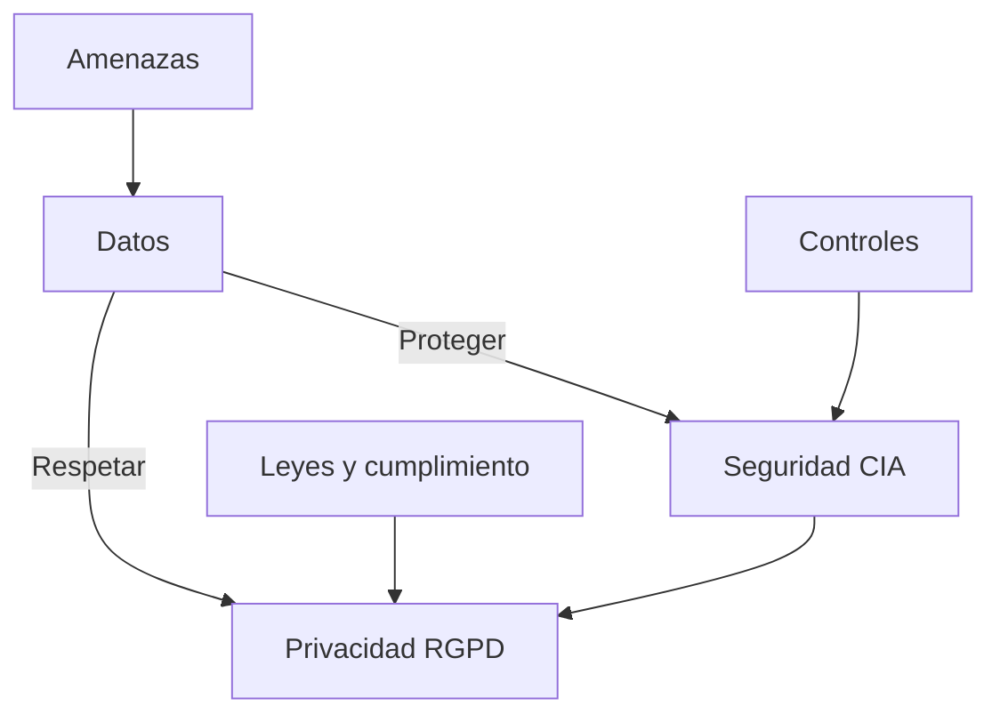

_Relación entre datos, seguridad (CIA), privacidad (RGPD), amenazas y controles._

En la sociedad contemporánea, la información se ha consolidado como uno de los activos estratégicos más valiosos tanto para individuos como para organizaciones. La progresiva digitalización de la economía, la administración pública y la vida cotidiana ha transformado la manera en que se producen, almacenan, transmiten y consumen datos. Hoy en día, procesos tan sensibles como la gestión financiera, la historia clínica electrónica, las transacciones de comercio electrónico o el control de infraestructuras críticas dependen de sistemas informáticos interconectados.

La llamada “sociedad de la información” se caracteriza por una creciente interdependencia tecnológica: cada vez más actividades requieren de plataformas digitales, y estas a su vez generan grandes volúmenes de datos que circulan a través de redes de comunicación. Este fenómeno, conocido como “economía del dato”, ha convertido a la información en un recurso equiparable al capital o la energía.

Sin embargo, este desarrollo acarrea también una exposición creciente a riesgos y amenazas. La ciberseguridad y la privacidad se sitúan en el centro del debate académico, empresarial y político por varias razones:

- Incremento de amenazas externas e internas: ataques de ransomware, robo de identidad, filtraciones de datos, fraudes financieros, ataques de denegación de servicio (DDoS).
- Cibercrimen organizado: grupos con alta capacidad técnica y motivación económica operan a nivel internacional, comercializando datos robados en la “dark web” y desarrollando malware sofisticado.
- Geopolítica del ciberespacio: los Estados utilizan herramientas de ciberespionaje y ciberdefensa como instrumentos estratégicos, lo que añade complejidad al panorama de la seguridad.
- Expansión del IoT (Internet of Things): miles de millones de dispositivos conectados (cámaras, sensores, wearables) generan datos continuamente, ampliando la superficie de ataque.

En este contexto, la seguridad y la privacidad de la información constituyen pilares esenciales para:

1. Proteger los activos críticos: desde bases de datos corporativas y patentes industriales hasta credenciales individuales y comunicaciones privadas.
2. Garantizar la continuidad operativa: un fallo de seguridad puede paralizar hospitales, empresas de transporte o redes eléctricas, con graves consecuencias sociales y económicas.
3. Cumplir con la legislación vigente: en Europa, el Reglamento General de Protección de Datos (RGPD) impone obligaciones estrictas en el manejo de información personal.
4. Preservar la confianza social: la reputación de una organización depende de su capacidad de proteger y gestionar responsablemente los datos de clientes, usuarios y empleados.

Conceptos clave: **seguridad de la información**, **privacidad**, **cibercrimen organizado**, **IoT**, **RGPD**, **continuidad operativa**.

Caso real: durante la pandemia, varios hospitales sufrieron ataques de ransomware que interrumpieron servicios críticos; los centros con planes de continuidad y copias de seguridad robustas pudieron recuperarse rápidamente, mientras que otros vieron afectada su capacidad asistencial.

### 1.2. La seguridad de la información

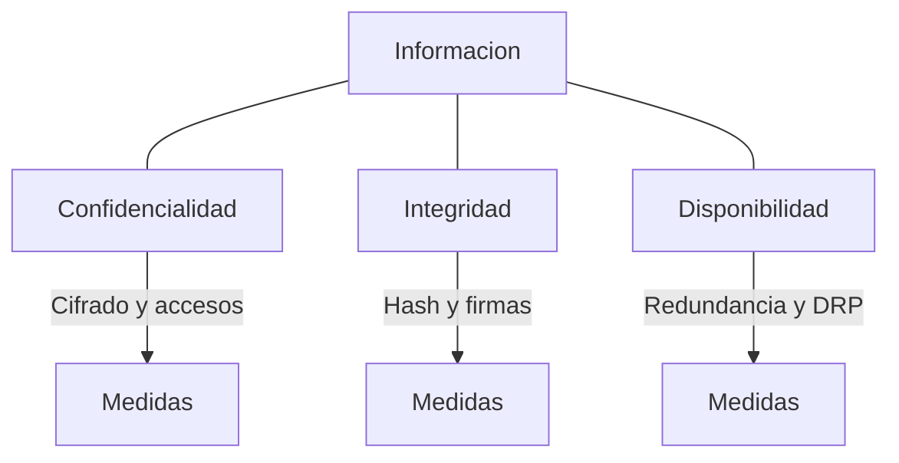

_Triada CIA aplicada a la información y ejemplos de controles._

La seguridad de la información se define como el conjunto de medidas técnicas, organizativas, físicas y administrativas diseñadas para proteger la información y los sistemas que la procesan frente a amenazas intencionadas (ataques) o accidentales (fallos humanos, errores técnicos, desastres naturales).

Su núcleo conceptual descansa en la triada CIA:

#### 1.2.1. Confidencialidad

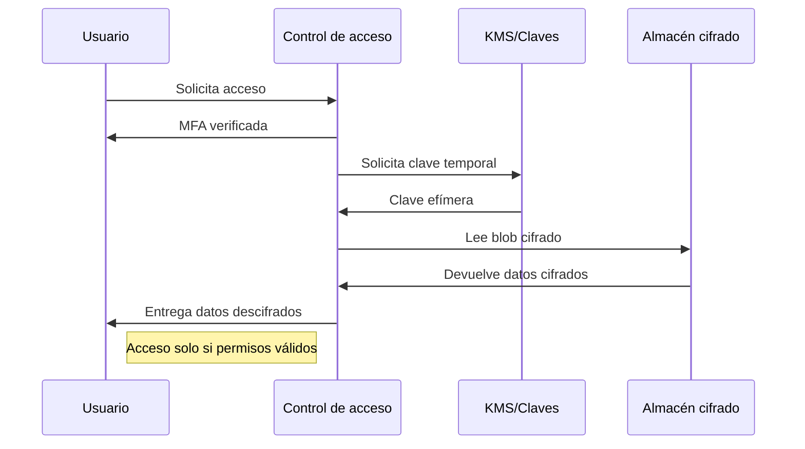

_Flujo de acceso confidencial con MFA, gestión de claves y cifrado._

- Garantiza que los datos solo puedan ser accedidos por personas o sistemas autorizados. La confidencialidad se logra mediante:
- Cifrado de la información (AES, RSA).
- Controles de acceso (contraseñas robustas, autenticación multifactor, biometría).
- Redes seguras (VPN, firewalls, segmentación de redes).

Conceptos clave: **confidencialidad**, **cifrado**, **controles de acceso**, **VPN**, **firewall**.

Caso real: una empresa evitó la filtración de nóminas porque los archivos estaban cifrados con AES-256; aunque un atacante exfiltró copias, los datos permanecieron ilegibles sin la clave.

#### 1.2.2. Integridad

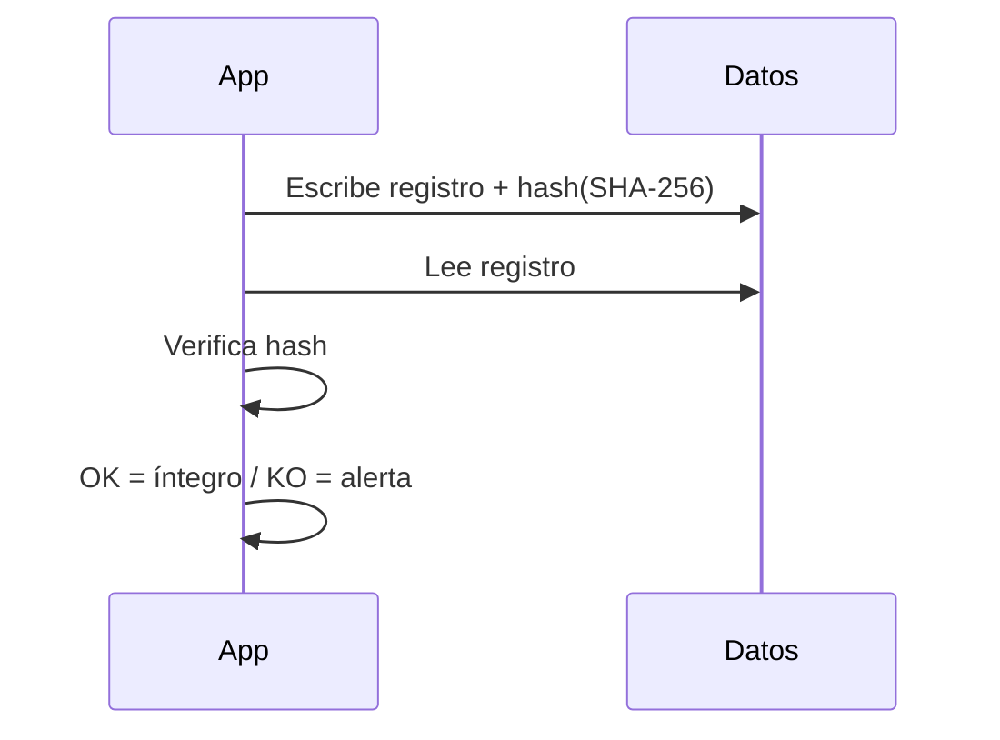

_Verificación de integridad mediante funciones hash y auditoría._

- Asegura que la información se mantenga completa, exacta y no se modifique sin autorización. Ejemplos de mecanismos de integridad:
- Funciones hash criptográficas (SHA-256).
- Firmas digitales.
- Registros de auditoría que permiten verificar cambios.

Conceptos clave: **integridad**, **hash**, **firmas digitales**, **auditoría**.

Caso real: en un proceso judicial, los registros de auditoría y las huellas SHA-256 de documentos electrónicos permitieron demostrar que no habían sido alterados desde su emisión.

#### 1.2.3. Disponibilidad

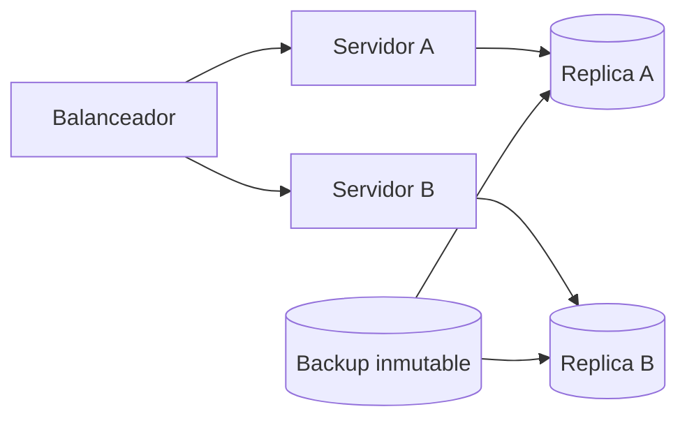

_Alta disponibilidad con balanceo, réplicas y copias inmutables._

- Implica que los datos y servicios estén accesibles cuando los usuarios legítimos los necesiten. La disponibilidad se garantiza mediante:
- Sistemas redundantes (RAID, servidores espejo).
- Planes de recuperación ante desastres (DRP).
- Copias de seguridad periódicas.
- Protección frente a ataques DDoS.

Conceptos clave: **disponibilidad**, **redundancia**, **DRP**, **copias de seguridad**, **DDoS**.

Caso real: una plataforma de aprendizaje online soportó un pico de tráfico malicioso gracias a un CDN con mitigación DDoS y a infraestructura redundante en múltiples zonas.

Además de la triada CIA, hoy en día se añaden otros principios relevantes como la trazabilidad (poder rastrear todas las acciones realizadas sobre los datos), la resiliencia (capacidad de recuperación rápida tras un ataque) y la responsabilidad proactiva (anticiparse a riesgos, no solo reaccionar a incidentes).

La seguridad de la información se materializa a través de:

- Normas y estándares internacionales:
  - ISO/IEC 27001: sistemas de gestión de seguridad de la información.
  - NIST Cybersecurity Framework: marco de referencia en EE. UU. basado en identificar, proteger, detectar, responder y recuperar.
- Modelos de madurez en ciberseguridad: permiten a las organizaciones evaluar su nivel de protección y establecer planes de mejora.
- Centros de Operaciones de Seguridad (SOC): monitorizan en tiempo real las amenazas y gestionan incidentes.

La relevancia práctica de la seguridad de la información se observa en la cifra creciente de ciberataques. Informes como el de Check Point (2023) señalan un aumento anual del 38% en el número de ataques a empresas, lo que refleja la necesidad urgente de integrar la seguridad como parte central de la estrategia corporativa.

### 1.3. La privacidad de la información

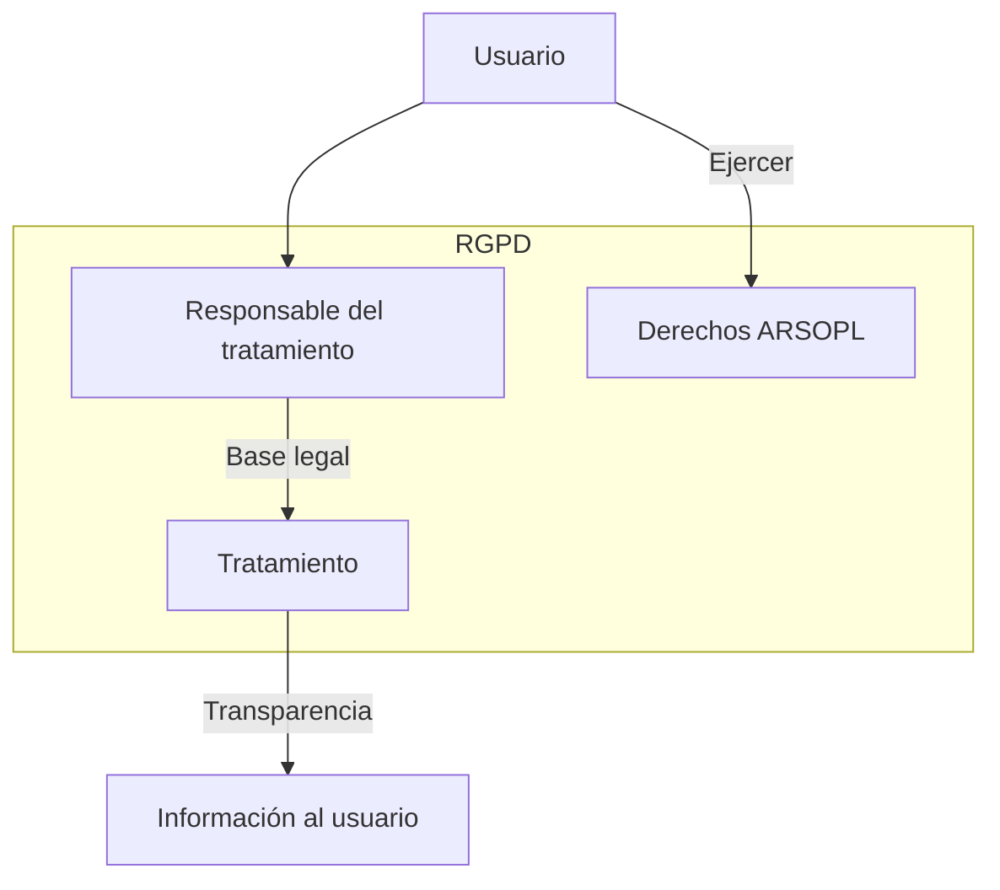

_Privacidad: base legal, transparencia y ejercicio de derechos._

La privacidad de la información se refiere al derecho de las personas a decidir cómo se recopilan, procesan, almacenan y comparten sus datos personales. A diferencia de la seguridad, que protege los datos frente a amenazas externas, la privacidad se centra en respetar la voluntad del titular y los límites impuestos por la legislación.

#### 1.3.1. Marco legal

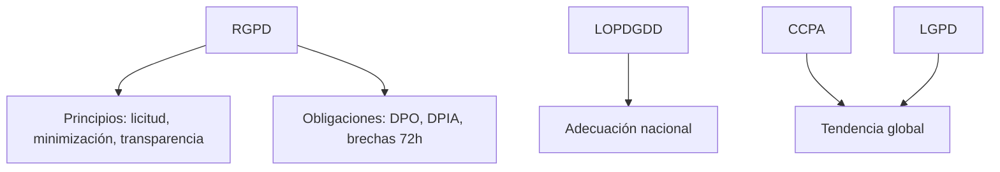

_Marco normativo: RGPD y leyes afines y sus pilares._

La privacidad está regulada por diferentes normas internacionales:

- Reglamento General de Protección de Datos (RGPD, UE, 2018): establece principios como licitud, lealtad, transparencia, minimización de datos y responsabilidad proactiva. Introduce obligaciones para las organizaciones (notificación de brechas, nombramiento de Delegados de Protección de Datos).
- LOPDGDD (España, 2018): adapta el RGPD al ordenamiento jurídico nacional.
- CCPA (California Consumer Privacy Act) y LGPD (Lei Geral de Proteção de Dados, Brasil): reflejan una tendencia global hacia la protección de datos.

Conceptos clave: **RGPD**, **LOPDGDD**, **CCPA**, **LGPD**, **responsabilidad proactiva**.

Caso real: la AEPD sancionó a una entidad por instalar cookies no esenciales sin consentimiento informado, vulnerando el principio de transparencia del RGPD.

#### 1.3.2. Derechos de los individuos

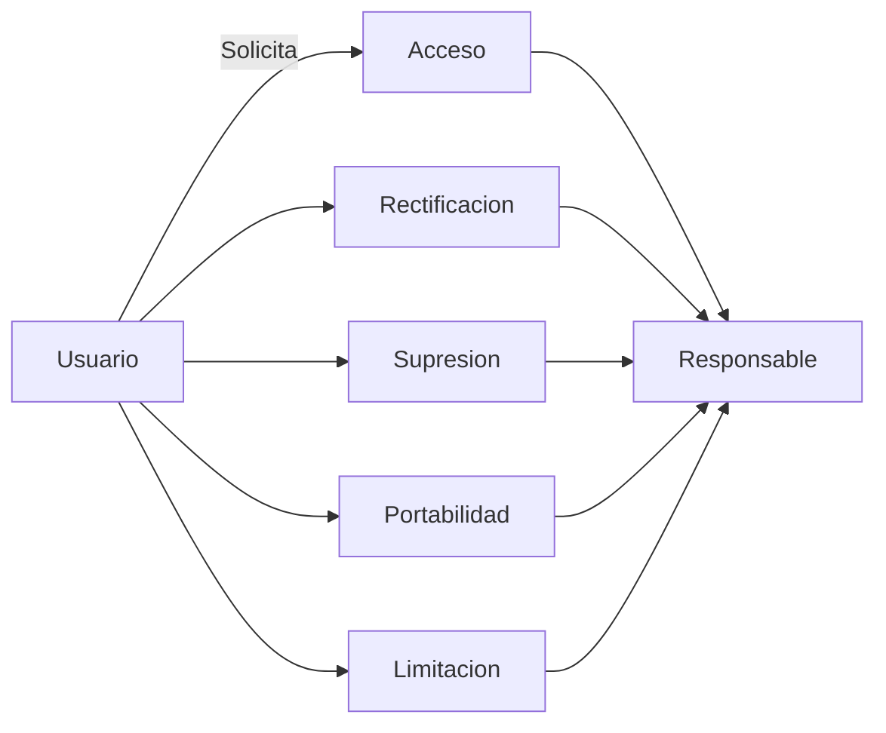

_Derechos clave del interesado y su tramitación._

El RGPD reconoce derechos fundamentales, entre ellos:

- Acceso: conocer qué datos personales se poseen y cómo se utilizan.
- Rectificación: corregir información inexacta.
- Supresión (“derecho al olvido”): solicitar la eliminación de datos cuando ya no sean necesarios.
- Portabilidad: trasladar los datos a otro proveedor de servicios.
- Limitación del tratamiento: restringir temporalmente el uso de los datos.

Conceptos clave: **acceso**, **rectificación**, **supresión (derecho al olvido)**, **portabilidad**, **limitación del tratamiento**.

Caso real: un usuario ejerció el derecho al olvido para que buscadores retiraran resultados con información obsoleta que afectaba a su reputación profesional.

#### 1.3.3. Diferencias entre seguridad y privacidad

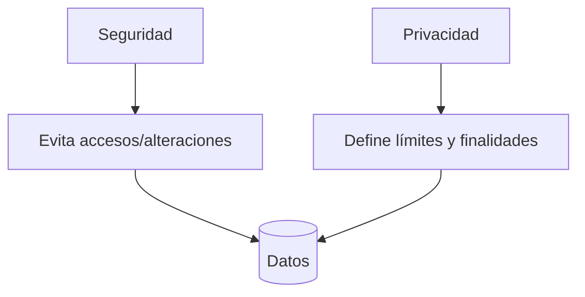

_Seguridad y privacidad: enfoques complementarios sobre los datos._

- Seguridad: busca evitar accesos no autorizados, proteger datos frente a amenazas y garantizar su disponibilidad.
- Privacidad: garantiza que los datos se recojan y usen solo con fines legítimos y autorizados.

En síntesis: puede haber seguridad sin privacidad, pero no privacidad sin seguridad.

Conceptos clave: **seguridad**, **privacidad**, **finalidad legítima**, **minimización de datos**.

Caso real: una app con fuerte cifrado (seguridad) compartía datos de uso con terceros para publicidad sin informar adecuadamente (falta de privacidad), generando sanciones y pérdida de confianza.

#### 1.3.4. Relevancia en la era digital

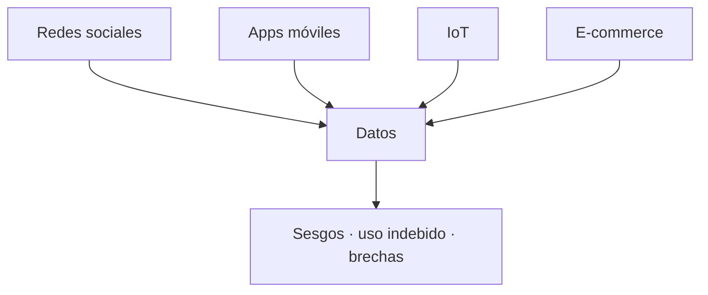

_Generación masiva de datos y riesgos asociados en la era digital._

La privacidad adquiere un papel crucial en un mundo en el que cada interacción digital genera datos:

- Redes sociales: se comparten voluntariamente grandes cantidades de información personal.
- Aplicaciones móviles: recopilan datos de ubicación, hábitos de consumo y preferencias.
- Comercio electrónico: requiere datos financieros y patrones de compra.
- Dispositivos IoT: relojes inteligentes, altavoces conectados y sensores recopilan datos de salud, voz o actividad diaria.

El uso indebido de estos datos puede derivar en:

- Vulneraciones de derechos fundamentales.
- Discriminación algorítmica (ej. rechazos de créditos basados en perfiles de datos).
- Pérdida de confianza en instituciones y empresas.

Por todo ello, la privacidad de la información no es solo un requisito legal, sino también un imperativo ético y social en la sociedad digital.

Conceptos clave: **redes sociales**, **apps móviles**, **e-commerce**, **IoT**, **discriminación algorítmica**.

Caso real: datos de actividad física de wearables compartidos con aseguradoras se usaron para ajustar primas, generando debate sobre sesgos y consentimiento explícito.

#### Tabla comparativa — Sección 1

| Aspecto | Qué protege | Objetivo | Medidas típicas | Métricas/indicadores |
|---|---|---|---|---|
| Seguridad | Sistemas y datos | Evitar accesos/alteraciones no autorizadas | Cifrado, control de accesos, firewalls, EDR | Incidentes/mes, MTTD/MTTR |
| Privacidad | Datos personales | Respetar derechos y finalidades legítimas | Minimización, transparencia, base legal, DPIA | Solicitudes de derechos atendidas, brechas notificadas |
| Cumplimiento | Obligaciones legales | Demostrar diligencia y conformidad | Políticas, auditorías, registros, formación | Hallazgos de auditoría, niveles de madurez |

#### Ejemplos reales

- Filtración en hotelería: exposición de datos de huéspedes impulsó revisiones de privacidad y notificaciones a reguladores.
- Campaña de smishing bancario: clientes engañados para entregar códigos; la MFA redujo el impacto.
- Exfiltración por USB en oficina: políticas de DLP y control de puertos frenaron la fuga.

#### Resumen

- La información es un activo estratégico expuesto a riesgos crecientes por digitalización e IoT.
- Seguridad y privacidad son complementarias: sin seguridad no hay privacidad efectiva.
- Marcos como RGPD, ISO 27001 y NIST fijan principios y buenas prácticas.
- La confianza y la continuidad de negocio dependen de integrar seguridad en la estrategia.

---

## 2. Tratamiento de la información

El tratamiento de la información hace referencia a todas las operaciones y procesos que se realizan sobre los datos, ya sea de forma manual (papel, archivos físicos) o mediante sistemas automatizados (software, bases de datos, algoritmos de inteligencia artificial).

### 2.1. Ciclo de vida de la información

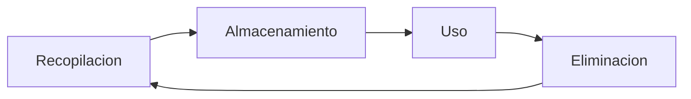

_Ciclo de vida del dato: de la captura a la eliminación._

#### 2.1.1. Recopilación

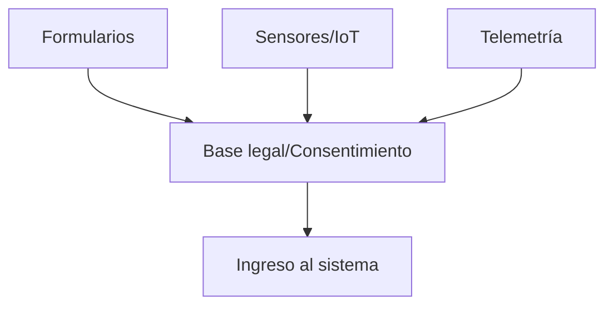

_Fuentes de datos y necesidad de base jurídica/consentimiento._

La recopilación es el punto de entrada de los datos en el sistema. Puede hacerse de forma explícita (cuando el usuario entrega voluntariamente información) o implícita (cuando los sistemas la obtienen automáticamente).

Ejemplos de la vida real:

- Formularios web: al registrarse en una red social, se solicitan nombre, correo electrónico y fecha de nacimiento.
- Sensores IoT: un reloj inteligente recopila ritmo cardíaco y pasos diarios.
- Registros administrativos: en un hospital, el paciente entrega información médica al ingresar.

Riesgo: si en esta fase no se aplican principios de minimización de datos, se puede recopilar más información de la necesaria, aumentando la exposición a brechas de seguridad.

Desde una perspectiva académica y normativa, la fase de recopilación exige al responsable del tratamiento fundamentar la licitud del tratamiento en una base jurídica adecuada (consentimiento, ejecución de un contrato, interés legítimo ponderado, obligación legal, interés vital o misión de interés público), conforme al artículo 6 del RGPD. La obtención de datos debe alinearse con los principios de limitación de la finalidad y minimización, de manera que solo se recojan aquellos datos estrictamente necesarios para los objetivos declarados. La transparencia se materializa a través de cláusulas informativas claras, accesibles y específicas, que describan la identidad del responsable, las finalidades, las bases legales, los destinatarios y los derechos de los interesados. En contextos con categorías especiales de datos (salud, biométricos, origen racial, entre otros), el artículo 9 del RGPD impone salvaguardas reforzadas y bases habilitantes específicas. La ausencia de claridad en esta fase no solo incrementa el riesgo jurídico, sino que dificulta la confianza de los usuarios y compromete la calidad de los datos obtenidos.

Desde el punto de vista técnico, la recopilación puede realizarse mediante mecanismos activos (formularios, encuestas, apps) o pasivos (telemetría, cookies, SDK de terceros, captación por sensores IoT). La irrupción del edge computing permite preprocesar y filtrar datos en el dispositivo, reduciendo la exposición y el volumen transferido a la nube, lo que coadyuva al principio de minimización. Sin embargo, la heterogeneidad de fuentes genera retos de interoperabilidad y de normalización semántica que afectan a la integridad y a la comparabilidad de los conjuntos de datos. Es esencial incorporar controles de calidad (validaciones, detección de valores atípicos, verificación de consistencia) y evitar sesgos de selección que deriven en representaciones distorsionadas, especialmente cuando los datos alimentan modelos analíticos o de aprendizaje automático con impacto en decisiones sociales o económicas.


Conceptos clave: **recopilación**, **consentimiento**, **minimización de datos**, **licitud**.

Caso real: una linterna móvil solicitaba acceso al GPS y a contactos; tras denuncias, el desarrollador actualizó la app para ceñirse al principio de minimización.

#### 2.1.2. Almacenamiento

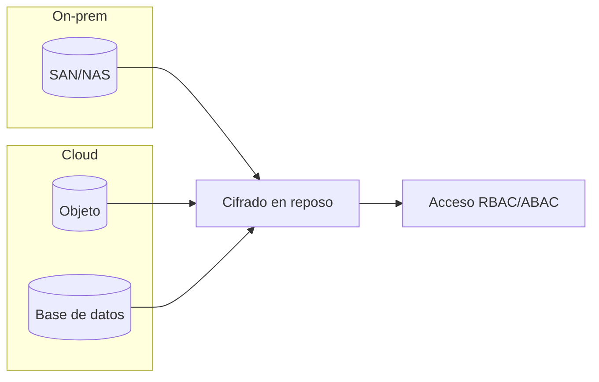

_Opciones de almacenamiento y controles: cifrado y control de acceso._

Una vez recopilados, los datos se conservan en distintos soportes: bases de datos relacionales, servidores en la nube, discos duros físicos o incluso archivos en papel.

En el plano arquitectónico, el almacenamiento de la información abarca múltiples paradigmas: infraestructuras on-premises, nubes públicas/privadas e implementaciones híbridas. A nivel lógico conviven bases de datos relacionales, almacenes NoSQL (clave-valor, documentos, grafos), lagos de datos y almacenamiento de objetos. La elección del sustrato tecnológico condiciona propiedades de seguridad y rendimiento, así como el cumplimiento de requisitos no funcionales (consistencia, disponibilidad, particionamiento). Para preservar la confidencialidad en reposo, se recomienda cifrado nativo del medio con gestión de claves centralizada (KMS, HSM), segregación de entornos y aislamiento de tenants. La integridad se refuerza con sumas de verificación, firmas, control de versiones e inmutabilidad cuando proceda; la disponibilidad, con replicación geográfica y políticas de recuperación definidas.

Los controles de acceso constituyen la primera línea de defensa operativa: modelos RBAC/ABAC, separación de funciones, autenticación robusta y autorización granular por recurso y operación. La implementación de copias de seguridad, versionado y almacenamiento inmutable (WORM) mitiga los efectos de errores humanos y ataques como ransomware. Políticas de retención y borrado alineadas con requisitos legales evitan acumulaciones innecesarias. La confiabilidad del almacenamiento también depende de la higiene de configuración (principio de mínimo privilegio, desactivación de acceso público por defecto, endpoints privados) y del hardening del sistema operativo y del stack de almacenamiento. La monitorización continua de accesos y anomalías, junto con alarmas basadas en comportamiento, contribuye a una detección temprana de incidentes.


Ejemplos:

- Banco: conserva el historial de transacciones de un cliente en un servidor seguro durante el tiempo legalmente requerido.
- Universidad: almacena los expedientes académicos en un sistema de gestión interna.
- Google Drive / Dropbox: servicios en la nube que guardan información personal y laboral de millones de usuarios.

Riesgo: el almacenamiento inseguro o sin cifrado puede derivar en accesos indebidos (ejemplo: filtraciones masivas de contraseñas de LinkedIn en 2012).

Conceptos clave: **almacenamiento**, **cifrado en reposo**, **nube**, **gestión de claves**.

Caso real: un bucket en la nube mal configurado expuso bases de datos de clientes; el uso posterior de cifrado y políticas de acceso minimizó el impacto ante accesos no autorizados.

#### 2.1.3. Uso

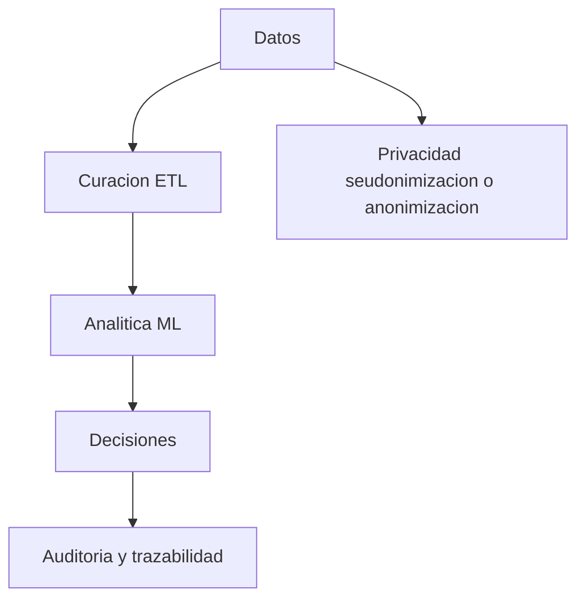

_Uso legítimo: calidad de datos, analítica y privacidad preservadora._

El uso implica que los datos se procesen con una finalidad legítima y transparente, previamente informada al titular.

El uso de la información debe ajustarse estrictamente al principio de limitación de la finalidad y a la compatibilidad de propósitos establecida por el RGPD. La reutilización de datos con fines secundarios requiere evaluar la relación entre la finalidad original y la nueva, el contexto de obtención, la naturaleza de los datos, las posibles consecuencias y la existencia de salvaguardas adecuadas. En un marco académico, esto se traduce en modelos de gobernanza que articulan catálogos de datos, glosarios de negocio y registros de tratamiento, asegurando coherencia semántica y facilitando el control del linaje (data lineage). La transparencia en el uso, mediante avisos y paneles informativos, mejora la confianza y habilita el ejercicio informado de derechos por parte de los interesados.

Los tratamientos basados en analítica avanzada y aprendizaje automático introducen retos específicos de equidad, explicabilidad y no discriminación. La inferencia de atributos sensibles o la segmentación algorítmica (profiling) puede generar sesgos y resultados adversos para colectivos vulnerables. Por ello, se recomiendan evaluaciones de impacto algorítmico, pruebas de sesgo, documentación de modelos (model cards) y técnicas de privacidad preservadora como la seudonimización, privacidad diferencial o aprendizaje federado. La calidad del dato (completitud, exactitud, actualidad) condiciona la validez de las conclusiones; políticas de curación, control de versiones y validaciones sistemáticas son indispensables para mantener la integridad del análisis.

En la operación diaria, el principio de mínimo privilegio, la segregación de entornos (desarrollo, pruebas, producción) y la separación de funciones limitan la exposición. El acceso just-in-time y la revisión periódica de permisos reducen riesgos de acumulación de privilegios. La auditoría de accesos, la detección de uso anómalo y los mecanismos de trazabilidad permiten identificar desvíos de uso y respaldar la rendición de cuentas. Asimismo, la gestión diligente de solicitudes de derechos (acceso, portabilidad, oposición) y la estructuración de acuerdos de intercambio de datos con terceros, incluyendo cláusulas de uso permitido y prohibido, resultan esenciales para evitar usos indebidos y garantizar el cumplimiento.

Ejemplos:

- Netflix: usa el historial de visionado de cada usuario para recomendar nuevas series mediante algoritmos de machine learning.
- Sanidad pública: analiza datos epidemiológicos para detectar brotes de enfermedades.
- E-commerce: un supermercado online personaliza las ofertas en función del historial de compras del cliente.

Riesgo: un uso no autorizado (ejemplo: escándalo de Cambridge Analytica en 2018, donde se usaron datos de Facebook para manipulación política).


Conceptos clave: **finalidad**, **transparencia**, **legitimación**, **profiling**.

Caso real: el caso Cambridge Analytica evidenció cómo datos recogidos para fines "sociales" se reutilizaron para segmentación política sin consentimiento explícito.

#### 2.1.4. Eliminación

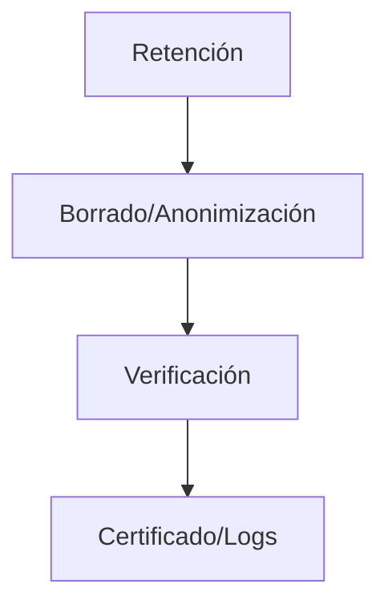

_Eliminación segura con verificación y evidencia._

Cuando los datos dejan de ser necesarios, deben ser suprimidos o anonimizados de forma segura, respetando los plazos legales.
La eliminación eficaz se asienta en calendarios de retención definidos por tipología de dato y obligación normativa (fiscal, laboral, sanitaria, sectorial). Estos calendarios deben equilibrar las necesidades operativas con los principios de minimización y almacenamiento limitado, evitando la conservación indefinida por inercia. Las organizaciones han de contemplar situaciones de legal hold, en las que la supresión se suspende temporalmente por requerimientos judiciales o de investigación. Desde un enfoque sistémico, es fundamental identificar todas las copias y proyecciones de un dato a lo largo del ecosistema (respaldos, cachés, índices de búsqueda, entornos de pruebas) para asegurar la coherencia de la supresión.

En términos técnicos, la eliminación puede implementarse mediante borrado lógico (marcado de registros para no ser usados), sobrescritura segura de sectores, destrucción de claves criptográficas (crypto-shredding) o sanitización conforme a estándares como NIST SP 800-88. La elección del método depende del soporte (HDD, SSD, cintas, papel) y de la sensibilidad de la información. La verificación de la supresión, mediante muestreo, logs de borrado y certificaciones de proveedores, es imprescindible para reducir el riesgo residual. En entornos cloud, debe atenderse a instantáneas, réplicas y colas de mensajes, donde pueden persistir referencias a datos supuestamente eliminados.


Ejemplos:

- Entidad bancaria: elimina registros de operaciones pasados X años, según normativa de prevención de blanqueo de capitales.
- Empresa de RRHH: borra los CV de candidatos no seleccionados después de un tiempo prudencial.
- Universidad: destruye exámenes en papel tras digitalizar y finalizar el proceso de reclamaciones.

Riesgo: no eliminar correctamente datos sensibles puede provocar su recuperación por terceros (ejemplo: venta de discos duros usados en eBay que aún contenían historiales clínicos).


Conceptos clave: **plazos de conservación**, **supresión**, **anonimización**, **borrado seguro**.

Caso real: una empresa recicló equipos sin sobrescritura; investigadores recuperaron datos sensibles, lo que derivó en una notificación de brecha y sanción.


Conceptos clave: **responsable del tratamiento**, **encargado del tratamiento**, **contratos de encargo**, **notificación de brechas**.

Caso real: tras un incidente en su proveedor cloud, una clínica notificó en 72 horas a la AEPD y a los afectados, cumpliendo el RGPD y mitigando el impacto reputacional.

### 2.2. Clasificación de la información

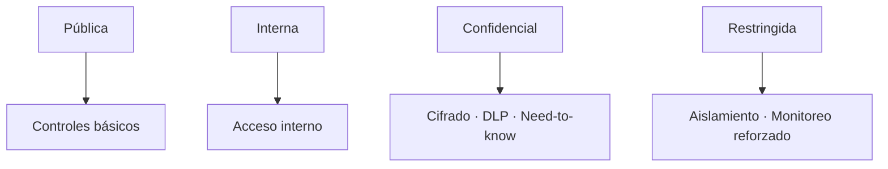

_Niveles de clasificación y ejemplos de controles asociados._

La clasificación de la información consiste en asignar niveles de protección en función de la sensibilidad, el valor y el riesgo que supone su exposición.

La clasificación de la información constituye un pilar de la gobernanza del dato al permitir modular controles según la sensibilidad y el impacto potencial de exposición, alteración o pérdida. Desde un enfoque metodológico, se parte de un inventario de activos informacionales y de un análisis de impacto en el negocio (BIA) que relaciona cada activo con procesos críticos, dependencias y tolerancias temporales. Los criterios de valoración deben considerar aspectos estratégicos, reputacionales, regulatorios y de seguridad, evitando una hipertrofia de la categoría máxima que termine por banalizarla. El patrocinio directivo y el alineamiento con la gestión de riesgos corporativos facilitan la adopción uniforme en todas las áreas.


El ciclo de vida de la clasificación requiere revisiones periódicas, gestión de excepciones justificadas y retroalimentación de incidentes y auditorías para ajustar criterios y controles. La sensibilización del personal es determinante: comprender qué implica cada etiqueta y cómo manejarla en la práctica reduce errores operativos.

El hallazgo de datos “huérfanos” o de sistemas en la sombra (shadow IT) demanda procesos de descubrimiento continuo y regularización. Finalmente, una clasificación efectiva facilita el cumplimiento normativo al demostrar proporcionalidad en las medidas adoptadas y dota de eficiencia a la respuesta ante incidentes al priorizar la contención de activos más críticos.

Niveles comunes y ejemplos:

- Información pública
  - Datos accesibles sin restricción.
  - Ejemplo: notas de prensa de una institución, horarios de transporte público.
- Información interna
  - Uso exclusivo dentro de la organización.
  - Ejemplo: manuales de procedimientos de una empresa.
- Información confidencial
  - Requiere un control de acceso, ya que su filtración puede causar daños.
  - Ejemplo: contratos de clientes, estrategias de marketing, expedientes médicos.
- Información restringida
  - Máxima protección; su pérdida tendría un impacto crítico.
  - Ejemplo: credenciales de acceso a sistemas financieros, algoritmos propios de Google, planos de infraestructuras críticas.

Criterios de clasificación:

- Valor: importancia estratégica o económica.
- Impacto: consecuencias de divulgación, pérdida o alteración.
- Requisitos legales: leyes que obligan a niveles específicos (ej. protección reforzada de datos biométricos o de salud en el RGPD).


Caso real: en 2014, el robo de información confidencial de Sony Pictures expuso correos internos y estrategias de negocio, causando graves pérdidas económicas y de reputación.

Conceptos clave: **pública**, **interna**, **confidencial**, **restringida**, **impacto**.

Caso real: el incidente de Sony Pictures demostró cómo tratar como interna información que debía ser confidencial incrementó el daño de la filtración.

### 2.3. Protección de la información

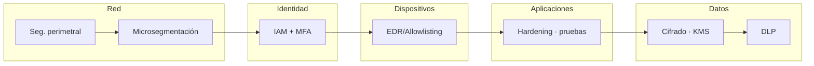

_Defensa en profundidad por capas y Zero Trust._

Para proteger bien la información, piensa en un castillo: no basta con una muralla, hacen falta varias. A eso lo llamamos defensa en profundidad: colocar diferentes barreras en puntos distintos del sistema para que, si una falla, otra detenga o retrase al atacante. En la práctica, combinamos medidas para prevenir incidentes, detectar rápidamente lo anómalo y responder y recuperarnos con eficacia. Más capas implican más dificultad para el adversario y más tiempo para que tú puedas reaccionar.

Por capas, hablamos de red, identidad, dispositivos (endpoint), aplicaciones y datos. El enfoque Zero Trust (confianza cero) resume una idea sencilla: no confiar por defecto aunque el acceso venga “desde dentro”; verificar cada petición, dar solo los permisos mínimos necesarios y asumir que en algún momento puede haber un equipo comprometido. Técnicas como la segmentación y microsegmentación de red, el aislamiento de entornos (desarrollo, pruebas y producción) y el endurecimiento de sistemas (configurar seguro por defecto y reducir servicios innecesarios) cortan el movimiento lateral y disminuyen la superficie de ataque.

En el plano técnico, hay controles clave que conviene interiorizar:

- Gestión de identidades y accesos (IAM) con autenticación multifactor resistente al phishing, revisión periódica de permisos y accesos “just‑in‑time”.
- Protección de equipos con EDR/XDR y listas blancas de ejecución (allowlisting) para limitar qué puede correr en los endpoints.
- Monitorización con SIEM y orquestación/automatización (SOAR) para correlacionar eventos y ejecutar respuestas guiadas por playbooks.
- Gestión de vulnerabilidades y parcheo continuo, apoyados en escaneos regulares y verificación de configuración (p. ej., CIS Benchmarks).
- Cifrado de datos en tránsito (TLS) y en reposo, con gestión segura de claves (KMS/HSM), rotación y separación de funciones.

Nada de esto funciona sin la parte organizativa. Hacen falta políticas claras y conocidas, formación continua y simulaciones (campañas de phishing, ejercicios de mesa) para construir cultura de seguridad. La preparación se plasma en planes de respuesta a incidentes, continuidad de negocio y recuperación ante desastres, que deben probarse y medirse (MTTD, MTTR). La gestión de cambios, el análisis de amenazas en el diseño (threat modeling) y las auditorías contribuyen a la mejora continua. Y, sobre todo, es clave la colaboración entre TI, seguridad, cumplimiento y negocio para alinear la protección con los riesgos reales y los objetivos de la organización.

Tipos de controles:

- Controles físicos
  - Restringen el acceso a instalaciones y equipos.
  - Ejemplos: cerraduras electrónicas, cámaras de vigilancia, guardias de seguridad, tarjetas de identificación.
  - Caso real: en centros de datos de Amazon Web Services (AWS), el acceso físico está limitado con biometría y vigilancia 24/7.
- Controles técnicos
  - Basados en herramientas tecnológicas.
  - Ejemplos: cifrado, firewalls, antivirus, autenticación multifactor (MFA), sistemas de detección de intrusiones (IDS/IPS).
  - Caso real: tras el ataque de ransomware WannaCry (2017), muchos hospitales tuvieron que reforzar la seguridad técnica de sus redes.
- Controles administrativos
  - Basados en políticas, normas y formación.
  - Ejemplos: políticas de contraseñas, formación en phishing, planes de respuesta a incidentes.
  - Caso real: en 2020, un empleado de Twitter fue engañado (ingeniería social), lo que permitió a atacantes tomar el control de cuentas verificadas.

Conceptos clave: **defensa en profundidad**, **controles físicos**, **controles técnicos**, **controles administrativos**, **formación**.

Caso real: después de WannaCry, hospitales implantaron segmentación de red, parches regulares y formación antiphishing, reduciendo drásticamente incidentes.

#### Tabla comparativa — Sección 2

| Fase/rol | Riesgo clave | Medidas recomendadas | Evidencias |
|---|---|---|---|
| Recopilación | Exceso de datos, base legal débil | Minimización, información clara, consentimiento válido | Cláusulas informativas, registros de consentimiento |
| Almacenamiento | Accesos indebidos, pérdida | Cifrado, backups, control de accesos, hardening | Configuraciones, inventario de activos, pruebas de restauración |
| Uso | Deriva de finalidad, sesgos | Gobernanza, seudonimización, controles de acceso | ROPA, data lineage, revisiones de permisos |
| Eliminación | Persistencia en copias | Calendarios de retención, sanitización | Logs de borrado, certificados, políticas |
| Responsable/Encargado | Falta de control a terceros | DPA, evaluación de proveedores, auditorías | Contratos, informes SOC 2/ISO, planes de respuesta |

#### Ejemplos reales (extra)

- Errores de configuración en cloud dejaron buckets públicos expuestos hasta su cierre y cifrado.
- Reutilización de datos de apps para fines publicitarios conllevó sanciones por falta de transparencia.
- Borrado incompleto en discos reciclados permitió recuperar historiales; implantación posterior de NIST SP 800-88.

#### Resumen de la sección 2

- El ciclo de vida (recopilar, almacenar, usar, eliminar) requiere controles específicos en cada fase.
- La gobernanza (ROPA, DPIA, DPA) y la rendición de cuentas sostienen el cumplimiento.
- La calidad, seguridad y privacidad del dato son interdependientes.
- Los terceros y la nube exigen contratos y verificaciones continuas.

---

## 3. Almacenamiento de la información

### Importancia del almacenamiento seguro

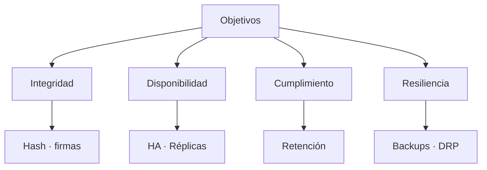

_Objetivos del almacenamiento seguro y controles asociados._

El almacenamiento de la información constituye una de las funciones críticas en la gestión de datos. No se trata únicamente de guardar archivos en un soporte físico o en la nube, sino de garantizar que los datos permanezcan íntegros, disponibles y protegidos frente a pérdidas accidentales, accesos no autorizados o desastres imprevistos.

Objetivos clave:

- Preservar la integridad: que la información no sea alterada sin autorización.
- Asegurar la disponibilidad: acceso a los datos cuando se requieran, evitando caídas o bloqueos.
- Cumplimiento normativo: conservar información durante períodos determinados (p. ej., documentación contable en España durante 6 años).
- Resiliencia: capacidad de recuperar la información tras fallos técnicos, ataques o catástrofes.

Conceptos clave: **integridad**, **disponibilidad**, **cumplimiento**, **resiliencia**.

Caso real: tras un incendio en una oficina, una pyme restauró sus sistemas en 24 horas gracias a copias off-site y un plan de continuidad probado.

### 3.1. Copias de seguridad

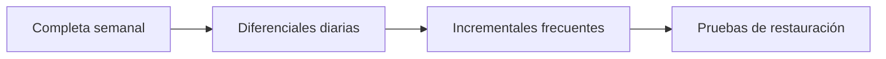

_Combinación de tipos de copia y validación periódica._

Las copias de seguridad (backups) son la herramienta más efectiva para garantizar la continuidad del negocio y la recuperación de la información tras un incidente. Representan la última línea de defensa frente a ataques como el ransomware o a fallos de hardware.

#### Copia completa

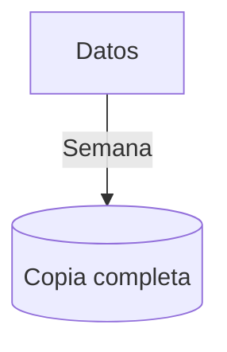

_Copia íntegra periódica de todos los datos._

- Réplica íntegra de todos los datos seleccionados.
- Ventajas: recuperación rápida y sencilla.
- Desventajas: mayor tiempo y espacio de almacenamiento.
- Ejemplo: copia semanal de toda la base de datos de una empresa.

Conceptos clave: **backup completo**, **RTO**, **espacio de almacenamiento**.

Caso real: un despacho legal recuperó rápidamente expedientes tras un ransomware gracias a su copia completa más reciente.

#### Copia incremental

```mermaid
graph TD
  Cambios -->|Tras última copia| Incremental[(Incremental)]
```

_Solo cambios desde la copia previa (completa o incremental)._

- Solo almacena los cambios desde la última copia (completa o incremental).
- Ventajas: ahorro de espacio y tiempo.
- Desventajas: restauración más compleja (depende de varias copias encadenadas).

Conceptos clave: **backup incremental**, **ventana de copia**, **cadena de restauración**.

Caso real: un e-commerce minimizó el tiempo de copia diaria usando incrementales, asumiendo una restauración algo más lenta pero suficiente para su RTO.

#### Copia diferencial

```mermaid
graph TD
  Cambios -->|Desde última completa| Diferencial[(Diferencial)]
```

_Todos los cambios desde la última completa._

- Guarda todos los cambios desde la última copia completa.
- Ventajas: equilibrio entre rapidez y espacio.
- Desventajas: requiere más almacenamiento que la incremental.

Conceptos clave: **backup diferencial**, **equilibrio espacio/tiempo**, **restauración**.

Caso real: una startup combinó copia completa semanal con diferenciales diarios para equilibrar almacenamiento y rapidez de recuperación.

#### Estrategia 3-2-1

```mermaid
graph TD
  D[(Datos)] --> C1[Copia 1 (local)]
  D --> C2[Copia 2 (otro soporte)]
  D --> C3[Copia 3 (off-site/inmutable)]
```

_Estrategia 3-2-1: 3 copias, 2 soportes, 1 externa/inmutable._

- 3 copias de los datos importantes.
- 2 soportes diferentes (por ejemplo, disco local y almacenamiento en la nube).
- 1 copia en una ubicación externa (off-site).

#### Pruebas periódicas

```mermaid
sequenceDiagram
  participant Op as Operaciones
  participant B as Backup
  participant Sys as Sistema
  Op->>B: Solicita restauración de muestra
  B->>Sys: Restaura conjunto
  Sys->>Op: Valida integridad y tiempos (RTO/RPO)
```

_Pruebas periódicas de restauración para validar RTO/RPO._

Práctica recomendada: realizar pruebas de restauración periódicas para validar integridad y tiempos de recuperación (RTO).

Conceptos clave: **3-2-1**, **off-site**, **inmutabilidad**, **pruebas de restauración**.

Caso real: una empresa descubrió que su proveedor de backup no guardaba metadatos críticos al ejecutar un simulacro; ajustó la configuración antes de sufrir un incidente real.

### 3.2. Borrado seguro de la información

```mermaid
graph TD
  Fin[Fin de retención] --> Metodo{Soporte}
  Metodo -->|HDD| SOB[Sobrescritura]
  Metodo -->|Magnético| DEG[Degaussing]
  Metodo -->|Alta sensibilidad| DES[Destrucción física]
```

_Selección de método de borrado según soporte y sensibilidad._

Borrar un archivo no implica eliminarlo definitivamente: normalmente desaparece la referencia del sistema, pero los datos siguen en el soporte hasta que se sobrescriben.

Conceptos clave: **borrado lógico**, **recuperación forense**, **ciclo de vida**.

Caso real: equipos subastados por una organización conservaban archivos borrados recuperables; tras el hallazgo, adoptaron políticas de borrado seguro certificadas.

#### 3.2.1. Métodos de borrado seguro

```mermaid
graph LR
  SOB[Sobrescritura] --> REU[Reutilización del soporte]
  DEG[Degaussing] --> RET[Retirada del soporte]
  DES[Destrucción física] --> ELI[Eliminación definitiva]


_Efecto esperado de cada método de sanitización._

##### Sobrescritura

```mermaid
sequenceDiagram
  participant Tool as Herramienta
  participant Disk as Disco
  Tool->>Disk: Pasa 1 (aleatorio)
  Tool->>Disk: Pasa 2 (0x00)
  Tool->>Disk: Pasa 3 (0xFF)
  Note right of Disk: Verificación de escritura
```

_Proceso de sobrescritura con múltiples pasadas y verificación._

- Reescritura de los sectores con patrones aleatorios o específicos (varias pasadas incrementan la dificultad de recuperación forense).

##### Degradación magnética (degaussing)

```mermaid
graph TD
  Campo[Campo magnético intenso] --> HDD[HDD/Cintas]
  HDD --> Inutil[Inutilización del soporte]
```

_Degradación magnética de soportes magnéticos._

- Aplicación de un campo magnético intenso que inutiliza soportes magnéticos (HDD, cintas). Destruye el soporte.

##### Destrucción física

```mermaid
graph TD
  Soporte --> Trituracion[Trituración]
  Soporte --> Pulverizacion[Pulverización]
  Soporte --> Incineracion[Incineración]
```

_Destrucción física para información altamente sensible._

- Trituración, pulverización o incineración. Método definitivo para información altamente sensible.

Conceptos clave: **sobrescritura**, **degaussing**, **destrucción física**.

Caso real: una administración destruyó físicamente discos con información clasificada al finalizar su vida útil para impedir cualquier recuperación.

#### 3.2.2. Importancia del borrado seguro

```mermaid
graph LR
  Fuga[Fuga por reciclaje] --> Sancion[Sanciones RGPD]
  Sancion --> Mejora[Política de borrado certificado]
```

_Riesgos por borrado inadecuado y mitigaciones._

- Prevención de fugas: muchos incidentes surgen al vender o reciclar equipos sin borrado adecuado.
- Cumplimiento normativo: el RGPD exige la supresión efectiva de datos personales cuando dejan de ser necesarios.
- Optimización de recursos: libera espacio sin comprometer la seguridad.

Conceptos clave: **prevención de fugas**, **cumplimiento RGPD**, **retención y borrado**.

Caso real: una cadena minorista fue multada tras vender TPVs con datos de clientes; la posterior implantación de borrado certificado evitó recurrencias.

#### Tabla comparativa — Sección 3

| Tipo de copia | Qué guarda | Ventajas | Desventajas | Uso típico |
|---|---|---|---|---|
| Completa | Todo el conjunto | Restauración rápida | Tiempo/espacio elevados | Hitos semanales |
| Incremental | Cambios desde última copia (cualquiera) | Copias rápidas, poco espacio | Restauración encadenada | Diaria/frecuente |
| Diferencial | Cambios desde última completa | Equilibrio copia/restauración | Más espacio que incremental | Diaria junto a semanal completa |

| Método de borrado | Soporte principal | Reversibilidad | Coste | Uso recomendado |
|---|---|---|---|---|
| Sobrescritura | HDD/SSD (según fabricante) | Baja si varias pasadas | Bajo/medio | Activos reutilizables |
| Degaussing | Magnéticos (HDD, cintas) | Irreversible | Medio | Retirada de soportes magnéticos |
| Destrucción física | Cualquier soporte | Irreversible | Medio/alto | Información altamente sensible |

#### Ejemplos reales — Sección 3

- Simulacro de DR reveló que faltaban claves API en backups; se ajustó alcance y verificación.
- Copias en la misma oficina quedaron inutilizadas tras inundación; se adoptó 3-2-1 con off-site.
- SSD retirados sin sanitización contenían credenciales; se pasó a destrucción certificada.

#### Resumen de la sección 3

- Las copias son la última línea ante fallos y ransomware; probar la restauración es crítico.
- Combinar completa + incremental/diferencial optimiza RTO/RPO y costos.
- El borrado seguro previene fugas al final del ciclo de vida del soporte.
- La estrategia 3-2-1 y la inmutabilidad elevan la resiliencia.

---

## 4. Principales amenazas a la información

### 4.1. Panorama actual

```mermaid
flowchart TD
  VOL[Mayor volumen de ataques] --> RIES[Mayor riesgo]
  SOF[Más sofisticación de ataques] --> RIES
  IMP[Impacto económico y reputacional] --> DEC[Más inversión en seguridad]

```

_Factores del panorama actual de amenazas._

- Mayor volumen: cada minuto se registran millones de intentos de intrusión.
- Más sofisticación: uso de IA, ingeniería social avanzada y malware polimórfico.
- Impacto económico: el coste global del cibercrimen podría superar los 10,5 billones de dólares anuales en 2025 (Cybersecurity Ventures, 2023).
- Impacto reputacional: una brecha puede destruir la confianza en horas.

Conceptos clave: **ransomware**, **ingeniería social**, **IA en ataques**, **coste del cibercrimen**.

Caso real: múltiples hospitales europeos reportaron en 2020-2022 interrupciones por ransomware, acelerando inversiones en ciberseguridad sanitaria.

### 4.2. Objetivos de los atacantes

```mermaid
flowchart TD
  Att[Atacante] --> Robo[Robo de informacion]
  Att --> Ext[Extorsion ransomware]
  Att --> DD[DDoS]
  Att --> Supl[Suplantacion]
```

_Objetivos frecuentes de los atacantes._

- Robo de información: datos financieros, credenciales, secretos industriales.
- Extorsión económica: ransomware que bloquea sistemas hasta el pago de un rescate.
- Interrupción de servicios: DDoS.
- Suplantación de identidad: fraudes con identidades digitales.

Ejemplo real: en 2021, el ataque de ransomware a Colonial Pipeline paralizó un oleoducto clave en EE. UU. y motivó un pago de 4,4 millones de dólares.

Conceptos clave: **robo de información**, **extorsión**, **DDoS**, **suplantación de identidad**.

Caso real: un banco sufrió un DDoS que dejó inoperativa su web durante horas; la entidad desplegó mitigación y redundancia para evitar nuevos impactos.

### 4.3. Phishing

```mermaid
sequenceDiagram
  participant A as Atacante
  participant U as Usuario
  participant S as Servicio legítimo
  A->>U: Email/SMS/llamada señuelo
  U->>A: Credenciales/OTP
  A->>S: Intenta acceso
  S->>A: Bloqueo si MFA resistente
```

_Flujo típico de phishing y mitigación con MFA resistente._

El phishing consiste en suplantar identidad para engañar al usuario y obtener información confidencial.

Tipos de phishing:

- Email phishing: correos que simulan ser de bancos o servicios.
- Smishing: a través de SMS.
- Vishing: mediante llamadas telefónicas.
- Spear phishing: ataques dirigidos con mensajes personalizados.

Señales de alerta:

- Mensajes con urgencia o amenazas.
- Errores gramaticales o traducciones pobres.
- Remitentes sospechosos o dominios que no son oficiales.
- Enlaces acortados o con direcciones poco claras.

Prevención:

- Verificar siempre la procedencia.
- No hacer clic en enlaces sospechosos.
- Usar autenticación multifactor para mitigar el impacto aunque se filtren credenciales.

Ejemplo real: en 2020, spear phishing contra empleados de Twitter permitió tomar el control de cuentas verificadas para fraudes con criptomonedas.

Conceptos clave: **phishing**, **smishing**, **vishing**, **spear phishing**, **señales de alerta**.

Caso real: una pyme evitó pérdidas cuando un empleado detectó un dominio falso (typosquatting) en un correo de “proveedor” y reportó el intento.

### 4.4. Malware

```mermaid
graph LR
  Malware --> Virus
  Malware --> Ransomware
  Malware --> Spyware
  Malware --> Troyanos
  Malware --> Gusanos
```

_Principales tipos de malware._

El término malware abarca cualquier programa diseñado para infiltrarse o dañar un sistema.

#### Tipos principales

```mermaid
graph TD
  Descargas --> Infeccion[Infección]
  Adjuntos --> Infeccion
  WebComp[Web comprometida] --> Infeccion
  Infeccion --> Deteccion[Detección y respuesta]
```

_Vectores de infección y respuesta._

- Virus: se adjuntan a archivos y se ejecutan al abrirlos.
- Ransomware: bloquea datos y exige un rescate.
- Spyware: recopila información sin consentimiento (contraseñas, hábitos).
- Troyanos: se hacen pasar por software legítimo y crean accesos ocultos.
- Gusanos: se propagan automáticamente por redes.

Vías de infección:

- Descargas desde sitios no seguros.
- Archivos adjuntos en correos fraudulentos.
- Páginas web comprometidas o anuncios maliciosos.

Medidas de protección:

- Antivirus actualizados.
- Políticas de navegación segura.
- Concienciación sobre los riesgos de abrir archivos o enlaces sospechosos.

Ejemplo real: en 2017, el ransomware WannaCry afectó a más de 200.000 equipos en 150 países, paralizando servicios como el NHS británico.

Conceptos clave: **virus**, **ransomware**, **spyware**, **troyanos**, **gusanos**, **medidas de protección**.

Caso real: una administración pública contuvo un brote de malware gracias a listas blancas de ejecución y segmentación de red, limitando la propagación.

#### Tabla comparativa — Sección 4

| Amenaza | Vector típico | Señales de alerta | Impacto probable | Medidas de mitigación |
|---|---|---|---|---|
| Phishing | Email/SMS/llamada | Urgencia, dominios extraños, adjuntos | Robo de credenciales, fraude | Concienciación, MFA, filtros |
| Ransomware | Adjuntos, RDP expuesto, exploits | Archivos cifrados, notas de rescate | Paralización operativa | Segmentación, parches, backups |
| DDoS | Botnets hacia servicios | Latencia alta, caídas | Indisponibilidad | CDN, WAF, mitigación DDoS |
| Spyware/Troyanos | Software falso, cracks | Procesos sospechosos, exfiltración | Pérdida de datos | EDR, allowlisting, educación |

#### Ejemplos reales — Sección 4

- Campaña de spear phishing a directivos de empresas energéticas para robar accesos VPN.
- Ataques DDoS contra banca en línea durante eventos comerciales masivos.
- Ransomware en administración local: restauración desde backups evitó pago de rescate.

#### Resumen de la sección 4

- El panorama de amenazas combina ingeniería social y explotación técnica.
- La detección y respuesta tempranas reducen el impacto económico y reputacional.
- La MFA, segmentación, parcheo y formación son medidas transversales efectivas.
- La preparación (playbooks, simulacros) acelera la recuperación.

---

## 5. Contraseñas y autenticación

### 5.1. La importancia de las contraseñas

```mermaid
graph TD
  Len[Longitud] --> Ent[Entropía]
  Comp[Complejidad] --> Ent
  Uniq[Unicidad] --> Riesgo[Menor impacto en brechas]
  Gest[Gestor de contraseñas] --> Uniq
```

_Factores que aumentan la entropía y reducen el riesgo._

- Una **contraseña** robusta debe combinar **longitud** (preferiblemente ≥ **14** caracteres) y **complejidad** (mezcla de letras, números y símbolos) o, mejor aún, una **passphrase** formada por varias palabras aleatorias.
- La **entropía** efectiva aumenta más por la longitud que por símbolos exóticos; prioriza frases largas y únicas frente a patrones predecibles.
- Evita la **reutilización**: una filtración en un servicio expone cuentas en otros; usa un **gestor de contraseñas** para generar y almacenar claves únicas.
- Distingue entre ataques **en línea** (limitados por intentos) y **fuera de línea** (cracking de hashes); para estos últimos, la longitud es decisiva.
- Activa alertas de **credenciales expuestas** y cambia inmediatamente las afectadas; verifica si tus correos aparecen en bases públicas.

Conceptos clave: **longitud**, **complejidad**, **no reutilización**, **gestores de contraseñas**.

Caso real: una brecha expuso contraseñas reutilizadas; usuarios que repetían la misma clave en varios servicios vieron comprometidas sus cuentas en cadena.

### 5.2. Buenas prácticas en la gestión de contraseñas

```mermaid
graph LR
  MFA --> Reduccion[Reducción de accesos indebidos]
  Auditoria[Auditoría de bóveda] --> Higiene
  Listas[Bloqueo de contraseñas comunes] --> Higiene
  Higiene --> Reduccion
```

_Buenas prácticas que elevan la higiene de credenciales y reducen ataques._

- Habilita **MFA** siempre que sea posible; prioriza métodos **resistentes al phishing** (por ejemplo, **FIDO2/WebAuthn** con llaves de seguridad).
- Usa un **gestor de contraseñas** con sincronización segura, **cifrado** de bóveda y opción de **auditoría** (detección de contraseñas débiles/repetidas).
- Define políticas basadas en **riesgo**: no fuerces cambios periódicos innecesarios; sí exige cambio tras **sospecha de compromiso**.
- Bloquea **contraseñas comunes** y filtradas (listas de denegación); impón **mínimos de longitud** y evita requisitos que induzcan patrones predecibles.
- Implementa **protecciones anti-fuerza bruta**: límites de intento, **CAPTCHA** adaptativo y **listas de bloqueo** por IP anómala.
- Establece **procedimientos de recuperación** seguros: verificación de identidad, **códigos de respaldo** y revocación de factores perdidos.

Conceptos clave: **MFA**, **rotación basada en riesgo**, **phishing-resistant MFA**, **contraseñas únicas**.

Caso real: tras implementar MFA y un gestor corporativo, una empresa redujo en 90% los accesos no autorizados por credenciales filtradas.

### 5.3. Autenticación multifactor (MFA)

#### Factores de autenticación

```mermaid
graph TD
  Sabes[Algo que sabes] --> Riesgos1[Phishing · fuerza bruta]
  Tienes[Algo que tienes] --> Riesgos2[Pérdida · SIM swapping]
  Eres[Algo que eres] --> Riesgos3[Privacidad · revocación]
  FIDO2[Factor FIDO2/WebAuthn] --> Alta[Alta resistencia al phishing]
```

_Comparativa de factores y fortaleza frente a phishing._

- **Algo que sabes**: contraseña o **PIN**; vulnerable a **phishing** y **shoulder surfing**.
- **Algo que tienes**: **token hardware** (FIDO2), app **TOTP** o **push**; los SMS son más débiles por **SIM swapping**.
- **Algo que eres**: **biometría** (huella, rostro); cómodo pero con retos de **privacidad** y **revocación**.
- Recomendado: factores **resistentes al phishing** (FIDO2/WebAuthn), con **enrolamiento** controlado, **códigos de recuperación** y políticas de **revocación**.

Conceptos clave: **algo que sabes**, **algo que tienes**, **algo que eres**, **tokens FIDO2**.

Caso real: un ataque de phishing obtuvo la contraseña de un directivo, pero el uso de llave física FIDO2 bloqueó el acceso.

#### Tabla comparativa — Sección 5

| Factor | Ejemplos | Fortalezas | Debilidades |
|---|---|---|---|
| Algo que sabes | Contraseña, PIN, passphrase | Fácil de desplegar | Phishing, reutilización, fuerza bruta |
| Algo que tienes | Token FIDO2, app OTP, SMS | Resistencia a phishing (FIDO2) | Pérdida/robo del dispositivo |
| Algo que eres | Huella, rostro, voz | No se puede “olvidar” | Privacidad, spoofing, revocación |

#### Ejemplos reales — Sección 5

- Campañas de password spraying tuvieron éxito en cuentas sin MFA; se mitigó con FIDO2.
- Robo de móvil con app OTP comprometió accesos; política de revocación inmediata evitó abuso.
- Gestores de contraseñas permitieron contraseñas únicas largas sin fricción para usuarios.

#### Resumen de la sección 5

- Las contraseñas por sí solas son insuficientes; combinar con MFA es esencial.
- Factores resistentes al phishing (FIDO2) ofrecen la mayor protección práctica.
- La higiene de contraseñas (no reutilizar, longitud) y gestores reducen riesgos dramáticamente.
- Las políticas de revocación y recuperación deben estar definidas y probadas.

---

## 6. Protección del puesto de trabajo

### 6.1. Medidas de protección física

[Contenido pendiente]

```mermaid
graph TD
  Accesos[Control de accesos] --> Puertas[Cerraduras/Badges]
  Vigilancia[Vigilancia/CCTV] --> Deteccion[Detección]
  Proteccion[Protecciones físicas] --> Cables[Cableado seguro]
  Proteccion --> Pantallas[Pantallas de privacidad]
```

_Controles físicos típicos para el puesto y la sala._

Conceptos clave: **control de accesos**, **cableado seguro**, **pantallas de privacidad**, **limpieza de mesa**.

Caso real: la pérdida de un portátil sin cifrar provocó una fuga de datos; la posterior adopción de cifrado de disco completo evitó incidentes similares.

### 6.2. Medidas de protección lógica

#### Áreas principales

[Contenido pendiente]

```mermaid
graph LR
  Antimal[Antimalware] --> Defensa
  Parches[Parches] --> Defensa
  Cifrado[Cifrado de disco] --> Defensa
  Minimo[Minimo privilegio] --> Defensa
  Defensa --> Reduccion[Reducción de superficie de ataque]
```

_Capas lógicas de protección en el endpoint._

Conceptos clave: **antimalware**, **parcheo**, **cifrado**, **principio de mínimo privilegio**.

Caso real: aplicar parches críticos a tiempo hubiera evitado el aprovechamiento de una vulnerabilidad conocida (CVE) por un atacante interno.

---

## Conclusiones

La seguridad y la privacidad de la información son disciplinas dinámicas que deben adaptarse a amenazas emergentes (IA generativa, IoT masivo) y a cambios normativos. Su gestión efectiva requiere equilibrar:

1. Tecnología: cifrado, monitorización, redundancia.
2. Marco legal: cumplimiento del RGPD, CCPA y normas internacionales.
3. Cultura organizacional: concienciación y compromiso ético.

Proteger la información es un imperativo ético y social, directamente ligado a los derechos fundamentales y a la confianza en el ecosistema digital.

Referencias clave:

- ISO/IEC 27001:2022. Sistemas de Gestión de Seguridad de la Información.
- NIST Cybersecurity Framework 2.0 (2023).
- Reglamento General de Protección de Datos (UE 2016/679).
- LOPDGDD (España, 2018).
- IBM (2023). Cost of a Data Breach Report.
