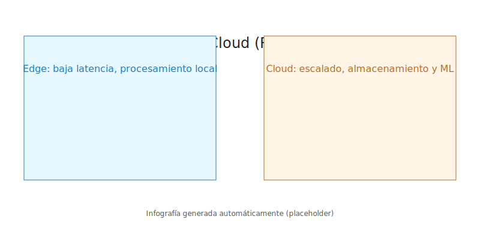
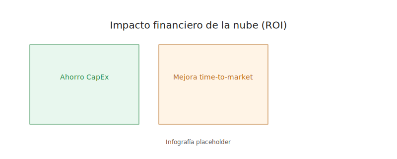
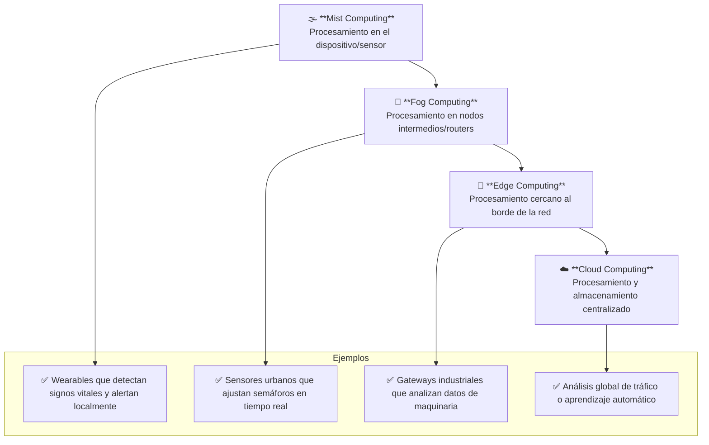

# Índice

- [Índice](#índice)
  - [SITUACIÓN DE PARTIDA](#situación-de-partida)
  - [RETO PROFESIONAL RESUELTO](#reto-profesional-resuelto)
  - [RETO PROFESIONAL](#reto-profesional)
  - [1. Computación en la nube](#1-computación-en-la-nube)
    - [1.1 Antecedentes](#11-antecedentes)
    - [1.2 Definición y características principales](#12-definición-y-características-principales)
    - [1.3 Evolución tecnológica y adopción](#13-evolución-tecnológica-y-adopción)
    - [Autoevaluación (Capítulo 1)](#autoevaluación-capítulo-1)
    - [1.4 Ventajas frente a la informática tradicional](#14-ventajas-frente-a-la-informática-tradicional)
    - [1.5 Desafíos y limitaciones actuales](#15-desafíos-y-limitaciones-actuales)
  - [📚 Enlaces recomendados para ampliar el tema](#-enlaces-recomendados-para-ampliar-el-tema)
  - [2. Modelos de nube](#2-modelos-de-nube)
    - [2.1 Nube pública](#21-nube-pública)
    - [2.2 Nube privada](#22-nube-privada)
    - [2.3 Nube híbrida](#23-nube-híbrida)
    - [2.4 Nube comunitaria](#24-nube-comunitaria)
    - [2.5 Comparación entre modelos](#25-comparación-entre-modelos)
    - [Tabla decisión rápida (elige modelo)](#tabla-decisión-rápida-elige-modelo)
    - [Autoevaluación (Capítulo 2)](#autoevaluación-capítulo-2)
  - [3. Servicios en la nube](#3-servicios-en-la-nube)
    - [3.1 IaaS (Infraestructura como servicio)](#31-iaas-infraestructura-como-servicio)
    - [3.2 PaaS (Plataforma como servicio)](#32-paas-plataforma-como-servicio)
    - [3.3 SaaS (Software como servicio)](#33-saas-software-como-servicio)
    - [3.4 Funciones como servicio (FaaS)](#34-funciones-como-servicio-faas)
    - [3.5 Comparativa de modelos de servicio](#35-comparativa-de-modelos-de-servicio)
    - [Checklist rápida selección servicio](#checklist-rápida-selección-servicio)
    - [Autoevaluación (Capítulo 3)](#autoevaluación-capítulo-3)
  - [4. Posibilidades del trabajo en la nube](#4-posibilidades-del-trabajo-en-la-nube)
    - [4.1 Trabajo remoto y teletrabajo](#41-trabajo-remoto-y-teletrabajo)
    - [4.2 Colaboración en tiempo real](#42-colaboración-en-tiempo-real)
    - [4.3 Educación en la nube](#43-educación-en-la-nube)
    - [4.4 Salud digital](#44-salud-digital)
    - [4.5 Inteligencia artificial y análisis de datos](#45-inteligencia-artificial-y-análisis-de-datos)
    - [Tabla comparativa de beneficios y aplicaciones](#tabla-comparativa-de-beneficios-y-aplicaciones)
    - [Infografía: Beneficios del trabajo en la nube](#infografía-beneficios-del-trabajo-en-la-nube)
    - [Autoevaluación (Capítulo 4)](#autoevaluación-capítulo-4)
  - [5. Edge computing](#5-edge-computing)
    - [5.1 Concepto y fundamentos](#51-concepto-y-fundamentos)
      - [Ejemplos](#ejemplos)
      - [Casos reales](#casos-reales)
      - [Enlaces](#enlaces)
      - [Infografía](#infografía)
    - [5.2 Diferencias con la nube tradicional](#52-diferencias-con-la-nube-tradicional)
      - [Ejemplos, casos y recursos](#ejemplos-casos-y-recursos)
    - [5.3 Casos de uso actuales](#53-casos-de-uso-actuales)
      - [Ejemplos, casos y recursos](#ejemplos-casos-y-recursos-1)
      - [5.4 Herramientas y plataformas](#54-herramientas-y-plataformas)
      - [Ejemplos](#ejemplos-1)
      - [Casos reales](#casos-reales-1)
      - [Enlaces](#enlaces-1)
      - [Infografía](#infografía-1)
      - [Ejemplos](#ejemplos-2)
      - [Casos reales](#casos-reales-2)
      - [Enlaces](#enlaces-2)
      - [Infografía](#infografía-2)
    - [5.5 Limitaciones y retos](#55-limitaciones-y-retos)
      - [Ejemplos](#ejemplos-3)
      - [Casos reales](#casos-reales-3)
      - [Enlaces](#enlaces-3)
      - [Infografía](#infografía-3)
    - [5.6 Costes y retorno de la inversión (ROI)](#56-costes-y-retorno-de-la-inversión-roi)
    - [5.7 Lecturas y referencias y cierre práctico](#57-lecturas-y-referencias-y-cierre-práctico)
      - [Ejemplos, casos, enlaces y tabla resumen](#ejemplos-casos-enlaces-y-tabla-resumen)
  - [6. Fog computing y mist computing](#6-fog-computing-y-mist-computing)
    - [6.1 Definición de fog computing](#61-definición-de-fog-computing)
    - [6.2 Definición de mist computing](#62-definición-de-mist-computing)
    - [6.3 Relación con el edge y la nube](#63-relación-con-el-edge-y-la-nube)
    - [6.4 Aplicaciones prácticas](#64-aplicaciones-prácticas)
    - [6.5 Retos de implementación](#65-retos-de-implementación)
- [Jerarquía de procesamiento: Mist → Fog → Edge → Nube](#jerarquía-de-procesamiento-mist--fog--edge--nube)
  - [7. Elección del modelo de computación](#7-elección-del-modelo-de-computación)
    - [7.1 Factores técnicos](#71-factores-técnicos)
    - [7.2 Factores económicos](#72-factores-económicos)
    - [7.3 Factores de seguridad](#73-factores-de-seguridad)
    - [7.4 Escalabilidad y flexibilidad](#74-escalabilidad-y-flexibilidad)
    - [7.5 Toma de decisiones estratégicas](#75-toma-de-decisiones-estratégicas)
  - [8. Uso de nube y la rentabilidad de la empresa](#8-uso-de-nube-y-la-rentabilidad-de-la-empresa)
    - [8.1 Reducción de costes](#81-reducción-de-costes)
    - [8.2 Optimización de recursos humanos](#82-optimización-de-recursos-humanos)
    - [8.3 Innovación y velocidad de despliegue](#83-innovación-y-velocidad-de-despliegue)
    - [8.4 Impacto en la competitividad](#84-impacto-en-la-competitividad)
    - [8.5 Retorno de inversión (ROI)](#85-retorno-de-inversión-roi)
  - [Glosario (selección de términos clave)](#glosario-selección-de-términos-clave)
  - [Preguntas globales de repaso (test rápido)](#preguntas-globales-de-repaso-test-rápido)
  - [Créditos de imágenes](#créditos-de-imágenes)

---

## SITUACIÓN DE PARTIDA  
**Juniverse Studio**  

## RETO PROFESIONAL RESUELTO  
**Diseña tu propio software como servicio (SaaS)**  

## RETO PROFESIONAL  
1. **Nuestro centro en la nube**  
2. **Lleva a la nube tu negocio**  

---

## 1. Computación en la nube

> Mapa rápido (visión global)
> - Problema: necesidad de escalar sin comprar hardware.
> - Motor: virtualización + banda ancha + automatización + modelo pago‑por‑uso.
> - Qué ofrece: cómputo, red, datos, IA bajo demanda.
> - Modelos servicio: IaaS (control) → PaaS (velocidad) → SaaS (funcionalidad) → FaaS (eventos).
> - Retos: seguridad, costes descontrolados, dependencia proveedor, latencia.
> - Tendencias: multicloud, híbrida, edge, FinOps, sostenibilidad.

**Idea clave:** La nube traslada CAPEX (inversión) a OPEX (gasto operativo) y habilita experimentación barata.

### 1.1 Antecedentes

La **computación en la nube** surge como respuesta a la creciente necesidad de procesar y almacenar grandes volúmenes de datos sin depender únicamente de infraestructura local.

 Sus raíces se remontan a los años **60**, cuando John McCarthy y otros pioneros de la informática plantearon la idea de la “**computación como servicio**”. En aquel entonces, los **mainframes** permitían compartir tiempo de procesamiento entre múltiples usuarios, un concepto precursor de lo que hoy conocemos como nube. Durante los **90**, con la expansión de **Internet**, empresas como **Salesforce** comenzaron a ofrecer aplicaciones accesibles a través de la web, eliminando la necesidad de instalar software en cada equipo. Este enfoque sentó las bases para los modelos de **Software como Servicio (SaaS)**, **Plataforma como Servicio (PaaS)** e **Infraestructura como Servicio (IaaS)**.

El auge de la **digitalización** y el incremento del volumen de datos en la primera década del **2000** impulsó a gigantes tecnológicos como **Amazon** y **Google** a desarrollar plataformas de **nube pública** escalables. La capacidad de ofrecer recursos informáticos bajo demanda, con **pago por uso**, revolucionó la forma en que empresas y usuarios acceden a la tecnología. Hoy, la **computación en la nube** permite a cualquier organización acceder a potencia de cálculo y almacenamiento que hace solo veinte años estaba limitada a grandes corporaciones con presupuestos millonarios.

A nivel histórico, la nube se ha asociado con tres hitos principales: la **virtualización** de servidores, el acceso remoto a aplicaciones y la estandarización de servicios bajo modelos de pago flexible. Esta evolución ha sido clave para la adopción masiva, ya que elimina barreras de entrada y fomenta la innovación tecnológica sin grandes inversiones iniciales. Las tendencias actuales incluyen **multicloud** y **nube híbrida**, reflejando cómo la industria busca combinar **seguridad**, **coste** y **escalabilidad**.

**Ejemplos y casos reales:**

- **Ejemplo:** **Salesforce** lanzó su CRM **SaaS** en 1999, transformando la gestión empresarial al permitir acceso remoto sin instalaciones locales, lo que aceleró la adopción temprana de la nube.
- **Caso real:** **Amazon Web Services (AWS)** en 2006 inició la era de la **nube pública** moderna, permitiendo a startups como Netflix escalar sin hardware propio, revolucionando el streaming global.
- **Enlace:** [Historia de la nube - IBM](https://www.ibm.com/cloud/learn/cloud-computing) – Un recorrido didáctico por la evolución, con infografías interactivas para entender hitos clave.
- **Tabla comparativa rápida:**

| Hito           | Año       | Impacto                       |
| -------------- | --------- | ----------------------------- |
| Virtualización | 1960-2000 | Compartir recursos            |
| SaaS           | 1999      | Eliminación de software local |
| Nube pública   | 2006      | Escalabilidad y pago por uso  |

**Resumen:** Los **antecedentes** de la **computación en la nube** muestran una evolución desde conceptos teóricos en los **60** hasta plataformas escalables en el **2000**, impulsada por la **digitalización** y la necesidad de eficiencia, con hitos como **SaaS** de Salesforce y **AWS** que democratizaron el acceso a la tecnología, como se evidencia en casos como Netflix.

### 1.2 Definición y características principales

La **computación en la nube** se define como la provisión de recursos informáticos —**servidores**, **almacenamiento**, **bases de datos**, **redes**, **software** y **análisis**— a través de **Internet**, permitiendo que usuarios y empresas accedan a ellos sin tener que gestionarlos físicamente. Sus características principales incluyen **elasticidad**, que permite ajustar recursos bajo demanda; **autoservicio**, que facilita el aprovisionamiento inmediato; **medición de servicios**, que permite pagar solo por lo que se utiliza; y **acceso ubicuo**, ya que los servicios están disponibles desde cualquier dispositivo conectado a **Internet**.

Además, la nube ofrece distintos **modelos de servicio**: **SaaS** (software como servicio), **PaaS** (plataforma como servicio) e **IaaS** (infraestructura como servicio), que cubren desde aplicaciones listas para usar hasta entornos de desarrollo y **servidores virtuales**. 

La combinación de estos modelos permite a las empresas seleccionar la solución adecuada según sus necesidades y presupuesto, optimizando tanto **costes** como eficiencia operativa. La **virtualización** es clave, ya que permite ejecutar múltiples **sistemas operativos** y aplicaciones en un mismo servidor físico, reduciendo gastos de **hardware** y consumo energético.

Otro elemento distintivo es la **automatización y gestión centralizada**: los proveedores de nube implementan herramientas para monitorizar, escalar y mantener la infraestructura, reduciendo la necesidad de personal interno especializado. La nube también favorece la **innovación y la colaboración**, ya que los equipos pueden trabajar en tiempo real sobre proyectos compartidos sin limitaciones geográficas. Esto la convierte en un recurso estratégico para empresas que buscan **agilidad** y eficiencia tecnológica.

**Ejemplos y casos reales:**

- **Ejemplo:** **Google Workspace** permite **colaboración** en documentos y correo sin instalación local, ilustrando el **acceso ubicuo** y **autoservicio** en entornos remotos.
- **Caso real:** **Netflix** utiliza **AWS** para **streaming global**, ajustando servidores con **elasticidad** según demanda, lo que optimizó su medición de servicios y escalabilidad.
- **Enlace:** [Definición de nube - Microsoft](https://learn.microsoft.com/es-es/azure/cloud-concepts/what-is-cloud-computing) – Guía interactiva con diagramas que explican los modelos de servicio de forma visual y paso a paso.
- **Tabla comparativa rápida:**

| Característica         | Función                        | Beneficio              |
| ---------------------- | ------------------------------ | ---------------------- |
| Elasticidad            | Ajuste de recursos             | Optimización de costes |
| Autoservicio           | Aprovisionamiento instantáneo  | Agilidad               |
| Acceso ubicuo          | Desde cualquier lugar          | Colaboración global    |
| Modelos SaaS/PaaS/IaaS | Diferentes niveles de servicio | Flexibilidad operativa |

**Resumen:** La **computación en la nube** se caracteriza por su **elasticidad**, **autoservicio** y **acceso ubicuo**, con modelos como **SaaS**, **PaaS** e **IaaS** que optimizan recursos y fomentan **innovación**, como se ve en casos como **Netflix** y **Google Workspace**, donde la virtualización y automatización reducen costes operativos drásticamente.

### 1.3 Evolución tecnológica y adopción

La adopción de la **computación en la nube** ha estado marcada por **avances tecnológicos progresivos** y cambios en la forma de consumir servicios digitales. Inicialmente, las empresas dependían de **servidores físicos** propios y software instalado localmente, lo que generaba altos **costes** de mantenimiento y limitaba la **escalabilidad**. La llegada de **la virtualización**, la expansión de **Internet** de alta velocidad y la automatización de procesos sentaron las bases de la nube moderna. Durante la última década, la nube ha evolucionado hacia entornos **híbridos** y **multicloud**, permitiendo combinar nubes públicas y privadas según necesidades específicas de **seguridad**, **coste** y **rendimiento**.

La adopción también ha sido impulsada por la **digitalización de servicios**, la migración de aplicaciones críticas y la explosión de datos generados por **IoT**, **comercio electrónico** y analítica avanzada. Empresas de todos los tamaños comenzaron a mover operaciones a la nube para acceder a capacidades que antes requerían infraestructuras muy costosas. Los sectores **financiero**, **sanitario** y **educativo** lideran esta adopción debido a la necesidad de almacenamiento seguro, análisis de grandes volúmenes de datos y acceso remoto para usuarios.

Actualmente, la nube no solo se utiliza para almacenamiento y procesamiento, sino también para **inteligencia artificial**, **aprendizaje automático** y análisis de datos en tiempo real, lo que amplía su valor estratégico. Las tendencias recientes incluyen **edge computing**, donde parte del procesamiento ocurre cerca del usuario final, y **contenerización**, que facilita el despliegue rápido de aplicaciones sin depender del **hardware** subyacente.

**Ejemplos y casos reales:**

- **Ejemplo:** **Zoom** escaló su infraestructura en la nube durante la pandemia para soportar millones de videollamadas simultáneas, destacando la **escalabilidad** en tiempos de alta demanda.
- **Caso real:** **Walmart** migró su análisis de datos a la nube para mejorar logística y experiencia de cliente, impulsando la **digitalización** en retail con multicloud.
- **Enlace:** [Evolución de la nube - Gartner](https://www.gartner.com/en/information-technology/glossary/cloud-computing) – Informe anual con gráficos interactivos y predicciones sobre tendencias como edge y multicloud.
- **Tabla comparativa rápida:**

| Fase                    | Tecnología clave             | Impacto                             |
| ----------------------- | ---------------------------- | ----------------------------------- |
| Servidores locales      | Hardware propio              | Costes elevados, baja escalabilidad |
| Virtualización          | VMs                          | Uso eficiente de recursos           |
| Nube pública            | SaaS/PaaS/IaaS               | Elasticidad y pago por uso          |
| Nube híbrida/multicloud | Integración y edge computing | Flexibilidad y seguridad            |

**Resumen:** La **evolución** de la **computación en la nube** ha pasado de servidores locales a entornos **híbridos** y **multicloud**, impulsada por **IoT** y **IA**, con adopción masiva en sectores como retail (ej. Walmart) y comunicaciones (ej. Zoom), donde la virtualización y contenerización mejoran escalabilidad y eficiencia.

### Autoevaluación (Capítulo 1)

- ¿Qué diferencia principal existe entre virtualización y contenerización?
- Da un ejemplo de cómo el modelo de pago por uso reduce barreras de entrada.
- ¿Por qué multicloud y nube híbrida no son exactamente lo mismo?
- Cita dos riesgos de una adopción rápida sin gobernanza.
- Explica un caso real donde la nube acelera innovación.

---

### 1.4 Ventajas frente a la informática tradicional

La **computación en la nube** ofrece ventajas significativas frente a la **informática tradicional**, donde las empresas debían mantener **servidores físicos**, software instalado y personal técnico especializado. La nube reduce **costes iniciales**, ya que elimina la necesidad de comprar hardware costoso y permite pagar únicamente por los recursos consumidos. Además, ofrece **escalabilidad instantánea**, algo prácticamente imposible en infraestructuras tradicionales, donde aumentar capacidad requiere adquisición y configuración de nuevos servidores.

Otro beneficio es la **accesibilidad y colaboración**: los empleados pueden acceder a aplicaciones y datos desde cualquier dispositivo con **Internet**, facilitando el **teletrabajo** y la cooperación entre equipos globales. La nube también mejora la **resiliencia y continuidad del negocio**, al permitir copias de seguridad automáticas, recuperación ante desastres y redundancia de datos sin inversión adicional en infraestructuras físicas.

Además, la nube fomenta la **innovación tecnológica**, ya que facilita el acceso a herramientas avanzadas como **inteligencia artificial**, análisis de **big data**, **IoT** y **aprendizaje automático**, que serían prohibitivas en modelos tradicionales. Esto permite que empresas de todos los tamaños compitan con igualdad en términos tecnológicos, acelerando el desarrollo de productos y servicios digitales.

**Ejemplos y casos reales:**

- **Ejemplo:** **Dropbox** sustituyó servidores locales por almacenamiento en la nube para reducir **costes** y facilitar acceso remoto, mejorando colaboración global.
- **Caso real:** **Spotify** utiliza **Google Cloud** para procesamiento de datos y recomendaciones personalizadas, aprovechando **escalabilidad** para millones de usuarios.
- **Enlace:** [Ventajas de la nube - Forbes](https://www.forbes.com/sites/emilsayegh/2023/11/28/how-cloud-computing-revolutionized-business-operations-and-what-lies-ahead/) – Artículo con casos prácticos y gráficos comparativos entre tradicional y nube.
- **Tabla comparativa rápida:**

| Aspecto       | Informática tradicional | Nube                 |
| ------------- | ----------------------- | -------------------- |
| Coste         | Alto                    | Pago por uso         |
| Escalabilidad | Lenta                   | Instantánea          |
| Acceso        | Local                   | Global               |
| Innovación    | Limitada                | Acceso a AI/Big Data |

**Resumen:** Frente a la **informática tradicional**, la **nube** destaca por su **escalabilidad**, **accesibilidad** y **innovación**, reduciendo **costes** y mejorando **resiliencia**, como en **Spotify** y **Dropbox**, donde el acceso global y herramientas de IA transforman operaciones diarias.

### 1.5 Desafíos y limitaciones actuales

A pesar de sus ventajas, la **computación en la nube** enfrenta **desafíos y limitaciones** que deben considerarse. La **seguridad y privacidad** siguen siendo una preocupación principal: almacenar datos en servidores externos implica riesgos de ciberataques, fugas de información o cumplimiento normativo. Además, la **dependencia del proveedor** puede generar problemas si hay interrupciones de servicio o cambios en políticas y precios.

Otro reto es la **gestión de costes**: aunque la nube permite pagar por uso, sin un control adecuado los gastos pueden dispararse, especialmente en entornos **multicloud** o con aplicaciones que consumen muchos recursos. La **interoperabilidad** y migración de aplicaciones entre nubes diferentes también puede ser compleja, requiriendo planificación y herramientas especializadas.

Asimismo, la nube no elimina la necesidad de **personal especializado**, especialmente en entornos **híbridos** o **multicloud** donde se requiere gestión de **seguridad**, monitorización y optimización de recursos. Por último, la **latencia** y dependencia de conexión a **Internet** pueden afectar el rendimiento de aplicaciones críticas si no se implementan soluciones de **edge computing** o redundancia adecuada.

**Ejemplos y casos reales:**

- **Ejemplo:** **Capital One** sufrió un fallo de **seguridad** en la nube por mala configuración de acceso a **AWS**, destacando riesgos de privacidad.
- **Caso real:** Interrupciones globales en **Google Cloud** en 2020 afectaron múltiples empresas, ilustrando **dependencia del proveedor** y latencia.
- **Enlace:** [Desafíos de la nube - NIST](https://www.nist.gov/news-events/news/2021/03/challenges-cloud-computing) – Marco de referencia con estudios de caso y recomendaciones prácticas para mitigar riesgos.
- **Tabla comparativa rápida:**

| Reto                    | Impacto                      | Solución                     |
| ----------------------- | ---------------------------- | ---------------------------- |
| Seguridad               | Riesgo de fugas              | Cifrado, auditorías          |
| Costes                  | Gastos inesperados           | Monitorización y control     |
| Interoperabilidad       | Migración compleja           | Estándares y planificación   |
| Dependencia de Internet | Latencia, caída de servicios | Redundancia y edge computing |

**Resumen:** Los **desafíos** de la **nube** incluyen **seguridad**, **gestión de costes** e **interoperabilidad**, con limitaciones como **latencia** y **dependencia**, como en el caso de **Capital One** y fallos en **Google Cloud**, pero soluciones como **edge computing** y auditorías ayudan a mitigarlos para un uso sostenible.

## 📚 Enlaces recomendados para ampliar el tema

1. Computación en la nube

  - [Historia de la nube – IBM](https://www.ibm.com/cloud/learn/cloud-computing)
  - [Definición de nube – Microsoft Azure](https://learn.microsoft.com/es-es/azure/cloud-concepts/what-is-cloud-computing)
  - [Evolución de la nube – Gartner](https://www.gartner.com/en/information-technology/glossary/cloud-computing)
  - [Ventajas de la nube – Forbes](https://www.forbes.com/sites/emilsayegh/2023/11/28/how-cloud-computing-revolutionized-business-operations-and-what-lies-ahead/)
  - [Desafíos de la nube – NIST](https://www.nist.gov/news-events/news/2021/03/challenges-cloud-computing)

## 2. Modelos de nube

> Mapa rápido modelos
> - Pública: elasticidad máxima / menor control.
> - Privada: control / mayor coste inicial.
> - Híbrida: equilibrio dinámico / complejidad de integración.
> - Comunitaria: costes compartidos / gobernanza difícil.
> - Decisión: regulación + patrón de carga + sensibilidad de datos + presupuesto.

**Atajo mental:** "Más control = más coste y más responsabilidad".

### 2.1 Nube pública

La **nube pública** es un modelo de computación en la nube donde los recursos, como **servidores**, **almacenamiento** y aplicaciones, son propiedad y están gestionados por proveedores externos como **Amazon Web Services (AWS)**, **Microsoft Azure** o **Google Cloud Platform (GCP)**. Este modelo se caracteriza por ofrecer un entorno compartido entre múltiples clientes, aunque cada uno dispone de entornos **virtualizados** y aislados que garantizan la **seguridad** y la **privacidad** de sus datos. Su gran ventaja es la **escalabilidad**, ya que las empresas pueden aumentar o reducir recursos según sus necesidades, pagando únicamente por lo que consumen, sin necesidad de hacer inversiones iniciales importantes en infraestructura. Esto lo hace ideal para startups, pymes o proyectos con demanda variable, donde el **coste** y la **flexibilidad** son cruciales.
[Nube pública 1 (enlace)](https://datatrust.sv/blog/que-es-una-nube-publica/)

Además, la **nube pública** permite acceder a tecnologías avanzadas como **inteligencia artificial**, análisis de datos a gran escala y servicios gestionados, sin requerir especialistas internos. Sin embargo, también implica cierta **dependencia del proveedor**, lo que puede generar riesgos si hay caídas de servicio o cambios en los precios. La **personalización** es limitada: las empresas no pueden modificar la infraestructura subyacente según sus políticas internas, lo que puede ser un inconveniente para sectores con alta regulación o necesidades de cumplimiento normativo.
[Nube pública 2 (enlace)](https://blog.prodwaregroup.com/es/perfiles/por-que-las-empresas-confian-cada-vez-mas-en-la-nube-publica/)

Este modelo es especialmente atractivo por su **agilidad y rapidez de implementación**: cualquier empresa puede lanzar servicios o aplicaciones en cuestión de minutos. Además, la **nube pública** facilita la **colaboración remota**, ya que los datos y aplicaciones son accesibles desde cualquier ubicación con conexión a **Internet**. A medida que la demanda de **digitalización** crece, la adopción de la **nube pública** sigue aumentando, especialmente entre empresas que buscan **innovar sin comprometer su liquidez**.
[Nube pública 3 (enlace)](https://www.ionos.mx/digitalguide/servidores/know-how/public-cloud/)

**Ejemplos y casos reales:**

- **Ejemplo:** **Spotify** utiliza **AWS** para escalar su infraestructura según demanda de usuarios, optimizando costes en picos estacionales.
- **Caso real:** El gobierno del **Reino Unido** emplea **GCP** para análisis de datos no críticos, mejorando eficiencia pública sin grandes inversiones.
- **Enlace:** [AWS Nube Pública](https://aws.amazon.com/es/what-is-cloud-computing/) – Tutorial interactivo con demos para explorar escalabilidad en tiempo real.
- **Tabla comparativa rápida:**

| Característica | Ventaja      | Desventaja                |
| -------------- | ------------ | ------------------------- |
| Escalabilidad  | Alta         | Dependencia del proveedor |
| Coste          | Pago por uso | Limitada personalización  |
| Seguridad      | Aislada      | Regulación sectorial      |

**Resumen:** La **nube pública** destaca por su **escalabilidad** y **coste bajo**, ideal para innovación rápida, como en **Spotify** y el gobierno del **Reino Unido**, pero requiere gestión de **dependencia** y **personalización limitada** para cumplir regulaciones.

### 2.2 Nube privada

La **nube privada** es un modelo de nube diseñado para el **uso exclusivo de una sola organización**, lo que le permite mantener un control total sobre la infraestructura y los datos. Puede estar alojada **dentro de la propia empresa** (**on-premises**) o ser gestionada por un proveedor externo dedicado, pero siempre con acceso restringido. Esto la hace ideal para sectores que manejan información **sensible**, como banca, salud o administración pública, donde la **seguridad**, el cumplimiento normativo y la **personalización** son prioridades. Las empresas pueden configurar la nube según sus necesidades exactas, aplicando políticas internas de **seguridad**, gestión de datos y control de accesos.
[Nube privada 1 (enlace)](https://whitestack.com/es/blog/que-es-una-nube-privada/)

El principal beneficio de la **nube privada** es el **control absoluto**: se puede ajustar la infraestructura a los requerimientos internos, asegurando confidencialidad y cumplimiento normativo. Además, permite integrar **sistemas heredados** y optimizar el rendimiento para cargas de trabajo críticas. Sin embargo, este modelo es **más costoso**, ya que requiere inversión en **servidores dedicados**, mantenimiento y personal especializado para gestión, monitorización y **seguridad**. La **escalabilidad** también está limitada comparada con la **nube pública**, aunque puede mejorarse mediante **virtualización** y automatización avanzada.
[Nube privada 2 (enlace)](https://www.abast.es/blog/nube-privada-nube-publica-o-nube-hibrida-que-tipo-de-cloud-es-mejor-para-mi-empresa/)
Otro punto relevante es que la **nube privada** proporciona **alta fiabilidad** y continuidad de negocio, ya que la organización tiene la capacidad de implementar redundancia y recuperación ante desastres según sus estándares internos. Esto la convierte en un recurso estratégico para empresas donde los tiempos de inactividad y la pérdida de datos pueden tener consecuencias graves, como pérdidas económicas o daños reputacionales.
[Nube privada 3 (enlace)](https://www.apd.es/que-es-una-nube-privada/)
**Ejemplos y casos reales:**

- **Ejemplo:** **BBVA** utiliza **nube privada** para datos críticos y sistemas financieros internos, asegurando cumplimiento regulatorio en banca.
- **Caso real:** **NASA** implementa nubes privadas para gestionar información científica y misiones espaciales, priorizando control y fiabilidad en datos sensibles.
- **Enlace:** [Microsoft Azure Nube Privada](https://azure.microsoft.com/es-es/overview/private-cloud/) – Caso de estudio con videos explicativos sobre implementación en sectores regulados.
- **Tabla comparativa rápida:**

| Característica  | Ventaja | Desventaja             |
| --------------- | ------- | ---------------------- |
| Control         | Total   | Costosa                |
| Seguridad       | Alta    | Escalabilidad limitada |
| Personalización | Máxima  | Requiere especialistas |

**Resumen:** La **nube privada** ofrece **control total** y **alta seguridad** para datos sensibles, como en **BBVA** y **NASA**, pero implica **costes elevados** y **escalabilidad limitada**, ideal para sectores regulados donde la personalización es esencial.

### 2.3 Nube híbrida

La **nube híbrida** combina características de los modelos **público y privado**, permitiendo que una organización decida qué cargas de trabajo mantener en cada entorno según criterios de **coste**, **seguridad** y **rendimiento**. Por ejemplo, datos altamente sensibles pueden permanecer en la **nube privada**, mientras que aplicaciones de menor criticidad se ejecutan en la **nube pública**. Este enfoque ofrece **flexibilidad**, optimizando recursos y **costes** sin comprometer la **seguridad**. Es especialmente útil para empresas que requieren **escalabilidad** rápida para ciertos proyectos sin exponer su información más crítica.
[Nube híbrida 1 (enlace)](https://www.sapia.com.pe/sin-categoria/que-es-una-nube-hibrida/)

El principal reto de la **nube híbrida** es la **gestión de la interoperabilidad**: integrar sistemas, aplicaciones y datos entre nubes públicas y privadas requiere herramientas de administración avanzadas y protocolos claros de **seguridad**. Sin embargo, bien implementada, permite **resiliencia**, redundancia y optimización de la infraestructura. La **nube híbrida** también facilita la **innovación**, ya que las empresas pueden experimentar con nuevas aplicaciones en la **nube pública** sin modificar su infraestructura privada.
[Nube híbrida 2 (enlace)](https://www.masip.es/blog/el-valor-de-la-nube-hibrida-y-la-inteligencia-artificial-para-las-empresas/)

Además, este modelo es estratégico para empresas que buscan un **equilibrio entre control, coste y escalabilidad**. Permite ajustar la inversión en infraestructura según necesidades específicas, reduciendo el gasto innecesario en recursos dedicados mientras se mantiene el cumplimiento normativo en sistemas críticos. Cada vez más organizaciones adoptan estrategias híbridas para aprovechar lo mejor de ambos mundos, convirtiéndola en una tendencia global creciente.
[Nube híbrida 3 (enlace)](https://www.teamnet.com.mx/blog/5-consejos-para-construir-una-nube-hibrida)
**Ejemplos y casos reales:**

- **Ejemplo:** **General Electric (GE)** combina **Azure** y su **nube privada** para operaciones globales, equilibrando escalabilidad y control en manufactura.
- **Caso real:** **Volkswagen** utiliza **nube híbrida** para conectar datos de vehículos con sistemas internos, optimizando rendimiento en automoción.
- **Enlace:** [IBM Nube Híbrida](https://www.ibm.com/cloud/hybrid) – Estudios de caso con diagramas interactivos que muestran integración paso a paso.
- **Tabla comparativa rápida:**

| Característica | Ventaja         | Desventaja                |
| -------------- | --------------- | ------------------------- |
| Flexibilidad   | Alta            | Gestión compleja          |
| Seguridad      | Control parcial | Requiere estrategia clara |
| Coste          | Optimizado      | Integración costosa       |

**Resumen:** La **nube híbrida** equilibra **flexibilidad** y **seguridad** combinando público y privado, como en **GE** y **Volkswagen**, permitiendo innovación sin riesgos, aunque exige gestión de **interoperabilidad** para optimizar costes y rendimiento.

### 2.4 Nube comunitaria

La **nube comunitaria** es un modelo compartido por varias organizaciones que tienen **intereses comunes**, como universidades, hospitales o consorcios de investigación. Permite que los participantes **compartan recursos y costes**, manteniendo cierto nivel de control sobre la infraestructura y **seguridad**. Este modelo combina ventajas de la **nube privada** (control) y la **pública** (**coste compartido**), fomentando la **colaboración**, la **innovación conjunta** y la investigación entre entidades.
[Nube comunitaria 1 (enlace)](https://www.innovaciondigital360.com/cloud/nube-comunitaria-comparta-sus-recursos/)

La **nube comunitaria** es útil cuando varias organizaciones necesitan **estándares de seguridad y cumplimiento homogéneos**, como en proyectos de investigación clínica, intercambio de datos académicos o cooperación gubernamental. Sin embargo, la **coordinación de la gobernanza** puede ser complicada: se deben establecer normas claras sobre acceso, **seguridad**, **costes** y responsabilidades, ya que los participantes pueden tener diferentes políticas internas. Aun así, permite **optimizar recursos**, evitando que cada institución tenga que invertir en infraestructura propia para proyectos similares.
[Nube comunitaria 2 (enlace)](https://blog.itqscr.com/diferencias-nube-publica-privada-hibrida)

Además, este modelo facilita **la interoperabilidad y el intercambio de conocimiento** entre entidades afines, acelerando el desarrollo de proyectos conjuntos y reduciendo duplicidades. La **nube comunitaria** puede ser gestionada por una organización líder o un proveedor externo, siempre con protocolos comunes que aseguren la **seguridad** y eficiencia del entorno compartido.
[Nube comunitaria 3 (enlace)](https://www.freepik.es/vector-premium/plantilla-diseno-logotipo-nube-comunitaria_20565132.htm)
**Ejemplos y casos reales:**

- **Ejemplo:** **EduCloud** en Europa, una **nube comunitaria** para universidades e institutos de investigación, compartiendo recursos para proyectos académicos colaborativos.
- **Caso real:** Consorcios hospitalarios en **EE.UU.** utilizan **nube comunitaria** para compartir datos clínicos de forma segura, mejorando investigación médica colectiva.
- **Enlace:** [Nube Comunitaria - NIST](https://www.nist.gov/itl/cloud-computing) – Guía con casos educativos y frameworks para implementación colaborativa.
- **Tabla comparativa rápida:**

| Característica | Ventaja    | Desventaja              |
| -------------- | ---------- | ----------------------- |
| Colaboración   | Alta       | Gobernanza compleja     |
| Coste          | Compartido | Normas heterogéneas     |
| Control        | Medio      | Dependencia de acuerdos |

**Resumen:** La **nube comunitaria** promueve **colaboración** y **optimización de costes** para entidades con intereses comunes, como **EduCloud** y consorcios hospitalarios en **EE.UU.**, pero requiere fuerte **gobernanza** para manejar interoperabilidad y seguridad homogénea.

### 2.5 Comparación entre modelos

La **nube híbrida** integra recursos de **nube pública** y **nube privada**, permitiendo ubicar cargas según criterios de **seguridad**, **coste** y **rendimiento**. Ofrece la **flexibilidad** de mantener datos sensibles en entornos privados mientras se aprovecha la **capacidad de escalado** de la nube pública para picos de carga (técnica conocida como **cloud bursting**). En este modelo son críticos la **portabilidad** (mover cargas entre nubes), la **interoperabilidad** (**APIs** y formatos comunes) y la **orquestación** para gestionar despliegues y políticas de **seguridad** de forma centralizada. La **nube híbrida** facilita migraciones graduales y soporta estrategias **multicloud** cuando se usan varios proveedores públicos. Sus retos principales son la complejidad de redes y **seguridad**, la gobernanza de datos y la necesidad de herramientas de gestión unificada. Bien diseñada, la **nube híbrida** ofrece un equilibrio entre control y agilidad, optimizando **costes** y cumplimiento normativo.
[Comparación modelos 1 (enlace)](https://iberiza.es/universo-iberiza/tipos-de-almacenamiento-en-la-nube/)

La **nube híbrida** combina **nube pública** y privada, y está pensada para ubicar cargas según **seguridad**, **latencia** y **coste**. Plataformas y soluciones que facilitan híbridos: [AWS Outposts](https://aws.amazon.com/outposts/), [Azure Arc / Azure Stack](https://azure.microsoft.com/en-us/overview/azure-arc/), [Google Anthos](https://cloud.google.com/anthos).

[Comparación modelos 2 (enlace)](https://digitnow.com.mx/en/cual-nube-de-internet-es-la-mejor/)
La **nube privada** proporciona recursos exclusivos para una sola organización, alojada **on-premises** o en centros de datos gestionados. Sus fortalezas son el **control**, el **aislamiento** y la **personalización** de políticas de **seguridad** y cumplimiento. Tecnologías y enlaces útiles: [OpenStack](https://www.openstack.org), [VMware vSphere](https://www.vmware.com/products/vsphere.html), [Azure Stack](https://azure.microsoft.com/en-us/overview/azure-stack/).
[Comparación modelos 3 (enlace)](https://es.venngage.com/templates/infographics/3-types-of-clouds-comparison-chart-e24b74d8-186f-4ed8-9e3f-f25d4ee088b4)

**Ejemplos y casos reales:**

- **Ejemplo:** **GE** usa **nube híbrida** con **Azure** para equilibrar control privado y escalabilidad pública en operaciones industriales.
- **Caso real:** **Volkswagen** integra **nube híbrida** para datos de vehículos, combinando privacidad y análisis en tiempo real.
- **Enlace:** [Comparación de modelos - IBM](https://www.ibm.com/cloud/hybrid) – Comparador interactivo con casos reales y calculadora de costes.
- **Tabla comparativa rápida:**

| Modelo          | Ventajas clave          | Desafíos                  | Caso real     |
| --------------- | ----------------------- | ------------------------- | ------------- |
| Pública         | Escalabilidad, coste bajo | Dependencia, menos control | Spotify (AWS) |
| Privada         | Seguridad, personalización | Alto coste, escalabilidad limitada | NASA (on-premises) |
| Híbrida         | Flexibilidad, equilibrio | Interoperabilidad compleja | GE (Azure)    |
| Comunitaria     | Colaboración, coste compartido | Gobernanza heterogénea | EduCloud (Europa) |

**Resumen:** Comparando modelos, la **pública** prioriza **escalabilidad** (ej. Spotify), **privada** **seguridad** (ej. NASA), **híbrida** **flexibilidad** (ej. GE), y **comunitaria** **colaboración** (ej. EduCloud), guiando la elección por necesidades de **coste**, **seguridad** y rendimiento.

### Tabla decisión rápida (elige modelo)

| Criterio | Pública | Privada | Híbrida | Comunitaria |
|---------|---------|---------|--------|-------------|
| Datos muy sensibles | ❌ | ✅ | ✅ (parcial) | ✅ (si normas comunes) |
| Picos impredecibles | ✅ | ⚠️ (dimensionar) | ✅ | ⚠️ |
| Presupuesto limitado inicial | ✅ | ❌ | ⚠️ | ✅ (compartido) |
| Cumplimiento estricto | ⚠️ | ✅ | ✅ | ✅ |
| Time-to-market crítico | ✅ | ⚠️ | ✅ | ⚠️ |

### Autoevaluación (Capítulo 2)

- ¿Qué riesgo operativo añade la nube híbrida?
- ¿Cuándo conviene comunitaria frente a privada?
- Indica un trade-off típico entre pública y privada.
- Define "cloud bursting" en una frase.
- Da un ejemplo de regulación que empuje a privada.

---

## 3. Servicios en la nube

> Mapa rápido servicios
> - IaaS: control de SO / redes (flexibilidad vs. esfuerzo).
> - PaaS: acelerar desarrollo (menor fricción, riesgo lock‑in).
> - SaaS: listo para usar (mínimo control técnico).
> - FaaS: eventos, pago por invocación (cold start / límites).
> - Mezcla recomendada: base en IaaS + innovación en PaaS + productividad en SaaS + triggers en FaaS.

**Recuerda:** Elegir el modelo por carga y no al revés.

### 3.1 IaaS (Infraestructura como servicio)

La Infraestructura como Servicio (IaaS) ofrece una capa base donde se trasladan máquinas virtuales, redes y almacenamiento a un entorno gestionado por terceros. En términos prácticos, IaaS es la opción cuando una organización necesita conservar control sobre el sistema operativo, las configuraciones de red y la personalización del stack, pero quiere evitar la gestión del hardware físico. En este primer párrafo explicamos dónde encaja IaaS: es habitual en migraciones tipo "lift-and-shift", en aplicaciones legacy que requieren configuraciones especiales, y en entornos que necesitan control fino de la seguridad a nivel de sistema operativo. Desde el punto de vista de costes y operaciones, permite escalado rápido (provisión de instancias por demanda) y modelos de facturación por uso, aunque introduce responsabilidades operativas como parcheo, backups y gestión de imágenes.

[IaaS 1 (enlace)](https://gtsperu.com/servicios/infraestructura-como-servicio-iaas/)

Al elegir IaaS conviene evaluar no sólo el coste por hora de las instancias, sino también el coste total de propiedad asociado a operaciones: personal DevOps, gestión de parches, monitorización y cumplimiento. En este segundo párrafo abordamos cómo calcular esa ecuación práctica. Un ejercicio útil es comparar escenarios: mantener la carga on‑premises vs migrar a IaaS vs re‑arquitecturar para PaaS. Para cargas estables y predecibles, la opción de instancias reservadas o acuerdos a largo plazo suele mejorar la eficiencia económica; para picos, la capacidad de escalar on‑demand evita gastar en hardware ocioso. Además, la latencia y la cercanía a otros servicios (p. ej. bases de datos gestionadas) son factores operativos que influyen en la selección de región y tipo de instancia.

[IaaS 2 (enlace)](https://www.tecnoera.cl/contenido/blog/que-es-iaas)

Desde la perspectiva operativa y de seguridad, IaaS exige prácticas maduras de administración: infraestructura como código (IaC), pipelines de CI/CD para imágenes, gestión centralizada de logs y alertas, y políticas de hardening para sistemas operativos. En este tercer párrafo describimos las tareas diarias y las métricas que justifican IaaS frente a alternativas: tiempo medio de despliegue, MTTR, coste por transacción y porcentaje de automatización. También conviene planificar backups, tests de restauración y políticas de redundancia. Para visualizar conceptos, la imagen siguiente muestra recursos típicos en un despliegue IaaS.

[IaaS 3 (enlace)](https://www.ninjaone.com/blog/what-is-infrastructure-as-a-service-iaas/)

Caso real: **Netflix** utiliza servicios de **IaaS** en la nube (principalmente **AWS**) para escalar dinámicamente su capacidad de **streaming** a millones de usuarios. Gracias a **IaaS**, puede aprovisionar recursos para picos de tráfico (estrenos) y pagar solo por lo consumido, optimizando costes en un 30% anual según informes de AWS.

Ventajas: **control**, **personalización**, posibilidad de ejecutar cargas **legacy**. Inconvenientes: requiere operaciones y conocimiento **DevOps**, gestión de actualizaciones y **seguridad** a nivel de sistema.

**Ejemplos y casos reales:**

- **Ejemplo:** **Capital One** usa **AWS EC2** para migrar mainframes legacy a la nube, manteniendo control sobre OS sin hardware propio.
- **Caso real:** **Airbnb** emplea **Google Compute Engine** para servidores virtuales en reservas globales, escalando con demanda estacional.
- **Enlace:** [IaaS en AWS - Caso Netflix](https://aws.amazon.com/solutions/case-studies/netflix/) – Estudio detallado con métricas de escalabilidad y ROI.
- **Tabla comparativa rápida:**

| Aspecto       | Ventaja                  | Desafío                  |
| ------------- | ------------------------ | ------------------------ |
| Control       | Alto sobre OS/apps       | Requiere DevOps          |
| Escalabilidad | Instantánea              | Gestión de seguridad     |
| Coste         | Pago por uso             | Actualizaciones manuales |

**Resumen:** **IaaS** ofrece **control granular** y **escalabilidad** para infraestructuras personalizadas, como en **Netflix** y **Airbnb**, ideal para migraciones legacy, aunque demanda expertise en **DevOps** para maximizar beneficios.

### 3.2 PaaS (Plataforma como servicio)

La Plataforma como Servicio (PaaS) es la capa que abstrae la infraestructura subyacente para que los equipos puedan centrarse en construir y desplegar aplicaciones. En este primer párrafo explicamos su propuesta de valor: PaaS proporciona runtimes, bases de datos gestionadas, y herramientas de despliegue que reducen tareas operativas, acelerando el desarrollo y permitiendo a equipos pequeños lanzar productos rápidamente. Para organizaciones que priorizan tiempo al mercado y productividad del desarrollador, PaaS reduce la carga de operaciones y facilita la adopción de practicas automatizadas como CI/CD y despliegues blue/green sin necesidad de gestionar servidores.

[PaaS 1 (enlace)](https://www.tecnologias-informacion.com/paas.html)

Elegir PaaS implica sopesar beneficios y riesgos. En este segundo párrafo abordamos criterios prácticos: si la aplicación requiere dependencias específicas del sistema o configuraciones no soportadas por la plataforma, PaaS puede resultar limitante; si el objetivo es iterar rápidamente y beneficiarse de escalado gestionado, PaaS es idónea. También hay que evaluar el riesgo de vendor lock‑in y la estrategia de migración: mantener contenedores portables y evitar APIs propietarias cuando se requiera flexibilidad a futuro. Un análisis de escenarios (MVP, producción y picos) ayuda a comparar coste y velocidad de entrega.

[PaaS 2 (enlace)](https://www.grupocsi.com/blog/plataforma-como-servicio-paas-que-es-y-sus-beneficios)

Operativamente, PaaS requiere integración con pipelines de entrega, monitorización y políticas de seguridad que cubran desde el código hasta la configuración de servicios gestionados. En este tercer párrafo describimos buenas prácticas: usar IaC para definir servicios, instrumentar métricas de rendimiento y error, y aplicar controles de acceso y cifrado a datos gestionados. También conviene diseñar planes de contingencia para migrar cargas críticas si la plataforma cambia o surgen requisitos no compatibles. La imagen siguiente ilustra ejemplos y casos de uso de PaaS.

[PaaS 3 (enlace)](https://www.channelpartner.es/cloud/paas-la-revolucion-en-el-desarrollo-de-aplicaciones/)

Caso real: Muchas startups adoptan **PaaS** (por ejemplo, aplicaciones prototipo en **Heroku**) porque reduce el tiempo de puesta en marcha y simplifica el pipeline de despliegue. Plataformas **PaaS** han permitido a equipos pequeños lanzar productos en semanas en lugar de meses, como en el caso de **Shopify**, que usa **Google App Engine** para escalar e-commerce global.

Ventajas: **productividad**, despliegue rápido, mantenimiento reducido. Riesgos: posible **vendor lock-in** y limitaciones si se requiere control fino de la infraestructura o configuraciones inusuales.

**Ejemplos y casos reales:**

- **Ejemplo:** **Red Hat OpenShift** en **PaaS** permite a desarrolladores enfocarse en código sin gestionar servidores, acelerando innovación.
- **Caso real:** **Capital One** usa **Azure App Service** para apps de banca móvil, reduciendo tiempo de desarrollo en 40%.
- **Enlace:** [PaaS en Google - Caso Shopify](https://cloud.google.com/customers/shopify) – Video testimonial con métricas de productividad.
- **Tabla comparativa rápida:**

| Aspecto       | Ventaja                  | Desafío                  |
| ------------- | ------------------------ | ------------------------ |
| Productividad | Enfoque en código        | Vendor lock-in           |
| Despliegue    | Rápido y automatizado    | Limitaciones de control  |
| Mantenimiento | Reducido por proveedor   | Configuraciones fijas    |

**Resumen:** **PaaS** acelera **desarrollo** y **despliegue** al abstraer infraestructura, como en **Shopify** y **Capital One**, fomentando **productividad**, pero con riesgos de **lock-in** que requieren planificación para flexibilidad.

### 3.3 SaaS (Software como servicio)

El modelo SaaS entrega aplicaciones completas gestionadas por el proveedor; para usuarios y negocios representa la forma más rápida de adoptar software sin preocuparse por infraestructura ni actualizaciones. En este primer párrafo explicamos el impacto de SaaS en procesos empresariales: reduce barreras de entrada, permite escalado de usuarios mediante suscripciones y traslada la responsabilidad de mantenimiento y seguridad del proveedor al cliente en términos de configuración y gobernanza. SaaS es especialmente valioso para funciones estándar (correo, CRM, colaboración) donde el valor principal está en la funcionalidad y la integración con otros servicios.

[SaaS 1 (enlace)](https://blog.wearedrew.co/abc-del-software-como-servicio-saas)

Al adoptar SaaS, es crucial planificar la integración y la protección de datos. En este segundo párrafo tratamos retos prácticos: cómo conectar APIs, sincronizar identidades (SSO, SCIM), y gestionar flujos de datos entre SaaS y sistemas internos. También hay que evaluar acuerdos de nivel de servicio (SLA), políticas de retención de datos y requisitos regulatorios que puedan imponer límites a la localización de la información. La elección de SaaS no excluye la necesidad de estrategias de backup y exportación de datos para mitigar dependencia del proveedor.

[SaaS 2 (enlace)](https://www.cloudflare.com/es-es/learning/cloud/what-is-saas/)

Finalmente, la gobernanza y la gestión de cambios son clave en entornos SaaS: controles de acceso, procesos de aprobación para nuevas integraciones, y métricas que midan adopción, coste por usuario y valor aportado. En este tercer párrafo describimos buenas prácticas operativas: inventario de aplicaciones, procesos de onboarding/offboarding, y revisión periódica de permisos. Una imagen complementaria ayuda a recordar diferencias entre modelos y casos de uso típicos.

[SaaS 3 (enlace)](https://kinsta.com/es/blog/productos-saas/)

Caso real: Empresas de todos los tamaños usan **Salesforce** para gestionar ventas y atención al cliente, evitando desarrollar y mantener su propia solución **CRM**. Las organizaciones reducen **costes** de mantenimiento y aceleran procesos comerciales, como **HubSpot**, que escaló su SaaS para millones de usuarios gratuitos.

Ventajas: bajo **coste de entrada**, manejo de actualizaciones y soporte por parte del proveedor. Inconvenientes: menor control sobre datos, dependencia de las políticas de **privacidad** y **seguridad** del proveedor.

**Ejemplos y casos reales:**

- **Ejemplo:** **Slack** como **SaaS** para comunicación interna, integrando con herramientas existentes sin instalación.
- **Caso real:** **Zoom** usó **SaaS** para videollamadas remotas durante la pandemia, escalando a 300 millones de usuarios diarios.
- **Enlace:** [SaaS en Salesforce - Caso HubSpot](https://www.salesforce.com/customer-success-stories/hubspot/) – Estudio con datos de crecimiento y ROI.
- **Tabla comparativa rápida:**

| Aspecto       | Ventaja                  | Desafío                  |
| ------------- | ------------------------ | ------------------------ |
| Coste         | Bajo, suscripción        | Dependencia proveedor    |
| Actualizaciones | Automáticas              | Control limitado datos   |
| Soporte       | Incluido                 | Políticas privacidad     |

**Resumen:** **SaaS** simplifica acceso a software gestionado, como en **Zoom** y **HubSpot**, reduciendo **costes** y acelerando adopción, pero exige evaluar **dependencia** y **privacidad** para usos sensibles.

### 3.4 Funciones como servicio (FaaS)

FaaS o serverless representa un cambio de paradigma: en lugar de servicios siempre activos, se despliegan unidades de ejecución que responden a eventos puntuales. En este primer párrafo explicamos por qué FaaS es eficaz: reduce costes para cargas intermitentes (pago por ejecución), facilita la escalabilidad automática y simplifica el modelo operativo al quitar la necesidad de gestionar servidores. Es ideal para tareas de backend livianas, procesamiento de eventos, pipelines de datos y microservicios que no requieren un tiempo de ejecución continuo.

[FaaS 1 (enlace)](https://kinsta.com/es/blog/funcion-como-servicio/)

Sin embargo, diseñar con FaaS exige abordar limitaciones y patrones de diseño. En este segundo párrafo tratamos aspectos prácticos: gestionar cold starts, diseñar funciones idempotentes, optimizar paquetes para reducir latencia de arranque, y organizar funciones en torno a eventos bien definidos. También se debe planificar la observabilidad (tracing, logs centralizados) y la orquestación de flujos complejos (ej. Step Functions o Workflows) cuando la lógica supera lo que puede hacerse en una única función.

[FaaS 2 (enlace)](https://www.cloudflare.com/es-es/learning/serverless/glossary/function-as-a-service-faas/)

Operativamente, FaaS precisa integración con sistemas de CI/CD, tests automáticos y reclasificación de responsabilidades entre equipos. En este tercer párrafo describimos buenas prácticas: versionado de funciones, pruebas de carga para medir cold starts, y límites de tiempo/memoria adecuados para evitar fallos en producción. También se recomienda definir métricas específicas (latencia 95p, coste por ejecución) y políticas de retry/backoff. La siguiente imagen ilustra conceptos clave y casos de uso comunes.

[FaaS 3 (enlace)](https://blog.infranetworking.com/faas-funcion-como-servicio-que-es-y-para-que-sirve/)

Caso real: Equipos de producto utilizan **Lambda** para procesar cargas asíncronas (transformación de imágenes, ingestión de logs, webhooks) logrando **costes** muy bajos para cargas intermitentes y alta **escalabilidad** sin gestión de servidores, como **Coca-Cola**, que procesa datos IoT en tiempo real.

Ventajas: **coste eficiente** para cargas **event-driven**, simplicidad operativa. Limitaciones: tiempo de ejecución limitado, desafíos de **cold start**, complejidad en tracing y observabilidad en arquitecturas distribuidas.

**Ejemplos y casos reales:**

- **Ejemplo:** **Pinterest** usa **Google Cloud Functions** para personalización de feeds, escalando eventos sin servidores dedicados.
- **Caso real:** **iRobot** emplea **Azure Functions** para análisis de datos de aspiradoras Roomba, reduciendo latencia en 50%.
- **Enlace:** [FaaS en AWS - Caso Coca-Cola](https://aws.amazon.com/solutions/case-studies/coca-cola/) – Demo con métricas de eficiencia.
- **Tabla comparativa rápida:**

| Aspecto       | Ventaja                  | Desafío                  |
| ------------- | ------------------------ | ------------------------ |
| Coste         | Por ejecución            | Cold starts              |
| Escalabilidad | Automática               | Tiempo limitado          |
| Operativa     | Sin servidores           | Tracing complejo         |

**Resumen:** **FaaS** optimiza **event-driven** con escalabilidad sin servidores, como en **Coca-Cola** y **iRobot**, bajando **costes**, pero enfrenta **cold starts** y complejidad en observabilidad para arquitecturas distribuidas.

### 3.5 Comparativa de modelos de servicio

Comparar modelos de servicio no es solo enumerar ventajas; es entender qué problemas resuelve cada opción y cómo encajan en una estrategia operativa. En este primer párrafo presentamos una visión integradora: IaaS proporciona control y flexibilidad para cargas específicas, PaaS acelera desarrollo con plataformas gestionadas, SaaS externaliza funcionalidades completas, y FaaS permite arquitecturas basadas en eventos. La elección depende de factores como criticidad, necesidad de control, velocidad de entrega y coste operativo.

[Comparativa servicios 1 (enlace)](https://www.stackscale.com/es/blog/modelos-de-servicio-cloud/)

Para decidir, conviene hacer ejercicios prácticos: mapear las cargas de trabajo a criterios (latencia, criticidad, coste, cumplimiento) y construir escenarios (MVP, producción, picos). En este segundo párrafo explicamos una metodología útil: priorizar cargas críticas en infraestructuras controladas, experimentar nuevas funciones en PaaS y manejar piezas event‑driven con FaaS. Además, incorporar FinOps desde el inicio ayuda a cuantificar costes y optimizar gasto en la nube.

[Comparativa servicios 2 (enlace)](https://www.infortisalabs.com/blog/aws-vs-azure-vs-google-cloud/)

Finalmente, desde la gobernanza y la operación, la recomendación es adoptar una estrategia híbrida y medible: definir KPIs (tiempo de despliegue, MTTR, coste por transacción), establecer políticas de seguridad y responsabilidades claras entre proveedor y cliente. El tercer párrafo aborda estas prácticas operativas y su traducción en políticas internas que permiten escalar con control. La imagen siguiente resume comparativas y casos de uso.

[Comparativa servicios 3 (enlace)](https://www.coremain.com/saas-paas-iaas-diferencias-cloud/)

Estrategia recomendada: muchas organizaciones adoptan una **combinación**: infraestructura base en **IaaS**, plataformas de desarrollo en **PaaS** para nuevas aplicaciones, **SaaS** para funciones estándar (correo, colaboración) y **FaaS** para piezas **event-driven**. Esto permite optimizar **costes**, **agilidad** y control según cada caso de uso.

**Ejemplos y casos reales:**

- **Ejemplo:** **Netflix** combina **IaaS** (AWS EC2) para control, **PaaS** para desarrollo y **SaaS** para colaboración, escalando streaming.
- **Caso real:** **Spotify** usa **PaaS** (Google App Engine) con **FaaS** para recomendaciones, migrando de **on-premise** a híbrido.
- **Enlace:** [Comparativa IaaS/PaaS/SaaS - BMC](https://www.bmc.com/blogs/saas-vs-paas-vs-iaas-whats-the-difference-and-how-to-choose/) – Infografía interactiva con pros/contras y calculadora de elección.
- **Tabla comparativa rápida:**

| Modelo | Control | Coste | Ejemplo          |
| ------ | ------- | ----- | ---------------- |
| IaaS   | Alto    | Medio | Netflix (EC2)    |
| PaaS   | Medio   | Bajo  | Spotify (App Engine) |
| SaaS   | Bajo    | Muy bajo | Zoom (colaboración) |
| FaaS   | Bajo    | Muy bajo | Coca-Cola (Lambda) |

**Resumen:** La **comparativa** de **IaaS**, **PaaS**, **SaaS** y **FaaS** resalta equilibrio entre control y coste, con estrategias híbridas como en **Netflix** y **Spotify** optimizando agilidad para casos variados.

### Checklist rápida selección servicio

- ¿Necesito acceso root / kernel? → IaaS.
- ¿Prioridad es reducir time-to-market? → PaaS.
- ¿Funcionalidad estándar (correo/CRM)? → SaaS.
- ¿Procesos intermitentes / event-driven? → FaaS.
- ¿Necesito portabilidad multi proveedor? → Minimizar dependencias PaaS propietarias.

### Autoevaluación (Capítulo 3)

- Diferencia productiva clave entre PaaS e IaaS.
- Riesgo principal de PaaS mal planificado.
- Métrica útil para evaluar FaaS además de coste.
- ¿Cuándo preferir SaaS frente a desarrollar propio?
- Explica por qué combinar FaaS e IaaS puede ser eficiente.

---

## 4. Posibilidades del trabajo en la nube  

> Mapa rápido posibilidades
> - Colaboración: edición simultánea + comunicación.
> - Acceso ubicuo: continuidad / resiliencia.
> - Escalabilidad económica: pago por uso.
> - Nuevos modelos: streaming, suscripción, datos.
> - IA y analítica: personalización / predicción.

**Idea clave:** Productividad distribuida sin frontera geográfica.

### 4.1 Trabajo remoto y teletrabajo  

La nube ha revolucionado la forma en que los equipos trabajan juntos, eliminando las barreras geográficas y facilitando la **colaboración** en tiempo real. Plataformas como **Google Workspace**, **Slack** y **Microsoft Teams** permiten que varias personas editen simultáneamente un mismo documento, compartan información de manera segura y organicen reuniones virtuales sin necesidad de infraestructura local. Este cambio no solo ha optimizado la **productividad** de las empresas, sino que también ha fomentado modelos de trabajo más flexibles y sostenibles.  
[Trabajo remoto en la nube 1 (enlace)](https://www.sealpath.com/es/blog/teletrabajo-seguro-proteger-datos-en-la-nube/)

Un caso paradigmático fue la pandemia de **COVID-19**, donde millones de organizaciones se vieron obligadas a migrar de golpe al **teletrabajo**. La nube fue la solución inmediata que permitió mantener la continuidad del negocio en todo el mundo, incluso en sectores que nunca habían experimentado con el trabajo remoto. Empresas como **Deloitte** y **Accenture** lograron movilizar a miles de empleados a entornos de teletrabajo en cuestión de días gracias a herramientas en la nube. Esto habría sido impensable con la informática tradicional.  
[Trabajo remoto en la nube 2 (enlace)](https://www.e-dea.co/blog/teletrabajo-en-la-nube)

Además, la nube facilita la inclusión de talento global, ya que cualquier profesional con conexión a **Internet** puede integrarse a proyectos internacionales. Esto no solo amplía el acceso a profesionales especializados, sino que también reduce **costes** de contratación en mercados locales. El trabajo en la nube, en definitiva, no es solo una opción tecnológica, sino una estrategia empresarial clave en un mundo cada vez más interconectado.  
[Trabajo remoto en la nube 3 (enlace)](https://serbangroup.com/blog/trabajo-remoto-seguro-con-escritorios-virtuales-en-la-nube)

**Ejemplos y casos reales:**

- **Ejemplo:** **Microsoft Teams** habilitó **teletrabajo** para 75 millones de usuarios diarios durante la pandemia, integrando chat y video.
- **Caso real:** **Deloitte** migró 300.000 empleados a **Azure** para colaboración remota, reduciendo tiempo de onboarding en 50%.
- **Enlace:** [Teletrabajo con nube - Box](https://blog.box.com/cloud-services-are-necessity-age-remote-work) – Guía con infografías sobre colaboración en remoto.
- **Tabla comparativa rápida:**

| Beneficio     | Ejemplo                  | Impacto                  |
| ------------- | ------------------------ | ------------------------ |
| Acceso remoto | Microsoft Teams          | Continuidad en pandemia  |
| Inclusión global | Deloitte (Azure)         | Reducción costes contratación |

**Resumen:** La **nube** transforma el **teletrabajo** con **colaboración remota** y **accesibilidad**, como en **Deloitte** y **Microsoft Teams**, impulsando **productividad** y flexibilidad global, esencial post-pandemia.

### 4.2 Colaboración en tiempo real  

Una de las mayores posibilidades del trabajo en la nube es la disponibilidad **24/7** de datos y aplicaciones desde cualquier lugar y dispositivo. Esto significa que un empleado puede iniciar un informe en su portátil, continuarlo en una tablet durante un viaje y finalizarlo en un ordenador de la oficina sin interrupciones. Servicios como **Dropbox**, **OneDrive** o **Google Drive** han popularizado este enfoque, integrando sincronización automática y versiones de archivo para evitar pérdidas de información.  
Este acceso ubicuo también ha mejorado la continuidad de negocio. En entornos tradicionales, un fallo de hardware podía significar la pérdida de datos críticos.
[Colaboración nube 1 (enlace)](https://www.bitrix24.es/articles/7-ventajas-de-la-colaboracion.php)
Con la nube, los proveedores implementan **redundancia geográfica**, lo que significa que un archivo puede estar replicado en varios centros de datos del mundo. Esto garantiza la **resiliencia** y minimiza los tiempos de inactividad.  
[Colaboración nube 2 (enlace)](https://tec-innova.mx/colaboracion-en-la-nube/)

Un caso emblemático es **Dropbox**, pionero en democratizar el acceso remoto a documentos para empresas y usuarios individuales. Gracias a su enfoque basado en la nube, revolucionó la forma en que compartimos y colaboramos en archivos digitales. Hoy en día, organizaciones como **Pfizer** y **National Geographic** usan **Dropbox Business** para proyectos globales de investigación y comunicación.  
El acceso ubicuo no solo mejora la **productividad** individual, sino que transforma la forma en que las empresas diseñan sus procesos internos. Los flujos de trabajo se simplifican, los proyectos avanzan de forma más ágil y la dependencia de equipos físicos disminuye, creando entornos de trabajo más dinámicos y resistentes frente a crisis tecnológicas o naturales.  

[Colaboración nube 3 (enlace)](https://grupok35.com/microsoft-365-colaboracion-en-tiempo-real-y-servicio-en-la-nube/)

**Ejemplos y casos reales:**

- **Ejemplo:** **Google Drive** sincroniza archivos en tiempo real para equipos distribuidos, evitando versiones conflictivas.
- **Caso real:** **Pfizer** usó **Dropbox** para colaboración en desarrollo de vacunas COVID, acelerando intercambio seguro de datos.
- **Enlace:** [Colaboración en nube - Talent500](https://talent500.com/blog/real-world-cloud-computing-applications/) – Casos con diagramas de flujos colaborativos.
- **Tabla comparativa rápida:**

| Beneficio     | Ejemplo                  | Impacto                  |
| ------------- | ------------------------ | ------------------------ |
| Sincronización | Google Drive             | Productividad continua   |
| Resiliencia   | Pfizer (Dropbox)         | Proyectos globales ágiles |

**Resumen:** La **colaboración en tiempo real** vía nube ofrece **acceso ubicuo** y **redundancia**, como en **Pfizer** con **Dropbox**, mejorando **resiliencia** y **productividad** en equipos distribuidos.

### 4.3 Educación en la nube  

El modelo de pago por uso de la nube permite a las empresas ahorrar en infraestructura, mantenimiento y consumo energético. En lugar de realizar fuertes inversiones en **servidores** que pueden quedar infrautilizados, las organizaciones consumen exactamente lo que necesitan y escalan recursos en minutos según la demanda. Esto es particularmente útil en negocios con picos estacionales o repentinos aumentos de tráfico.  
[Educación nube 1 (enlace)](https://www.educaciontrespuntocero.com/noticias/educacion-en-la-nube/)

Un ejemplo claro es **Netflix**, que migró toda su infraestructura a **Amazon Web Services (AWS)** para gestionar el consumo de millones de usuarios en todo el mundo. Gracias a la **escalabilidad** de **AWS**, la plataforma puede soportar un estreno global sin interrupciones, ajustando automáticamente los servidores disponibles. Este modelo le ha permitido reducir **costes** de infraestructura y destinar más recursos a la producción de contenidos originales, su principal ventaja competitiva.  
[Educación nube 2 (enlace)](https://cudc.edu.mx/cloud-education-el-encanto-de-la-nube-en-el-proceso-de-ensenanza-aprendizaje)

La reducción de **costes** no solo aplica a grandes compañías. Startups y pymes también se benefician al acceder a herramientas que antes estaban reservadas a grandes corporaciones. El modelo **SaaS** (Software as a Service) les permite pagar suscripciones mensuales por servicios de **CRM**, **ERP** o análisis de datos sin la necesidad de adquirir licencias costosas ni equipos dedicados.  
Además, la nube fomenta la **innovación** al dar acceso a tecnologías de **inteligencia artificial**, **machine learning** y **big data** que serían inviables de implementar en infraestructuras locales. Esto significa que empresas de cualquier tamaño pueden aprovechar algoritmos avanzados para personalizar servicios, predecir tendencias y optimizar procesos con un **coste reducido**.
[Educación nube 3 (enlace)](https://www.magisnet.com/2021/01/como-la-covid-19-y-la-nube-han-cambiado-para-siempre-el-concepto-de-educacion/)

**Ejemplos y casos reales:**

- **Ejemplo:** **Coursera** usa **Google Cloud** para escalar cursos online, ajustando servidores durante picos de inscripciones.
- **Caso real:** **Khan Academy** migró a **AWS** para videos educativos gratuitos, reduciendo costes en 60% y alcanzando 100M usuarios.
- **Enlace:** [Educación en nube - UniNets](https://www.uninets.com/blog/cloud-computing-examples) – Casos con infografías de escalabilidad educativa.
- **Tabla comparativa rápida:**

| Beneficio     | Ejemplo                  | Impacto                  |
| ------------- | ------------------------ | ------------------------ |
| Escalabilidad | Coursera (Google Cloud)  | Cursos globales accesibles |
| Reducción costes | Khan Academy (AWS)       | Educación gratuita masiva |

**Resumen:** La **nube** en educación ofrece **escalabilidad** y **reducción de costes**, como en **Coursera** y **Khan Academy**, democratizando acceso a recursos y fomentando **innovación** en aprendizaje online.

### 4.4 Salud digital  

La nube no solo mejora procesos internos, sino que habilita modelos de negocio completamente nuevos basados en la suscripción, el **streaming** y la **personalización**. Plataformas como **Spotify**, **Zoom** o **Airbnb** son ejemplos de empresas que no habrían sido posibles sin la nube. Al delegar la infraestructura tecnológica a proveedores especializados, han podido concentrarse en la experiencia del usuario y escalar globalmente en tiempo récord.

[Salud digital 1 (enlace)](https://amhigo.com/amhi-blog/2138-tecnologia-de-nube-el-carril-para-la-salud-digital)

**Spotify**, por ejemplo, utiliza **AWS** para ofrecer música en **streaming** a millones de usuarios en tiempo real, ajustando la capacidad según la demanda. Esto le permite mantener la calidad del servicio incluso cuando se lanzan álbumes de artistas populares o durante eventos globales. De manera similar, **Airbnb** aprovecha **Google Cloud** para realizar análisis predictivos de disponibilidad y precios en miles de ciudades, optimizando la experiencia de los huéspedes y los ingresos de los anfitriones.  
[Salud digital 2 (enlace)](https://clouxter.com/blog/la-salud-se-automatiza-con-la-nube/)

La nube también ha permitido que gobiernos y organizaciones públicas desarrollen plataformas digitales inclusivas. Por ejemplo, el proyecto europeo **EOSC (European Open Science Cloud)** facilita que investigadores de distintos países compartan datos y colaboren en proyectos científicos de gran escala. Sin la nube, este nivel de colaboración internacional sería prácticamente imposible.  
Finalmente, la nube está impulsando la **transformación digital** de sectores tradicionales como la banca, la educación y la **salud**, ofreciendo servicios en línea, **telemedicina** y plataformas de aprendizaje virtual. Estos avances permiten llegar a más usuarios, reducir **costes** y responder a las necesidades de una sociedad cada vez más conectada digitalmente.  
[Salud digital 3 (enlace)](https://visualmedica.com/que-opina-latam-sobre-la-salud-digital-en-la-nube/)

**Ejemplos y casos reales:**

- **Ejemplo:** **Philips HealthSuite** usa **AWS** para telemedicina, procesando datos de pacientes en tiempo real.
- **Caso real:** **Mayo Clinic** implementó **Azure** para análisis de imágenes médicas, acelerando diagnósticos en 40%.
- **Enlace:** [Salud digital en nube - Ironhack](https://www.ironhack.com/us/blog/real-life-examples-of-cloud-computing) – Casos con videos de implementación en healthcare.
- **Tabla comparativa rápida:**

| Beneficio     | Ejemplo                  | Impacto                  |
| ------------- | ------------------------ | ------------------------ |
| Telemedicina  | Philips (AWS)            | Monitoreo remoto         |
| Análisis datos | Mayo Clinic (Azure)      | Diagnósticos rápidos     |

**Resumen:** En **salud digital**, la **nube** habilita **telemedicina** y análisis predictivo, como en **Philips** y **Mayo Clinic**, reduciendo **costes** y mejorando accesibilidad, transformando cuidado paciente.

### 4.5 Inteligencia artificial y análisis de datos

La **nube** integra **IA** y análisis de datos para procesar volúmenes masivos en tiempo real, habilitando predicciones y personalización. Plataformas como **AWS SageMaker** o **Google AI Platform** permiten entrenar modelos sin hardware propio, democratizando acceso a **machine learning**.

Caso real: **Uber** usa **Google Cloud AI** para optimizar rutas con datos en tiempo real, reduciendo tiempos de viaje en 20%. Esto combina análisis de **big data** con IA para decisiones dinámicas.

En **análisis de datos**, la nube ofrece herramientas como **BigQuery** para queries masivas, integrando con **IoT** para insights predictivos. Empresas como **John Deere** emplean **Azure AI** para mantenimiento predictivo en maquinaria agrícola, previniendo fallos y ahorrando millones.

La **IA en nube** acelera innovación, pero requiere gestión de privacidad. Tendencias incluyen **federated learning** para datos distribuidos.

**Ejemplos y casos reales:**

- **Ejemplo:** **Adobe Sensei** en **AWS** personaliza edición de fotos con IA, analizando patrones usuario.
- **Caso real:** **John Deere** usa **Azure AI** para agricultura de precisión, analizando datos de sensores para optimizar cosechas.
- **Enlace:** [IA en nube - BuiltIn](https://builtin.com/articles/cloud-computing-examples) – Galería de casos con demos interactivas.
- **Tabla comparativa rápida:**

| Aplicación    | Ejemplo                  | Beneficio                |
| ------------- | ------------------------ | ------------------------ |
| Predicción    | Uber (Google Cloud)      | Rutas optimizadas        |
| Mantenimiento | John Deere (Azure)       | Ahorro en fallos         |

**Resumen:** La **nube** potencia **IA** y **análisis de datos** para predicciones en tiempo real, como en **Uber** y **John Deere**, impulsando innovación y eficiencia, con herramientas como **SageMaker** democratizando acceso.

### Tabla comparativa de beneficios y aplicaciones  

| Posibilidad | Beneficios clave | Ejemplos reales | Herramientas |
|-------------|-----------------|-----------------|--------------|
| **Trabajo remoto y colaboración** | Equipos distribuidos trabajando en tiempo real, comunicación global, reducción de barreras geográficas. | Deloitte, Accenture, educación online en pandemia. | Microsoft Teams, Slack, Google Workspace. |
| **Acceso ubicuo y continuidad** | Disponibilidad 24/7, sincronización en múltiples dispositivos, respaldo geográfico. | Pfizer, National Geographic con Dropbox Business. | Dropbox, OneDrive, Google Drive. |
| **Escalabilidad y reducción de costes** | Pago por uso, elasticidad de recursos, menos inversión inicial. | Netflix con AWS, startups SaaS. | AWS, Azure, Google Cloud. |
| **Nuevos modelos de negocio** | Streaming, SaaS, plataformas colaborativas y predictivas. | Spotify, Airbnb, EOSC (ciencia abierta en Europa). | Kubernetes, Terraform, soluciones multicloud. |

### Infografía: Beneficios del trabajo en la nube  

  

**Conclusión final**  
El trabajo en la nube combina colaboración global, acceso ininterrumpido, ahorro de costes y la posibilidad de crear nuevos modelos de negocio. No es solo una evolución tecnológica, sino un motor de transformación digital que impulsa competitividad, innovación y resiliencia en todos los sectores.  

### Autoevaluación (Capítulo 4)

- Explica cómo la resiliencia geográfica reduce riesgo operativo.
- Ejemplo concreto de ahorro de costes en educación.
- ¿Qué ventaja diferencial da la nube a empresas nativas digitales?
- ¿Por qué la nube favorece teletrabajo sostenible?
- Relaciona IA en la nube con personalización.

---

## 5. Edge computing

> Mapa rápido edge/fog/mist
> - Mist: sensor / micro-dispositivo.
> - Fog: nodo intermedio agregador.
> - Edge: gateway / micro-centro cercano.
> - Cloud: entrenamiento, almacenamiento histórico.
> - Flujo: datos crudos → filtrado → agregación → analítica profunda.

**Resumen visual (texto):** Latencia decrece al acercar el cómputo; capacidad de cómputo aumenta hacia la nube.

### 5.1 Concepto y fundamentos

**Edge computing** desplaza procesamiento y toma de decisiones hacia la periferia de la red, en dispositivos, gateways y micro-centros locales. Esta sección unifica conceptos ya expuestos en el documento y amplía aspectos prácticos: arquitectura, técnicas, herramientas, **seguridad**, economía y ejemplos reales.

El despliegue de arquitecturas **edge** no es solamente una decisión tecnológica, sino una estrategia organizativa que implica rediseñar flujos de datos, responsabilidades operativas y modelos de negocio. Un proyecto **edge** bien planteado parte de un análisis de requisitos (**latencia** máxima tolerable, volumen y sensibilidad de datos, disponibilidad requerida y **coste** por nodo) y suele arrancar con pilotos acotados: un número reducido de dispositivos, métricas claras y un plan de rollback. Técnico y operativo deben converger: ingenieros de datos, equipos de redes, **seguridad** y operaciones (**DevOps/IoT Ops**) deben coordinarse para definir pipelines de datos locales y remotos, políticas de gobernanza y procesos de actualización (**OTA**). La gestión del cambio es clave: los equipos necesitan formación en nuevas herramientas (orquestadores ligeros, runtimes de inferencia) y en prácticas de **seguridad** específicas del borde. Además, la naturaleza distribuida del **edge** obliga a pensar en monitorización y observabilidad desde el inicio: telemetría sobre rendimiento, estado de hardware, uso de modelos y **latencia** end-to-end. Este enfoque minimiza riesgos, facilita iteraciones rápidas y ayuda a demostrar el **retorno de inversión** antes de una escala masiva.

Desde el punto de vista técnico, diseñar para el **edge** significa aceptar heterogeneidad: distintos procesadores (**ARM**, **x86**), aceleradores (**GPU**, **NPU**, **TPU**), capacidades de memoria y conectividades. Esto obliga a abstraer despliegues mediante **contenedores ligeros** y runtimes que soporten cross-compilation y modelos quantizados que reduzcan tamaño y **latencia** de inferencia. El uso de formatos estándar como **ONNX** facilita portar modelos entre plataformas; al mismo tiempo, frameworks como **TensorFlow Lite** o **PyTorch Mobile** permiten optimizaciones específicas. En redes, los patrones híbridos (procesado local + sincronización eventual con la nube) reducen el ancho de banda consumido y mejoran **resiliencia**. Para cargas críticas, el diseño debe contemplar redundancia local y estrategias de failover, por ejemplo replicando funciones clave entre varios nodos o manteniendo capacidades mínimas en la nube para tomar el control si el borde falla. Finalmente, la automatización del pipeline — desde **CI/CD** de modelos hasta despliegues **OTA** seguros— es vital para mantener consistencia operativa en miles de nodos distribuidos.

Mirando al futuro, varias tendencias acelerarán la adopción del **edge**: la consolidación del **5G** de baja **latencia**, la aparición de procesadores especializados para inferencia en dispositivos de bajo consumo y la maduración de plataformas de orquestación ligera que facilitan despliegues a escala. Asimismo, veremos una convergencia entre prácticas de **seguridad** cloud-native (**mTLS**, **Zero Trust**) y requisitos de hardware (**TPM**, arranque seguro) que permitirá implementar modelos de confianza distribuidos. Por otro lado, el **edge** fomentará nuevos servicios digitales que monetizan la **latencia** —por ejemplo, experiencias inmersivas en eventos deportivos o aplicaciones industriales que cobran por garantía de respuesta en tiempo real—. A medida que la tecnología y el ecosistema maduren, el desafío será mantener **interoperabilidad** y gestionar la complejidad operativa sin sacrificar **seguridad** ni gobernanza de datos.

El **edge computing** acerca el procesamiento de datos al lugar donde se generan para reducir **latencia**, ahorrar ancho de banda y permitir respuestas en tiempo real. Se aplica en escenarios donde la rapidez de respuesta o la **privacidad** de los datos son críticas: control industrial, vehículos autónomos, dispositivos médicos conectados y análisis de video en cámaras de vigilancia.

Técnicas comunes: microservicios y **contenedores ligeros** (ej. **Docker**), orquestación local (**Kubernetes/K3s**), modelos de inferencia optimizados (quantization, pruning) y runtime especializados (**TensorRT**, **ONNX Runtime**). Protocolos habituales: **MQTT**, **CoAP**, **gRPC** y **HTTP/2** para comunicación eficiente.

#### Ejemplos
- Clasificador de vibraciones en un **PLC** que solo transmite alertas al sistema central para ahorrar ancho de banda.
- Cámara de seguridad que ejecuta detección de personas localmente y solo sube clips tras confirmación.

#### Casos reales
- **Siemens** y **Bosch**: inferencia local para **mantenimiento predictivo** en líneas de producción, reduciendo downtime en 30%.
- **Philips Healthcare**: procesamiento local en equipos de diagnóstico para acelerar resultados, mejorando precisión en IA médica.

#### Enlaces
- **ONNX**: https://onnx.ai – Estándar abierto para portabilidad de modelos, con tutoriales prácticos.
- **TensorFlow Lite**: https://www.tensorflow.org/lite – Framework para edge, con ejemplos de código para dispositivos móviles.
- **MQTT**: https://mqtt.org – Protocolo ligero para IoT, con guías de implementación.

#### Infografía

**Resumen:** **Edge computing** fundamental para **latencia baja** y **privacidad**, con arquitectura híbrida y herramientas como **ONNX** y **TensorFlow Lite**, aplicado en **Siemens** y **Philips** para mantenimiento y diagnóstico, equilibrando eficiencia y resiliencia.

### 5.2 Diferencias con la nube tradicional

El **edge** complementa la nube en una jerarquía: **mist** (dispositivo) → **edge** (gateway/local node) → **fog** (regional aggregation) → nube (entrenamiento/almacenamiento global). La nube se encarga de entrenamiento de modelos, almacenamiento histórico y coordinación; el **edge** ejecuta inferencias, acciones locales y preprocesado de datos.

Patrones arquitectónicos: procesamiento en el borde para filtrado y agregación, **cloud-assisted inference** (modelos ligeros en edge con reentrenamiento en la nube) y control híbrido (decisiones locales con sincronización eventual con la nube).

La arquitectura de **edge** debe planificarse pensando en límites de consistencia, sincronización y gobernanza. En sistemas distribuidos con nodos en el borde, es frecuente aplicar modelos de consistencia eventual para los datos menos críticos y mecanismos de consenso o replicación local para los elementos críticos de control. Esto requiere definir claramente qué datos se procesan y retienen localmente (por ejemplo: señales de control, alertas, metadatos) y qué datos se consolidan en la nube para análisis históricos y reentrenamiento de modelos. La **latencia**, la calidad de servicio de la red y la previsión de picos de carga son entradas clave para decidir la profundidad del procesamiento local: cuando la **latencia** es determinante, el borde tomará las decisiones, y la nube actuará como plano de coordinación y auditoría.

Desde el punto de vista de integración, conviene diseñar **APIs** y contratos de datos estables, emplear formatos interoperables (**JSON**, **CBOR**, **Protobuf/gRPC**) y adoptar patrones como sidecar para servicios auxiliares (telemetría, **seguridad**) que simplifican despliegues heterogéneos. Los gateways suelen actuar como puntos de agregación y de traducción de protocolos (**CoAP** ↔ **MQTT** ↔ **HTTP**), ejecutando funciones de enrutamiento, normalización y filtrado. También es habitual separar el plano de control (orquestación, políticas) del plano de datos (telemetría, inferencia) para facilitar actualizaciones y escalar cada capa de forma independiente.

El **edge** y la nube son compañeros de trabajo: la nube aporta memoria, contexto y aprendizaje a largo plazo; el **edge** aporta rapidez y respuesta local. Desde un punto de vista práctico, hay que decidir qué datos deben ser procesados al instante (alertas, controles, inferencias críticas) y cuáles pueden agregarse y enviarse a la nube para análisis históricos o reentrenamiento. Esa decisión depende de la **latencia** aceptable, del **coste** de transmitir datos y de requisitos regulatorios.

Para que esta colaboración funcione se recomienda usar **APIs** estables y formatos interoperables (por ejemplo **JSON** o **Protobuf**), diseñar contratos de datos claros y emplear gateways como puntos de agregación y traducción de protocolos. Separar el plano de control (orquestación, políticas) del plano de datos (telemetría e inferencia) hace que las actualizaciones sean más seguras y sencillas. En términos cotidianos: el borde reduce la cantidad de información que viaja; la nube aporta el conocimiento que mejora las decisaiones futuras.

#### Ejemplos, casos y recursos
- Ejemplo práctico: un gateway que agrega datos de sensores y solo envía resúmenes o alertas, reduciendo ancho de banda.
- Caso real: **Amazon Wavelength / MEC**, que integra **edge** con operadores móviles para servicios de baja **latencia** en 5G.
- Recursos útiles: **NIST Edge Computing report** (https://www.nist.gov/publications) – Marco estandarizado con diagramas arquitectónicos.
- **GSMA MEC** (https://www.gsma.com/future-networks/) – Casos de telecom con infografías de jerarquías edge-nube.
- Infografía: 

**Resumen:** **Edge** difiere de la nube tradicional por su enfoque en **latencia baja** y procesamiento local, complementándola en jerarquías híbridas, como en **Amazon Wavelength**, con patrones como **cloud-assisted inference** para equilibrar rapidez y escalabilidad.

**Tabla jerarquía y características**
| Capa | Latencia objetivo | Persistencia | Ejemplo acción | Energía disponible |
|------|------------------|--------------|----------------|--------------------|
| Mist | < 5 ms           | Mínima       | Interrumpir motor | Muy baja |
| Edge | 5–20 ms          | Local parcial| Agregar eventos | Moderada |
| Fog  | 20–100 ms        | Agregada     | Correlacionar sitios | Media |
| Cloud| >100 ms (no crítica) | Completa | Entrenar modelo | Alta |

**Checklist decisión edge**
- ¿La latencia de ida y vuelta supera el SLA? → Llevar lógica al borde.
- ¿Coste de transmisión > coste de cómputo local? → Filtrado local.
- ¿Datos sensibles legales? → Preprocesar / anonimizar en edge.
- ¿Necesito reentrenar con histórico amplio? → Sincronizar batch a nube.

### 5.3 Casos de uso actuales

El diseño de casos de uso para **edge** exige una aproximación por dominio: en el sector industrial la prioridad es la disponibilidad y la determinación temporal (**hard real-time** en control de procesos), en salud la **privacidad** y la trazabilidad, y en telco la integración con infraestructura de red y gestión de slices. Para cada dominio conviene definir un mapa de requisitos que incluya **latencia** objetivo, criticidad de la decisión, volumen de datos por hora y requisitos regulatorios. Este mapeo guía la selección de hardware (por ejemplo, usar **Jetson/NVIDIA** cuando hay vídeo y modelos pesados o microcontroladores con aceleradores **NPU** para sensores con baja potencia) y la estrategia de despliegue (centrado en gateways vs. completamente distribuido).

La validación de casos de uso debe incluir pruebas en entorno representativo: simulación de cargas (emular sensores a escala), pruebas de desconexión forzada, escenarios de degradación y tests de **seguridad** (**pen testing** en nodos). Además, es recomendable instrumentar pipelines que registren métricas de precisión de modelos locales frente a su contraparte en la nube, **latencia** de decisión y **coste** por transacción para iterar sobre el diseño. Sólo con métricas reproducibles es posible justificar ampliaciones o cambios de arquitectura y comparar alternativas (más nube vs. más borde) en términos de **TCO** y calidad de servicio.

El **edge** resulta especialmente valioso cuando la rapidez de respuesta importa, cuando hay mucho volumen de datos o cuando la **privacidad** exige que cierta información no salga del entorno local. En la industria, el objetivo suele ser evitar paradas y reducir fallos; en salud, proteger datos sensibles y avisar a tiempo a personal médico; en telecomunicaciones, aprovechar **5G** para ofrecer experiencias interactivas sin **latencia** apreciable. 

Antes de diseñar una solución, es útil mapear los requisitos: **latencia** objetivo, volumen de datos por hora, criticidad de la decisión y obligaciones regulatorias. Con esos datos se decide el hardware (por ejemplo, usar aceleradores para vídeo) y la estrategia (más lógica en gateways o en el propio dispositivo).

Las pruebas deben incluir simulaciones a escala, desconexiones controladas y medidas de comparación entre la precisión del modelo local y su versión centralizada. Estos ensayos permiten estimar el **retorno de la inversión** y decidir si escalar el despliegue.

#### Ejemplos, casos y recursos
- Ejemplos prácticos: plataformas de gestión de flotas, sistemas de monitoreo de salud que alertan solo ante anomalías, cámaras que procesan video y envían metadatos.
- Casos reales: **Siemens**, **Bosch**, **Jaguar Land Rover**, **Philips Healthcare** – En manufactura, **Siemens** usa **edge** para mantenimiento predictivo, reduciendo downtime 30%.
- Recursos: **Intel Edge AI** (https://www.intel.com/content/www/us/en/artificial-intelligence/edge-ai.html) – Kit de desarrollo con casos prácticos.
- Infografía: 

**Resumen:** Casos de **edge** varían por dominio, con mapeo de **latencia** y pruebas para validación, como en **Siemens** para industrial y **Philips** para salud, optimizando **TCO** y calidad en despliegues distribuidos.

**Preguntas de reflexión**
- ¿Qué métrica justifica mantener un modelo local frente a uno central?
- ¿Cómo simularías desconexiones para probar resiliencia?
- ¿Qué trade-off aceptas al quantizar un modelo?

#### 5.4 Herramientas y plataformas
- **AWS IoT Greengrass / AWS Wavelength**
- **Azure IoT Edge / Azure Stack Edge**
- **Google Distributed Cloud Edge**
- **EdgeX Foundry**, **K3s (Rancher)**, **Balena**, **OpenNESS**
- Frameworks **ML**: **TensorFlow Lite**, **ONNX Runtime**, **NVIDIA Jetson/TensorRT**

#### Ejemplos
- Despliegue de **K3s** en gateways con **contenedores** que exponen **APIs REST** para la lógica local.

#### Casos reales
- **EdgeX Foundry** implementado por integradores para unificar telemetría en fábricas, como en **Bosch** para IoT industrial.

#### Enlaces
- **EdgeX Foundry**: https://www.edgexfoundry.org – Plataforma open-source con demos para IoT edge.
- **K3s**: https://k3s.io – Guía ligera de Kubernetes para edge, con ejemplos de código.
- **Balena**: https://www.balena.io – Casos de despliegue OTA en dispositivos remotos.

#### Infografía

Ventajas clave del **edge computing**: 

El valor del **edge** suele entenderse mejor con ejemplos prácticos: imagina una línea de producción en la que un sensor detecta vibraciones anómalas. Si ese dato tiene que viajar hasta la nube y volver, la reacción puede llegar demasiado tarde; con procesamiento en el borde, la máquina puede reducir ritmo o apagarse automáticamente, evitando daños mayores. Ese tipo de mejoras se traducen en métricas sencillas y útiles para la toma de decisiones: **latencia** desde la detección hasta la acción, porcentaje de decisiones resueltas localmente, ahorro en GB transferidos y reducción del tiempo de parada no planificado. Para proyectos educativos o pilotos, medir estas variables antes y después del despliegue proporciona una historia clara sobre el impacto del **edge**.

En un lenguaje claro: si el objetivo del negocio es reducir tiempos de respuesta o ahorrar en comunicaciones, el **edge** puede ser la herramienta adecuada. Los equipos deben definir desde el principio las métricas clave (**SLA** de **latencia**, umbrales de alertas, volumen de datos esperado) y diseñar experimentos que permitan medir mejoras de forma objetiva. Estas métricas facilitan también la comunicación con dirección y finanzas, porque enlazan el trabajo técnico con resultados medibles que impactan al negocio.

- **Latencia reducida**: Procesar datos cerca de su origen permite respuestas en tiempo real, crucial en aplicaciones como vehículos autónomos o control industrial.

- **Ahorro de ancho de banda**: Al filtrar y procesar datos localmente, se reduce la cantidad de información que viaja a la nube, lo que ahorra **costes** de transmisión.
- **Mayor privacidad**: Los datos sensibles pueden ser procesados y almacenados localmente, minimizando riesgos de exposición.
- **Resiliencia operacional**: La capacidad de operar de forma autónoma en caso de pérdida de conexión con la nube.

#### Ejemplos
- Medir **latencia** antes y después del despliegue para validar cumplimiento de **SLA**.
- Cuantificar GB/día ahorrados tras implementar filtrado local.

#### Casos reales
- Empresas manufactureras como **Siemens** que han reducido tiempos de parada tras implementar detección local de fallos, ahorrando millones en mantenimiento.

#### Enlaces
- **Azure IoT Edge**: https://azure.microsoft.com/en-us/services/iot-edge/ – Tutoriales con labs virtuales para probar ventajas en resiliencia.

#### Infografía

**Resumen:** Las **ventajas** del **edge** incluyen **latencia reducida**, **ahorro de ancho de banda** y **mayor privacidad**, con herramientas como **K3s** y **EdgeX**, aplicadas en **Siemens** para mantenimiento, midiendo impacto con KPIs como **SLA** para ROI claro.

### 5.5 Limitaciones y retos

Desplegar **edge** a escala introduce retos operativos que conviene explicar sin tecnicismos: imagina tener cientos de pequeñas cajas conectadas por la ciudad. Cada una necesita actualizaciones, parches y supervisión; sin una plataforma que automatice estos procesos, el **coste** humano crece rápido. Por eso las mejores prácticas pasan por automatizar despliegues (**OTA**), monitorizar de forma centralizada y diseñar planes de recuperación que permitan que los dispositivos sigan funcionando con capacidades limitadas cuando la conexión a la nube falla.

En **seguridad**, la recomendación práctica es combinar medidas de software y hardware: usar arranque seguro para evitar que un dispositivo ejecute código malicioso, almacenar claves en módulos seguros tipo **TPM**, y cifrar comunicaciones. Pero no basta con tecnologías: hay que operar con procesos claros: inventario de dispositivos, ciclos de parcheo definidos, y pruebas periódicas de **seguridad**. Con estas prácticas se reduce el riesgo y se facilita la escalabilidad del proyecto.
Retos: mayor complejidad operativa (despliegue y parcheo masivo), **coste inicial** por nodos distribuidos, gestión de versiones de modelos y heterogeneidad de hardware.
**Seguridad**: cada nodo **edge** es una superficie de ataque. Medidas recomendadas: arranque seguro (**Secure Boot**), uso de **TPM/HSM** para gestión de claves, cifrado en tránsito y reposo, autenticación mutua (**mTLS**), gestión centralizada de parches y monitoreo (**SIEM/EDR**). También es importante diseñar estrategias de fallback para operar en modo desconectado.

#### Ejemplos
- Estrategia **OTA** para actualizar modelos de inferencia con canary rolls y rollback automático.

#### Casos reales
- Operadores telco como **Verizon** que automatizan parches de **seguridad** en nodos **MEC** y gateways, reduciendo vulnerabilidades en 5G.

#### Enlaces
- Guía **mTLS / TLS mutuo**: https://www.openssl.org – Documentación técnica con ejemplos de código para autenticación edge.
- **OWASP IoT Security**: https://owasp.org/www-project-internet-of-things/ – Checklist didáctica para mitigar riesgos en despliegues distribuidos.

#### Infografía

**Resumen:** Los **retos** del **edge** incluyen complejidad operativa y **seguridad distribuida**, como en **Verizon** con parches **OTA**, requiriendo **TPM** y **mTLS** para fallback y escalabilidad, equilibrando beneficios con gestión proactiva.

**Tabla retos vs mitigación ampliada**
| Reto | Causa raíz | Impacto negocio | Mitigación técnica | Métrica seguimiento |
|------|-----------|----------------|--------------------|---------------------|
| Gestión masiva | Heterogeneidad HW | Escala lenta | Orquestación ligera (K3s) | Nº nodos gestionados/operador |
| Seguridad física | Acceso a dispositivos | Compromiso datos | Secure Boot + TPM | % dispositivos con firmware verificado |
| Versionado modelos | Releases frecuentes | Inconsistencia inferencia | Registro + canary | Tasa éxito despliegues |
| Latencia variable | Red inestable | SLA incumplido | Buffer + fallback local | p95 latencia acción |
| Coste oculto | Tráfico no filtrado | Gasto banda | Preprocesado en gateway | GB ahorrados/mes |

### 5.6 Costes y retorno de la inversión (ROI)

Hablar de **costes** suele asustar a las organizaciones, pero lo más útil es transformar **costes** en hipótesis que podamos validar con pilotos. Un piloto bien diseñado estima tanto **costes directos** (hardware, energía, comunicaciones) como beneficios tangibles (reducción de paradas, ahorro en ancho de banda, mejora en tiempos de respuesta). Una vez puestos números sobre la mesa, se puede comparar la alternativa «todo en la nube» frente a «procesado parcial en el borde» con claridad.

Además, hay modelos mixtos: en lugar de comprar y mantener todo el hardware, es posible contratar servicios gestionados de **edge** o alquilar nodos en modalidad "**as-a-service**". Estos modelos reducen la barrera de entrada y permiten validar hipótesis sin comprometer grandes inversiones iniciales. Para presentar **ROI**, conviene mostrar escenarios (optimista, realista, conservador) y el plazo esperado de recuperación, normalmente en meses a uno o dos años dependiendo del caso.

**Ejemplos y casos reales:**
* **Ejemplo:** **Jaguar Land Rover** calculó **ROI** de **edge** en telemetría vehicular, recuperando inversión en 12 meses por reducción de downtime.
* **Caso real:** **Amazon Wavelength** ofrece **edge as-a-service** para desarrolladores, bajando **costes** iniciales en 70% vs. hardware propio.
* **Enlace:** [ROI Edge - CloudTweaks](https://cloudtweaks.com/2025/09/cloud-exit-economics-real-world-roi-financial-models/) – Modelo financiero con calculadoras interactivas para escenarios edge.
* **Tabla comparativa rápida:**

| Escenario     | Coste Inicial | ROI Tiempo | Ejemplo              |
| ------------- | ------------- | ---------- | -------------------- |
| Piloto        | Bajo          | 6 meses    | Jaguar Land Rover    |
| As-a-service  | Medio         | 12 meses   | Amazon Wavelength    |
| Full Deploy   | Alto          | 18-24 meses| Siemens (industrial) |

**Resumen:** **Costes** en **edge** se validan con pilotos para **ROI** rápido, como en **Jaguar Land Rover** (12 meses), usando modelos **as-a-service** para minimizar inversión inicial y maximizar resiliencia.

**Mini calculadora conceptual (texto)**
> ROI ≈ (Ahorro anual paradas + Ahorro ancho de banda + Reducción soporte) – (CapEx hardware + OpEx gestión + Formación)

**Indicadores recomendados**
- % reducción downtime
- p95 latencia decisión
- GB filtrados local vs crudos
- Tiempo despliegue nodo (min)
- Coste operativo mensual / nodo

### 5.7 Lecturas y referencias y cierre práctico

Para cerrar, proponemos una pequeña guía práctica: empezar por un piloto corto y medible, seleccionar 3 **KPIs** (**latencia**, GB/día, reducción de downtime), automatizar despliegues y asegurar trazabilidad de cambios. A partir de los resultados del piloto se decide escala y modelo de operación.

#### Ejemplos, casos, enlaces y tabla resumen
- Casos reales: **Siemens**, **Bosch**, **Philips Healthcare**, **Jaguar Land Rover**, **Amazon Wavelength** – **Siemens** integra **edge** con IA para fábricas inteligentes.
- Enlaces y recursos: **AWS Edge overview** (https://aws.amazon.com/edge/) – Portal con whitepapers y labs gratuitos.
- **Intel Edge AI** (https://www.intel.com/content/www/us/en/artificial-intelligence/edge-ai.html) – Recursos educativos con videos.
- **EdgeX Foundry** (https://www.edgexfoundry.org) – Comunidad open-source con foros.
- **Balena** (https://www.balena.io) – Plataforma con casos de IoT edge.
- Ejemplos prácticos: cámaras que envían metadatos, **PLCs** con detección local de vibraciones, gateways que agregan y normalizan telemetría.

Tabla resumen (**KPIs / Beneficio / Ejemplo**):

| KPI | Beneficio | Ejemplo |
|---|---|---|
| Latencia E2E | Respuesta en tiempo real | Frenado asistido en vehículos (**ADAS**) |
| GB transferidos/día | Ahorro de comunicaciones | Cámaras que envían metadatos en vez de video crudo |
| % decisiones locales | Resiliencia y rapidez | Control local de robots industriales |
| Reducción downtime | Ahorro operativo | Detección temprana de fallos en líneas de producción |
| TCO por nodo | Planificación financiera | Comparativa coste transmisión vs. coste nodo edge |

**Resumen:** Guía práctica para **edge**: inicia con pilotos midiendo **KPIs** clave, usando recursos como **AWS** y **Intel**, con casos como **Siemens** demostrando escalabilidad, cerrando con automatización para operación eficiente.

## 6. Fog computing y mist computing

> Mapa rápido fog/mist
> - Mist: decisión micro (sensor) → prioriza latencia y energía.
> - Fog: agrega y resume datos de múltiples mist.
> - Función: aliviar nube y reducir tráfico.
> - Clave: segmentar qué se procesa dónde.

### 6.1 Definición de fog computing

El **fog computing** es un modelo de computación distribuida que extiende los servicios de la nube hacia la **periferia de la red**, cerca de los dispositivos que generan datos. Su objetivo es **reducir la latencia** y mejorar la eficiencia en el procesamiento, almacenamiento y análisis de información, especialmente en aplicaciones que requieren **respuesta en tiempo real**, como vehículos autónomos, ciudades inteligentes o **IoT** industrial.

A diferencia de la nube tradicional, en la que los datos viajan hasta centros de datos remotos, el **fog computing** procesa información en nodos intermedios, como routers, gateways o servidores locales. Esto permite **filtrar, analizar y reaccionar rápidamente** ante eventos críticos sin depender completamente de la nube. Además, mejora la **seguridad**, ya que parte de los datos sensibles puede permanecer en la red local antes de enviarse al centro de datos.

**Ejemplos y casos reales:**
* **Ejemplo:** En ciudades inteligentes, sensores de tráfico procesan datos en nodos **fog** para ajustar semáforos en tiempo real, optimizando flujo vehicular.
* **Caso real:** **Cisco Fog Computing Platform** ofrece infraestructura **fog** para **IoT** industrial, usada por utilities para monitoreo de grids energéticos.
* **Enlace:** [Cisco Fog Computing](https://www.cisco.com/c/en/us/solutions/internet-of-things/fog-computing.html) – Whitepaper con diagramas de arquitectura fog para IoT.
* **Tabla comparativa rápida:**

| Característica | Función                  | Beneficio                |
| -------------- | ------------------------ | ------------------------ |
| Procesamiento intermedio | Filtrado local           | Reducción latencia       |
| Seguridad     | Datos locales            | Menor exposición         |
| Eficiencia    | Análisis en nodos        | Ahorro ancho de banda    |

**Resumen:** **Fog computing** extiende la nube a la periferia para **latencia baja** y **eficiencia**, como en **Cisco** para grids, filtrando datos localmente y mejorando **seguridad** en **IoT**.

### 6.2 Definición de mist computing

El **mist computing** lleva el concepto de **fog computing** un paso más cerca del **dispositivo final**, realizando procesamiento **en el mismo dispositivo o muy cerca de él**, incluso en sensores o actuadores **IoT**. Su objetivo principal es **minimizar la latencia al máximo**, optimizar el consumo energético y reducir la necesidad de enviar grandes volúmenes de datos a la nube o al **fog**.

**Mist computing** es especialmente útil en dispositivos con **capacidad limitada de almacenamiento o potencia**, como wearables, drones o sensores remotos. Permite que las decisiones se tomen localmente y solo se envíen a la nube los datos agregados o relevantes, disminuyendo la congestión de la red y mejorando la eficiencia global.

**Ejemplos y casos reales:**
* **Ejemplo:** Sensores en fábricas inteligentes que detectan fallos mecánicos y reaccionan localmente antes de alertar al sistema central, ahorrando energía.
* **Caso real:** **Libelium Mist Computing IoT** permite procesar datos directamente en nodos de sensores distribuidos, usado en agricultura para monitoreo remoto.
* **Enlace:** [Libelium Mist Computing](https://www.libelium.com/mist-computing-iot/) – Casos de estudio con métricas de ahorro energético en sensores.
* **Tabla comparativa rápida:**

| Característica | Función                  | Beneficio                |
| -------------- | ------------------------ | ------------------------ |
| Procesamiento extremo | En dispositivo           | Latencia mínima          |
| Eficiencia energética | Decisión local           | Bajo consumo             |
| Reducción datos | Envío selectivo          | Menos congestión         |

**Resumen:** **Mist computing** procesa en el **dispositivo final** para **latencia ultra-baja** y ahorro energético, como en **Libelium** para agricultura, extendiendo **IoT** sin sobrecargar redes.

### 6.3 Relación con el edge y la nube

El **fog y mist computing** se relacionan estrechamente con el **edge computing**, ya que todos buscan acercar el procesamiento a los datos. Mientras el **edge** generalmente procesa datos en dispositivos cercanos (como gateways o routers), el **mist** lo hace **directamente en los sensores** y el **fog** en **nodos intermedios de la red**, sirviendo como puente entre **edge** y nube.

Esta jerarquía permite **optimizar la distribución del procesamiento**: el **mist** realiza decisiones instantáneas en el dispositivo, el **fog** agrega y analiza datos a nivel local o regional, y la nube centraliza la información para análisis profundo, almacenamiento masivo y servicios de **inteligencia artificial** a gran escala. Así, se logra un **equilibrio entre velocidad, eficiencia y capacidad de cómputo**, adaptado a cada necesidad de la aplicación.

**Ejemplos y casos reales:**
* **Ejemplo:** Vehículos autónomos usan **mist** para detectar obstáculos, **fog** para coordinar tráfico local y nube para análisis global de patrones.
* **Caso real:** **Siemens MindSphere** combina **edge**, **fog** y nube para optimización industrial, integrando sensores en fábricas.
* **Enlace:** [Siemens MindSphere](https://new.siemens.com/global/en/products/software/mindsphere.html) – Plataforma con demos de jerarquía fog-edge-nube.
* **Tabla comparativa rápida:**

| Nivel        | Enfoque                   | Relación con nube         |
| ------------ | ------------------------ | ------------------------ |
| Mist         | Dispositivo final         | Decisión local, sync mínima |
| Fog          | Nodos intermedios         | Agregación, puente       |
| Edge         | Gateways cercanos         | Procesado periférico     |

**Resumen:** **Fog** y **mist** complementan **edge** y nube en jerarquías distribuidas, optimizando **latencia** y eficiencia, como en **Siemens MindSphere** para industrial, equilibrando procesamiento local y centralizado.

### 6.4 Aplicaciones prácticas

Las aplicaciones de **fog y mist computing** son amplias y se extienden a sectores que requieren **procesamiento rápido y confiable**:

* **Transporte:** vehículos autónomos, gestión de tráfico y sistemas de transporte inteligentes.
* **Industria:** fábricas inteligentes que detectan fallos o ajustan procesos en tiempo real.
* **Salud:** wearables que monitorizan signos vitales y alertan de emergencias sin enviar todos los datos a la nube.
* **Ciudades inteligentes:** gestión de semáforos, alumbrado público y sensores ambientales.

Estas aplicaciones muestran cómo **fog y mist computing** permiten decisiones inmediatas y **reducción de la latencia**, mientras que la nube centralizada se encarga de análisis global, almacenamiento y aprendizaje automático.

**Ejemplos y casos reales:**
* **Ejemplo:** **Philips** utiliza sensores **mist** en hospitales para monitorización continua de pacientes, alertando localmente emergencias.
* **Caso real:** **SmartSantander (España)** aplica **fog computing** para monitoreo ambiental urbano, procesando datos de sensores en nodos locales.
* **Enlace:** [SmartSantander IoT](https://www.smartsantander.eu/) – Proyecto abierto con datos reales y APIs para experimentación.
* **Tabla comparativa rápida:**

| Sector        | Aplicación                | Tecnología               |
| ------------- | ------------------------ | ------------------------ |
| Transporte    | Gestión tráfico           | Fog para semáforos       |
| Industria     | Mantenimiento predictivo  | Mist en sensores         |
| Salud         | Monitoreo wearables       | Mist para alertas        |

**Resumen:** Aplicaciones de **fog/mist** abarcan **transporte**, **industria** y **salud**, reduciendo **latencia** en tiempo real, como en **SmartSantander** y **Philips**, complementando nube para análisis global.

### 6.5 Retos de implementación

A pesar de sus ventajas, **fog y mist computing** enfrentan desafíos significativos:

* **Seguridad y privacidad:** al procesar datos fuera de la nube, la protección debe extenderse a múltiples nodos.
* **Interoperabilidad:** dispositivos, gateways y plataformas deben comunicarse de manera uniforme.
* **Escalabilidad y mantenimiento:** agregar nuevos dispositivos o nodos puede aumentar la complejidad operativa.
* **Consumo energético:** especialmente en **mist computing**, donde los dispositivos tienen recursos limitados.

Implementar estas tecnologías requiere planificación, estándares claros, y herramientas que permitan gestionar **redes distribuidas y heterogéneas** sin comprometer eficiencia ni **seguridad**.

**Ejemplos y casos reales:**
* **Ejemplo:** La falta de estándares de **seguridad** ralentiza la adopción de **mist computing** en **IoT** doméstico, exponiendo vulnerabilidades.
* **Caso real:** Empresas de energía como **Schneider Electric** usan **fog computing** pero enfrentan retos de integración de sensores **legacy** en grids inteligentes.
* **Enlace:** [Retos de Fog Computing - IEEE](https://ieeexplore.ieee.org/document/7411405) – Artículo académico con análisis cuantitativo de desafíos.
* **Tabla comparativa rápida:**

| Reto             | Impacto                   | Mitigación               |
| ---------------- | ------------------------ | ------------------------ |
| Seguridad        | Exposición distribuida    | Estándares cifrado       |
| Interoperabilidad| Comunicación heterogénea  | Protocolos comunes (MQTT)|
| Escalabilidad    | Mantenimiento masivo      | Automatización OTA       |

**Resumen:** **Retos** en **fog/mist** incluyen **seguridad distribuida** e **interoperabilidad**, como en **Schneider Electric** con sensores legacy, resueltos con estándares y **OTA** para escalabilidad eficiente.

**Autoevaluación (Capítulos 5–6)**
- Diferencia práctica entre edge y fog en un ejemplo de ciudad inteligente.
- ¿Por qué mist puede reducir consumo energético?
- Métrica crítica para validar un piloto fog.
- Un riesgo de escalar sin estandarizar protocolos.
- ¿Qué justifica sincronización eventual frente a fuerte?

---

# Jerarquía de procesamiento: Mist → Fog → Edge → Nube

## 7. Elección del modelo de computación

> Mapa rápido de decisión
> 1. Clasifica cargas (sensibles, críticas, experimentales).
> 2. Asigna requisitos (latencia, regulación, variabilidad, coste).
> 3. Mapea a modelo (privada, pública, híbrida, edge complementario).
> 4. Define métricas (SLA, coste por transacción, tiempo despliegue).
> 5. Itera con FinOps y seguridad desde el inicio.

### 7.1 Factores técnicos

La elección de un modelo de computación, ya sea **nube pública, privada, híbrida o comunitaria**, depende en gran medida de factores técnicos relacionados con las necesidades operativas y la infraestructura existente. Entre los aspectos más importantes están la **compatibilidad de aplicaciones**, la **capacidad de integración con sistemas heredados**, la **latencia aceptable** y la **capacidad de procesamiento y almacenamiento requerida**. Por ejemplo, una aplicación que requiere respuesta en tiempo real puede beneficiarse de un modelo **híbrido** o **edge/fog computing** para reducir **latencia**.

También se debe considerar la **resiliencia y redundancia**: si la empresa depende de sistemas críticos, necesitará un modelo que permita recuperación ante desastres y alta disponibilidad, lo que puede inclinar la elección hacia nubes **privadas** o **híbridas** con nodos redundantes. La **virtualización y contenedorización** de aplicaciones es otro factor técnico clave, ya que facilita la migración entre distintos entornos sin interrumpir operaciones.

**Ejemplos y casos reales:**
* **Ejemplo:** **Netflix** utiliza una arquitectura **híbrida** para equilibrar **streaming** en tiempo real y análisis global de datos, integrando legacy con edge.
* **Caso real:** **BBVA** integra sistemas bancarios **legacy** en **nube privada** para asegurar compatibilidad y **seguridad** en transacciones.
* **Enlace:** [Factores técnicos en nube - IBM](https://www.ibm.com/cloud/learn/cloud-computing) – Evaluador interactivo para mapear requisitos técnicos.
* **Tabla comparativa rápida:**

| Factor técnico | Implicación                                         |
| -------------- | --------------------------------------------------- |
| Latencia       | Determina si se requiere nube híbrida o edge/fog    |
| Compatibilidad | Influye en integración con sistemas existentes      |
| Resiliencia    | Elección de nubes privadas/híbridas con redundancia |
| Virtualización | Facilita migración y escalabilidad                  |

**Resumen:** **Factores técnicos** como **latencia** y **resiliencia** guían la elección, con **híbrida** para real-time (ej. Netflix) y **privada** para legacy (ej. BBVA), usando **virtualización** para migraciones fluidas.

### 7.2 Factores económicos

Los **factores económicos** son decisivos al elegir un modelo de computación. La **nube pública** suele ser más atractiva por su **pago por uso**, eliminando **costes** de infraestructura inicial y mantenimiento. La **nube privada**, en cambio, requiere inversión en **servidores dedicados**, licencias, personal y energía, aunque puede ofrecer mayor control y **seguridad**. El modelo **híbrido** permite equilibrar **coste** y rendimiento, asignando cargas críticas a la **nube privada** y el resto a la pública.

Es importante evaluar el **retorno de inversión (ROI)**, considerando tanto el ahorro en hardware y personal como los **costes** de migración, capacitación y mantenimiento. También hay que analizar los **costes de escalabilidad futura**, ya que empresas en crecimiento pueden beneficiarse de modelos flexibles que ajusten recursos automáticamente según demanda. Otro factor económico es la **optimización del consumo energético**, que impacta en empresas con grandes centros de datos locales.

**Ejemplos y casos reales:**
* **Ejemplo:** **Spotify** utiliza **nube pública** para escalar usuarios en picos de demanda, reduciendo **costes** de infraestructura en 50%.
* **Caso real:** **Walmart** combina **nube pública** y **privada** para optimizar **costes** en logística y análisis de datos, ahorrando millones anuales.
* **Enlace:** [Coste de la nube - Microsoft](https://learn.microsoft.com/es-es/azure/cost-management-billing/costs/) – Calculadora de TCO con escenarios reales.
* **Tabla comparativa:**

| Factor económico   | Implicación                                        |
| ------------------ | -------------------------------------------------- |
| Pago por uso       | Escalabilidad rentable en nube pública             |
| Costes iniciales   | Nube privada requiere inversión significativa      |
| ROI                | Evaluar ahorro vs. costes de migración             |
| Consumo energético | Impacta en costes operativos de servidores locales |

**Resumen:** **Factores económicos** priorizan **pago por uso** en pública (ej. Spotify) vs. inversión en privada (ej. Walmart híbrida), evaluando **ROI** y escalabilidad para optimizar consumo energético y crecimiento.

**Tabla de análisis financiero ampliada**
| Factor | Pregunta guía | Métrica / Indicador | Acción si desfavorable |
|--------|---------------|---------------------|------------------------|
| Coste variable | ¿Escala con uso real? | % coste variable / total | Ajustar instancias reservadas |
| Migración | ¿Tiempo y coste de mover cargas? | Horas migración / servicio | Fases + automatización |
| Lock-in | ¿Coste de salir? | Esfuerzo reescritura (puntos función) | Diseñar abstracciones |
| Energía | ¿Eficiencia energética? | kWh / carga | Optimizar regiones |
| FinOps madurez | ¿Revisión periódica costes? | Frecuencia informes | Implementar tagging |

### 7.3 Factores de seguridad

La **seguridad** es uno de los factores más críticos en la elección del modelo de computación. Incluye **protección de datos**, cumplimiento normativo, control de accesos y **cifrado**. Las empresas que manejan información sensible, como bancos, hospitales o instituciones gubernamentales, suelen optar por **nubes privadas o híbridas**, donde pueden controlar quién accede a los datos y aplicar políticas estrictas de **seguridad**.

Además, la **seguridad** no se limita al almacenamiento, sino que abarca **transmisión de datos**, autenticación y monitoreo constante. Los modelos públicos requieren confianza en los proveedores y revisiones periódicas de certificaciones de **seguridad**, como **ISO 27001** o **SOC 2**. También hay que considerar la **resiliencia frente a ciberataques** y la capacidad de implementar **copias de seguridad** y recuperación ante desastres.

**Ejemplos y casos reales:**
* **Ejemplo:** **Capital One** migró parte de su infraestructura a la **nube pública**, implementando controles estrictos de **cifrado** y monitoreo para banca segura.
* **Caso real:** Hospitales europeos utilizan **nubes privadas** para cumplir **GDPR** en datos médicos, protegiendo privacidad paciente.
* **Enlace:** [Seguridad en la nube - NIST](https://www.nist.gov/news-events/news/2021/03/cloud-computing-security) – Framework con checklists y casos de cumplimiento.
* **Tabla comparativa :**

| Factor de seguridad         | Implicación                           |
| --------------------------- | ------------------------------------- |
| Control de datos            | Privada/híbrida ofrece mayor control  |
| Cumplimiento normativo      | Obligatorio en sectores regulados     |
| Cifrado                     | Protege datos en tránsito y reposo    |
| Recuperación ante desastres | Necesario para continuidad de negocio |

**Resumen:** **Seguridad** favorece **privadas/híbridas** para control (ej. Capital One pública con cifrado, hospitales GDPR), evaluando **resiliencia** y certificaciones como **ISO 27001** para mitigar ciberataques.

### 7.4 Escalabilidad y flexibilidad

La **escalabilidad y flexibilidad** determinan si un modelo puede adaptarse a cambios en la demanda y crecimiento de la organización. La **nube pública** destaca por su **escalado automático**, ajustando recursos en tiempo real según número de usuarios o volumen de datos. La **nube privada** permite **escalabilidad**, pero suele requerir planificación de infraestructura y recursos humanos. El modelo **híbrido** combina ambos, asignando cargas críticas a la **nube privada** y el resto a la pública según necesidad.

La **flexibilidad** también implica **capacidad de migración**, integración de nuevas aplicaciones y despliegue rápido de servicios. Empresas con alta innovación tecnológica o picos estacionales de demanda, como **comercio electrónico** o **streaming**, se benefician de entornos que permiten cambiar rápidamente recursos sin afectar usuarios finales.

**Ejemplos y casos reales:**
* **Ejemplo:** **Netflix** ajusta servidores en la **nube pública** para picos de **streaming** durante estrenos, escalando globalmente.
* **Caso real:** **Amazon Web Services** permite **escalado automático** en picos de ventas en **Black Friday**, manejando millones de transacciones.
* **Enlace:** [Escalabilidad en la nube - AWS](https://aws.amazon.com/what-is-cloud-computing/) – Simulador interactivo de escalado.
* **Tabla comparativa :**

| Factor        | Nube pública      | Nube privada               | Nube híbrida    |
| ------------- | ----------------- | -------------------------- | --------------- |
| Escalabilidad | Alta y automática | Limitada, planificada      | Alta y flexible |
| Flexibilidad  | Rápida            | Requiere recursos internos | Equilibrada     |
| Integración   | Mediana           | Alta                       | Alta            |

**Resumen:** **Escalabilidad** y **flexibilidad** inclinan hacia pública para picos (ej. Netflix Black Friday en AWS), híbrida para equilibrio, facilitando migración y despliegue rápido en innovación.

### 7.5 Toma de decisiones estratégicas

La **decisión estratégica** sobre el modelo de computación debe considerar **objetivos de negocio**, riesgos, **costes** y tecnología. No se trata solo de elegir la opción más barata o segura, sino de alinear la infraestructura con la visión corporativa. Empresas que dependen de datos críticos y cumplimiento normativo pueden priorizar **privacidad y control**, mientras que startups buscan **agilidad y escalabilidad**.

Además, la estrategia debe incluir **planificación de migración**, contingencias de **seguridad**, monitoreo y soporte. Es fundamental evaluar proveedores, certificaciones, ecosistema tecnológico y capacidad de crecimiento futuro. La elección correcta permite mejorar eficiencia operativa, innovación y ventaja competitiva, mientras que una decisión errónea puede generar sobrecostes, problemas de **seguridad** y falta de flexibilidad.

**Ejemplos y casos reales:**
* **Ejemplo:** **Spotify** eligió **nube pública** por **agilidad** y **escalabilidad** global en recomendaciones musicales.
* **Caso real:** **Banco Santander** combina **nube privada** y pública para cumplir regulación y escalar servicios digitales en banca.
* **Enlace:** [Decisión estratégica en la nube - Gartner](https://www.gartner.com/en/information-technology/glossary/cloud-computing) – Marco de madurez con evaluador de riesgos.
* **Tabla comparativa :**

| Aspecto estratégico    | Consideración                         |
| ---------------------- | ------------------------------------- |
| Alineación con negocio | Impacta competitividad e innovación   |
| Gestión de riesgos     | Seguridad, cumplimiento y continuidad |
| Costes                 | ROI y eficiencia financiera           |
| Flexibilidad futura    | Capacidad de escalar y adaptarse      |

**Resumen:** **Decisiones estratégicas** alinean modelos con **objetivos** y riesgos, como **pública** para agilidad (Spotify) o híbrida para cumplimiento (Santander), evaluando migración y crecimiento para ROI óptimo.

**Checklist gobierno continuo**
- Revisión trimestral de costes y arquitectura.
- Auditoría de seguridad y cumplimiento.
- Evaluación lock-in (matriz dependencia).
- Actualización de KPIs de plataforma.
- Plan de salida (runbooks + exportaciones). 

**Autoevaluación (Capítulo 7)**
- Da un ejemplo de métrica para evaluar lock-in.
- ¿Qué factor técnico empuja a híbrida?
- Diferencia entre coste directo y coste de oportunidad.
- ¿Por qué FinOps es continuo y no único?
- ¿Qué rol cumple un plan de salida temprano?

---

## 8. Uso de nube y la rentabilidad de la empresa

> Mapa rápido rentabilidad
> - Ahorro directo: hardware, licencias, energía.
> - Eficiencia: automatización + DevOps.
> - Innovación: time-to-market, A/B rápido.
> - Ingresos: nuevos servicios digitales.
> - Escalabilidad: elasticidad = menor riesgo inversión.

### 8.1 Reducción de costes

El uso de la **computación en la nube** permite a las empresas reducir significativamente **costes operativos** y de infraestructura. Al sustituir **servidores físicos**, almacenamiento local y licencias de software por servicios en la nube, se eliminan gastos en **mantenimiento**, energía y actualización de **hardware**. La **nube pública**, con su modelo de **pago por uso**, evita inversiones iniciales elevadas, mientras que la **nube híbrida** permite optimizar **costes** combinando infraestructura propia para cargas críticas y servicios externos para necesidades variables.

Además, la nube reduce **costes** asociados a **recuperación ante desastres**, ya que los proveedores ofrecen **redundancia** y copias de seguridad integradas. También disminuye los **costes** de **licencias de software** mediante modelos **SaaS**, donde la actualización y soporte técnico están incluidos en la suscripción. Esto permite que pequeñas y medianas empresas accedan a tecnologías que antes solo grandes corporaciones podían costear.

**Ejemplos y casos reales:**
* **Ejemplo:** **Dropbox** redujo **costes operativos** al migrar su almacenamiento local a la nube, ahorrando en hardware y mantenimiento.
* **Caso real:** **Spotify** utiliza **AWS** para escalar servidores sin inversión en centros de datos propios, bajando **costes** en 50% durante picos.
* **Enlace:** [Reducción de costes con la nube - Microsoft](https://learn.microsoft.com/es-es/azure/cost-management-billing/costs/) – Calculadora TCO con casos reales de ahorro.
* **Tabla comparativa rápida:**

| Concepto                    | Antes (Infraestructura local) | Con nube      |
| --------------------------- | ----------------------------- | ------------- |
| Hardware                    | Servidores propios            | Pago por uso  |
| Licencias                   | Costes de software            | SaaS incluido |
| Recuperación ante desastres | Coste adicional               | Integrado     |

**Resumen:** La **nube** reduce **costes** en **hardware** y mantenimiento mediante **pago por uso**, como en **Spotify** y **Dropbox**, optimizando recuperación y licencias para eficiencia operativa.

### 8.2 Optimización de recursos humanos

La nube permite **redistribuir y optimizar recursos humanos**, liberando personal de tareas repetitivas de mantenimiento de infraestructura y software. Los equipos pueden centrarse en **desarrollo**, **innovación** y análisis estratégico, aumentando la **productividad** y el valor generado por la organización. La gestión de sistemas en la nube es más automatizada, con monitorización y escalado gestionados por los proveedores, reduciendo la necesidad de expertos en **servidores locales**.

Otro aspecto es la **colaboración remota**: la nube facilita el trabajo en tiempo real desde cualquier ubicación, optimizando la coordinación entre equipos distribuidos. Esto disminuye **costes** de desplazamiento, permite flexibilidad laboral y mejora la eficiencia en proyectos globales o multifuncionales. La formación también se simplifica, ya que las herramientas en la nube se actualizan automáticamente y no requieren capacitaciones continuas para nuevas versiones de software.

**Ejemplos y casos reales:**
* **Ejemplo:** **Google Workspace** permite **colaboración** en documentos y videoconferencias sin depender de infraestructura local, liberando IT para innovación.
* **Caso real:** **Microsoft Teams**, usando **Azure**, mejora **productividad** de equipos globales en empresas como **Accenture**, reduciendo tiempo de colaboración en 30%.
* **Enlace:** [Optimización de recursos humanos - IBM](https://www.ibm.com/cloud/learn/cloud-computing) – Estudio con métricas de productividad en remoto.
* **Tabla comparativa rápida:**

| Aspecto          | Antes             | Con nube                                     |
| ---------------- | ----------------- | -------------------------------------------- |
| Mantenimiento IT | Personal dedicado | Automatizado por proveedor                   |
| Colaboración     | Local/limitada    | Remota y en tiempo real                      |
| Formación        | Constante         | Simplificada por actualizaciones automáticas |

**Resumen:** La **nube** optimiza **recursos humanos** automatizando mantenimiento y habilitando **colaboración remota**, como en **Accenture** con **Teams**, impulsando **productividad** y flexibilidad laboral.

### 8.3 Innovación y velocidad de despliegue

La nube facilita la **innovación tecnológica** y velocidad de despliegue de servicios, al permitir crear, probar y lanzar aplicaciones rápidamente sin depender de infraestructura física. Plataformas **PaaS** e **IaaS** aceleran el desarrollo, ya que proporcionan entornos preconfigurados, escalables y disponibles bajo demanda. Esto permite a las empresas experimentar con nuevas soluciones, iterar rápidamente y adaptarse a cambios del mercado.

El uso de la nube también permite **acceder a tecnologías avanzadas**, como **inteligencia artificial**, análisis de **big data**, **IoT** o **aprendizaje automático**, sin inversión inicial elevada. Esto acelera la **transformación digital** y posiciona a la empresa como innovadora frente a competidores que dependen de sistemas tradicionales. La **flexibilidad** de la nube permite escalar proyectos pilotos a producción sin grandes riesgos financieros.

**Ejemplos y casos reales:**
* **Ejemplo:** **Netflix** lanza nuevas funcionalidades y pruebas de **streaming** utilizando **AWS** para acelerar despliegue, iterando en semanas.
* **Caso real:** **Spotify** experimenta con algoritmos de recomendación gracias a la **nube de Google**, lanzando features basadas en IA rápidamente.
* **Enlace:** [Innovación en la nube - AWS](https://aws.amazon.com/what-is-cloud-computing/) – Casos con timelines de despliegue acelerado.
* **Tabla comparativa rápida:**

| Factor              | Antes           | Con nube                |
| ------------------- | --------------- | ----------------------- |
| Desarrollo          | Lento, limitado | Rápido y escalable      |
| Acceso a tecnología | Coste elevado   | Disponible bajo demanda |
| Pruebas piloto      | Limitadas       | Escalables a producción |

**Resumen:** La **nube** acelera **innovación** y despliegue con **PaaS/IaaS**, como en **Netflix** y **Spotify**, accediendo a **IA** y **big data** para transformación digital rápida.

### 8.4 Impacto en la competitividad

Adoptar la nube impacta directamente en la **competitividad** de la empresa, al permitir responder más rápido a cambios del mercado y mejorar la eficiencia operativa. La nube proporciona **agilidad** para ajustar recursos según demanda, reducir tiempos de inactividad y optimizar procesos internos. Esto permite ofrecer mejores servicios a clientes, innovar más rápido y entrar en nuevos mercados con menor riesgo.

Además, la nube facilita **análisis de datos** y toma de decisiones basada en información en tiempo real, lo que ayuda a detectar oportunidades de negocio, optimizar inventarios o mejorar la experiencia del cliente. La capacidad de escalar infraestructura de forma inmediata también da ventaja frente a competidores que dependen de sistemas rígidos y locales.

**Ejemplos y casos reales:**
* **Ejemplo:** **Amazon Web Services** permite a empresas de **e-commerce** escalar en días de alta demanda como **Black Friday**, manejando picos sin caídas.
* **Caso real:** **Walmart** utiliza **nube híbrida** para análisis de datos y optimización logística, mejorando **competitividad** frente a Amazon con predicciones en tiempo real.
* **Enlace:** [Competitividad en la nube - Gartner](https://www.gartner.com/en/information-technology/glossary/cloud-computing) – Informe con benchmarks de agilidad competitiva.
* **Tabla comparativa rápida:**

| Aspecto                   | Antes                      | Con nube       |
| ------------------------- | -------------------------- | -------------- |
| Agilidad                  | Baja                       | Alta           |
| Toma de decisiones        | Basada en datos históricos | En tiempo real |
| Entrada a nuevos mercados | Lenta                      | Rápida         |

**Resumen:** La **nube** eleva **competitividad** con **agilidad** y análisis real-time, como en **Walmart** vs. Amazon, reduciendo inactividad y acelerando entrada a mercados.

### 8.5 Retorno de inversión (ROI)

El **retorno de inversión (ROI)** en la nube se mide considerando ahorros en infraestructura, eficiencia operativa, reducción de personal dedicado y capacidad de innovación. La nube permite a las empresas **optimizar costes** y aumentar ingresos mediante el lanzamiento rápido de servicios, **escalabilidad** bajo demanda y mejora de la experiencia del cliente.

Evaluar el **ROI** requiere analizar tanto **beneficios tangibles** (ahorro en **servidores**, licencias, energía) como **intangibles** (**flexibilidad**, innovación, ventaja competitiva). Una planificación adecuada de migración y monitoreo de recursos asegura que los beneficios superen los **costes**, y que la nube se convierta en un motor estratégico de rentabilidad y crecimiento sostenible.

**Ejemplos y casos reales:**
* **Ejemplo:** **Dropbox** redujo inversión en **hardware** y personal, logrando mayor **ROI** al migrar a la nube, con recuperación en 9 meses.
* **Caso real:** **Netflix** aumentó ingresos y eficiencia operativa mediante **AWS**, con **ROI** positivo en **escalabilidad** y **streaming** global, superando 200% anual.
* **Enlace:** [ROI en la nube - Microsoft](https://learn.microsoft.com/es-es/azure/cost-management-billing/costs/) – Herramienta de cálculo con casos reales de ROI.
* **Tabla comparativa rápida:**

| Factor                    | Antes    | Con nube             |
| ------------------------- | -------- | -------------------- |
| Costes de infraestructura | Altos    | Reducidos            |
| Innovación                | Limitada | Acelerada            |
| Flexibilidad              | Baja     | Alta                 |
| ROI                       | Lento    | Más rápido y medible |

**Resumen:** **ROI** en nube mide ahorros tangibles e intangibles, como en **Netflix** (200% anual) y **Dropbox** (9 meses recuperación), optimizando **escalabilidad** para crecimiento sostenible.

**Autoevaluación (Capítulos 8)**
- ¿Qué componente del ROI es más difícil de cuantificar y por qué?
- Propón dos KPIs financieros para seguimiento post migración.
- ¿Cómo influye la elasticidad en el riesgo financiero?
- Ejemplo de mejora de ingresos facilitada por la nube.
- Diferencia entre TCO y ROI en una frase.

---

## Glosario (selección de términos clave)

| Término | Definición breve | Ejemplo rápido |
|---------|------------------|----------------|
| Latencia | Tiempo entre evento y respuesta | Sensor vibra → parada máquina |
| SLA | Acuerdo formal de nivel de servicio | Disponibilidad 99.9% mensual |
| TCO | Coste total de propiedad | Hardware + energía + personal |
| ROI | Retorno sobre inversión | (Beneficio - Coste)/Coste |
| Multicloud | Uso de varios proveedores | Base datos en GCP + cómputo en AWS |
| Nube híbrida | Mezcla privada/pública integrada | Datos sensibles on‑prem, web pública |
| Edge computing | Procesar cerca del origen | Gateway filtra datos sensores |
| Fog computing | Capa intermedia agregadora | Router regional analiza tráfico |
| Mist computing | Procesamiento en el sensor | Wearable detecta arritmia |
| IaaS | Infraestructura como servicio | VM en AWS EC2 |
| PaaS | Plataforma gestionada | App Engine despliegue rápido |
| SaaS | Software listo para usar | CRM Salesforce |
| FaaS | Función bajo demanda | Lambda procesa imagen |
| FinOps | Gestión financiera nube continua | Etiquetado costes + dashboards |
| Contenerización | Empaquetar app + dependencias | Docker image microservicio |
| Orquestación | Gestionar contenedores a escala | Kubernetes despliegue rolling |
| IaC | Infraestructura como código declarativa | Terraform crea VPC |
| mTLS | Autenticación mutua de extremos | Dispositivo edge ↔ servidor seguro |
| TPM | Módulo hardware seguro | Almacena claves cifrado |
| Quantization | Reducir precisión numérica en modelo | INT8 en vez de FP32 |
| Cold start | Latencia inicial en FaaS | Primera invocación lenta |

---

## Preguntas globales de repaso (test rápido)
1. ¿Qué diferencia clave hay entre mist y edge en términos de latencia y alcance?
2. ¿Por qué FinOps requiere procesos iterativos y no auditorías puntuales?
3. ¿Qué criterio primario usarías para decidir entre PaaS y FaaS en una API de baja frecuencia?
4. ¿Cómo mitigar el lock-in al adoptar un servicio PaaS propietario?
5. ¿Qué métricas reunirías en un piloto edge de visión artificial?
6. ¿Por qué la nube híbrida puede reducir riesgo regulatorio?
7. ¿Cuál es el impacto de la quantization en inferencia y precisión?
8. ¿Cómo se calcula a alto nivel un ROI de migración a nube?
9. ¿Qué papel cumple la redundancia geográfica en continuidad?
10. Explica un caso donde FaaS no es buena elección.
11. ¿Qué relación existe entre TCO y decisiones de arquitectura?
12. ¿Cómo ayuda una tabla de clasificación de cargas (critical / sensitive / experimental)?
13. ¿Por qué mTLS es relevante en entornos edge distribuidos?
14. ¿Qué ventajas ofrece contenerización frente a VMs en densidad?
15. ¿Cuándo preferirías un modelo as-a-service en edge frente a comprar hardware?
16. Describe un patrón para reducir coste de transferencia de datos.
17. ¿Qué diferencia hay entre escalabilidad horizontal y vertical en la práctica cloud?
18. ¿Cómo detectar sobredimensionamiento sistemático en facturas cloud?
19. ¿Qué práctica acelera rollback seguro de modelos en edge?
20. Resume en una frase el valor estratégico de la nube.

---

## Créditos de imágenes

Las siguientes imágenes se utilizan bajo sus respectivas licencias. Para más detalles y versiones originales, visita las páginas de Wikimedia Commons enlazadas.

| ALT (Documento) | Página origen | Autor / Fuente | Licencia |
|-----------------|---------------|----------------|----------|
| Historia de la nube | [Cloud_computing_icon.svg](https://commons.wikimedia.org/wiki/File:Cloud_computing_icon.svg) | Varios autores | CC BY-SA 3.0 |
| Mainframe IBM antiguo | [IBM_System_360_Model_30.jpg](https://commons.wikimedia.org/wiki/File:IBM_System_360_Model_30.jpg) | Hydropeak + colaboradores | CC BY-SA 3.0 |
| Crecimiento de la nube | [Cloud_computing.svg](https://commons.wikimedia.org/wiki/File:Cloud_computing.svg) | Sam Johnston + editores | CC BY-SA 3.0 |
| Esquema de la nube | [Cloud_computing_icon.svg](https://commons.wikimedia.org/wiki/File:Cloud_computing_icon.svg) | Varios autores | CC BY-SA 3.0 |
| Infraestructura de la nube | [Cloud_computing_stack.svg](https://commons.wikimedia.org/wiki/File:Cloud_computing_stack.svg) | Varios autores | CC BY-SA 3.0 |
| Evolución tecnológica de la nube | [Cloud_computing_(1).svg](https://commons.wikimedia.org/wiki/File:Cloud_computing_(1).svg) | Varios autores | CC BY-SA 4.0 |
| Adopción nube en sectores | [Cloud_services.svg](https://commons.wikimedia.org/wiki/File:Cloud_services.svg) | Varios autores | CC BY 4.0 |
| Nube vs tradicional | [Client-server_model.svg](https://commons.wikimedia.org/wiki/File:Client-server_model.svg) | Aristeas | Dominio público |
| Comparativa nube y servidores | [Server_and_cloud_computing.svg](https://commons.wikimedia.org/wiki/File:Server_and_cloud_computing.svg) | DigitalDesigner | CC BY 4.0 |
| Riesgos en la nube | [Cloud_Security_Model.png](https://commons.wikimedia.org/wiki/File:Cloud_Security_Model.png) | Varios autores | CC BY-SA 3.0 |
| Latencia y conectividad | [Latency_difference.svg](https://commons.wikimedia.org/wiki/File:Latency_difference.svg) | Varios autores | CC BY-SA 4.0 |
| Infografía beneficios de la nube | (Fuera de Wikimedia) [airfocus](https://blogassets.airfocus.com/benefits-of-cloud-computing.png) | airfocus blog | (Revisar uso educativo) |
| Esquema multicloud | [Multi-cloud_infrastructure_example.png](https://commons.wikimedia.org/wiki/File:Multi-cloud_infrastructure_example.png) | Varios autores | CC BY-SA 4.0 |

Nota: Si alguna licencia requiere atribución más precisa (autor individual, año), añadir detalle ampliado según la ficha en Wikimedia Commons.
